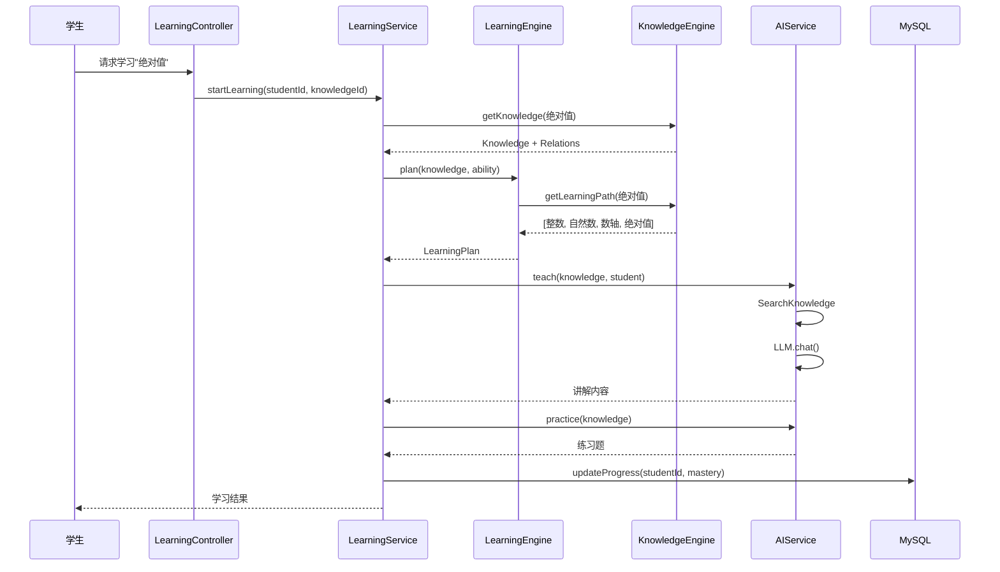
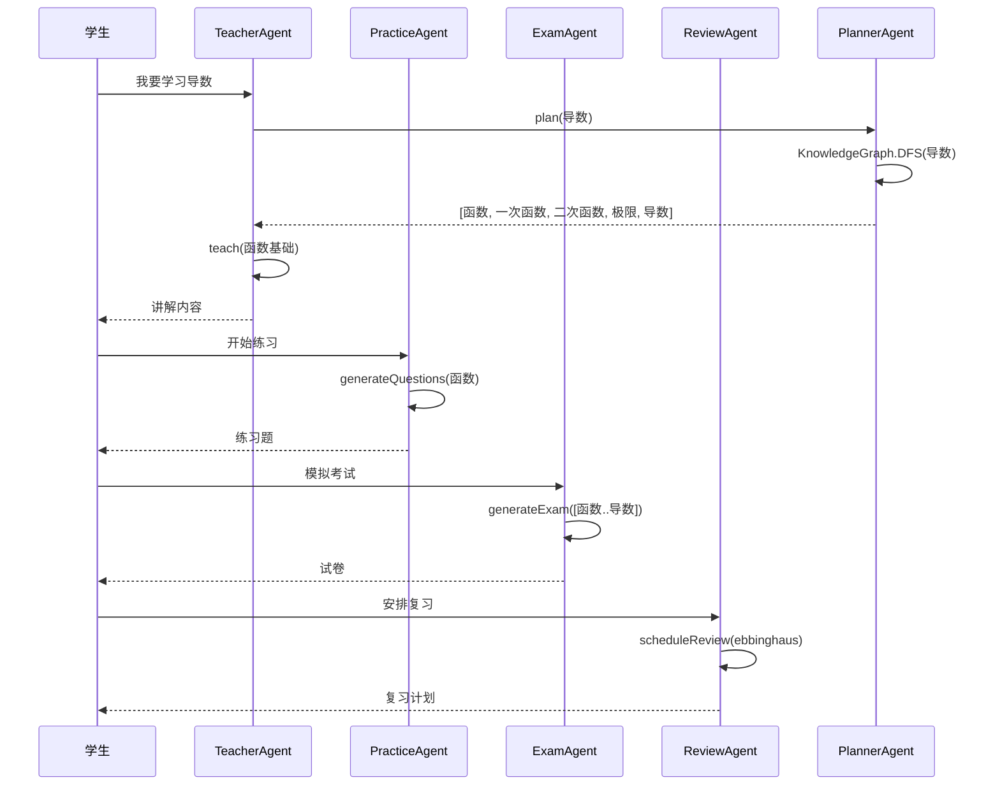

# 总体架构设计

## 1. 系统全景

```
                 用户
                  |
      +-----------+------------+
      |           |            |
   学生端      家长端      教师端
      |           |            |
      +-----------+------------+
                  |
           Learning Service
                  |
+---------------------------------------+
|       学习引擎 (Learning Engine)        |
+---------------------------------------+
| 知识图谱 | 学习路径 | 能力评估          |
| 错题分析 | AI Tutor | 资源推荐          |
| 考试分析 | 遗忘复习 | 智能推荐          |
+---------------------------------------+
|               数据层                    |
+---------------------------------------+
| MySQL/SQLite | RogueMap | File Storage |
+---------------------------------------+
```

## 2. 模块架构

```
shiyu-ai
|
+-- Platform Layer (平台层)
|   +-- Auth Service          认证鉴权 (JWT + RBAC)
|   +-- Config Service        系统配置
|   +-- File Service          文件存储
|   +-- Log Service           操作日志
|
+-- AI Core Layer (AI能力层)
|   +-- shiyu-ai-core         ChatEngine + ModelAdapter
|   +-- shiyu-ai-agent        Agent框架 (Teacher/Practice/Exam/Review/Planner)
|   +-- shiyu-ai-memory       Memory (会话/摘要/长期记忆)
|   +-- shiyu-ai-rag          RAG (文档解析/检索/生成)
|   +-- shiyu-ai-mcp          MCP工具扩展
|   +-- shiyu-ai-workflow     LiteFlow流程编排
|
+-- Knowledge Engine (知识引擎层)
|   +-- shiyu-ai-knowledge
|       +-- Graph             知识图谱 (DAG)
|       +-- Learning Path     学习路径算法
|       +-- Search            全文检索 (BM25 + Trie)
|       +-- Embedding         向量存储 + TopK
|       +-- Recommend         推荐索引
|       +-- Ability           能力模型
|       +-- Resource          学习资源管理
|       +-- Relation          关系管理
|
+-- Business Domain (业务域)
    +-- shiyu-ai-education
    |   +-- Subject           学科
    |   +-- Textbook          教材
    |   +-- Chapter           章节
    |   +-- Course            课程
    |   +-- Question          题库
    |   +-- Exam              考试
    |   +-- Review            复习
    |   +-- Study Plan        学习计划
    |   +-- Analytics         学习分析
    |   +-- Achievement       成长档案
    |
    +-- shiyu-ai-search       统一搜索
    +-- shiyu-ai-admin        管理后台
```

## 3. 核心调用链

```
               Student
                  |
           LearningController
                  |
           LearningService
                  |
         LearningEngine
                  |
      +-----------+------------+
      |           |            |
 Knowledge    AI Service    Review
      |           |            |
 RogueMap    ChatEngine    LiteFlow
      |           |
      +------- MySQL --------+
```

### 3.1 学习流程调用链



### 3.2 AI Tutor 调用链



## 4. 部署架构

### 4.1 单机部署

```
+----------------------------+
|      Spring Boot 4         |
|                            |
|  shiyu-ai.jar              |
|                            |
|  +-- HTTP API              |
|  +-- AI Service            |
|  +-- Learning Engine       |
|  +-- Knowledge Engine      |
|  +-- RogueMap              |
|  +-- SQLite (dev)          |
|  +-- File Storage          |
+----------------------------+
```

部署命令：

```bash
java -jar shiyu-ai.jar
```

无需：Redis、Neo4j、Elasticsearch、Milvus、Kafka、RabbitMQ、MinIO

### 4.2 Docker 部署

```yaml
version: "3.8"
services:
  shiyu-ai:
    image: shiyu/ai-platform:latest
    ports:
      - "8080:8080"
    volumes:
      - ./data:/app/data
      - ./resources:/app/resources
    environment:
      - SPRING_PROFILES_ACTIVE=prod
      - DB_URL=jdbc:mysql://mysql:3306/shiyu
    depends_on:
      - mysql

  mysql:
    image: mysql:8.0
    environment:
      MYSQL_ROOT_PASSWORD: root
      MYSQL_DATABASE: shiyu
    volumes:
      - mysql_data:/var/lib/mysql

volumes:
  mysql_data:
```

### 4.3 生产部署

```
+----------------------------------+
|          Nginx / Gateway         |
+----+------------+-----------+----+
     |            |           |
+----v---+  +----v----+  +---v-----+
|shiyu-ai|  |shiyu-ai |  |shiyu-ai |
| node-1 |  | node-2  |  | node-3  |
+----+---+  +----+----+  +---+-----+
     |            |           |
+----v------------v-----------v-----+
|           MySQL                   |
|                                   |
+-----------------------------------+
|         RogueMap (each node)      |
+-----------------------------------+
|        File Storage (OSS/S3)      |
+-----------------------------------+
```

## 5. DDD 分层

```
Domain Layer
+-- Entity          领域实体 (Knowledge, Course, Question, Student)
+-- Value Object    值对象 (Mastery, Ability, Difficulty)
+-- Repository      仓储接口
+-- Domain Service  领域服务 (LearningEngine, KnowledgeEngine)
+-- Event           领域事件 (LearnCompleteEvent, ExamSubmitEvent)

Application Layer
+-- Application Service  应用服务 (LearningService, ExamService)
+-- DTO                  数据传输对象
+-- Assembler            DTO <-> Entity 转换
+-- Command/Query        CQRS 命令/查询

Infrastructure Layer
+-- Repository Impl      仓储实现
+-- RogueMap Impl        RogueMap 存储实现
+-- MySQL Impl           MyBatis-Flex 实现
+-- AI Client            Spring AI 客户端
+-- MCP Client           MCP 工具调用

Interface Layer
+-- Controller           REST API
+-- WebSocket Handler    实时推送
+-- SSE Handler          流式输出
```

## 6. 插件化设计

教育域通过接口与平台解耦：

```java
public interface BusinessDomain {
    String domain();
    void register(AbstractApplicationContext ctx);
    List<AbstractAgent> agents();
    List<McpTool> tools();
    List<LiteFlowChain> chains();
}
```

```java
@Component
public class EducationDomain implements BusinessDomain {

    @Override
    public String domain() {
        return "education";
    }

    @Override
    public List<AbstractAgent> agents() {
        return List.of(
            teacherAgent,
            practiceAgent,
            examAgent,
            reviewAgent,
            plannerAgent,
            reportAgent
        );
    }
}
```

## 7. 包结构

```
com.shiyu.ai
|
+-- common
|   +-- config
|   +-- constant
|   +-- exception
|   +-- result
|   +-- util
|
+-- auth
|   +-- controller
|   +-- service
|   +-- entity
|   +-- security
|
+-- ai
|   +-- core
|   |   +-- engine        ChatEngine
|   |   +-- adapter       ModelAdapter (OpenAI/SiliconFlow/OpenRouter)
|   |   +-- streaming     SSE/WebSocket
|   |
|   +-- agent
|   |   +-- abstractAgent AbstractAgent
|   |   +-- teacher       TeacherAgent
|   |   +-- practice      PracticeAgent
|   |   +-- exam          ExamAgent
|   |   +-- review        ReviewAgent
|   |   +-- planner       PlannerAgent
|   |   +-- report        ReportAgent
|   |
|   +-- memory
|   |   +-- conversation  对话记忆
|   |   +-- summary       摘要记忆
|   |   +-- longterm      长期记忆
|   |
|   +-- rag
|   |   +-- loader        文档加载
|   |   +-- splitter      文档切分
|   |   +-- retriever     检索
|   |   +-- generator     生成
|   |
|   +-- mcp
|       +-- tool          MCP工具定义
|       +-- server        MCP服务器
|
+-- knowledge
|   +-- entity            Knowledge, Subject, Chapter, Textbook
|   +-- relation          ParentRelation, SimilarRelation, DependencyRelation
|   +-- graph             KnowledgeGraph, GraphStore
|   +-- embedding         EmbeddingService, VectorStore
|   +-- search            SearchService, BM25, Trie
|   +-- recommend         RecommendService
|   +-- ability           AbilityModel, BloomTaxonomy
|   +-- path              LearningPath, PathAlgorithm
|   +-- service           KnowledgeService
|
+-- education
|   +-- subject           学科
|   +-- textbook          教材
|   +-- chapter           章节
|   +-- course            课程
|   +-- question          题库
|   +-- exam              考试
|   +-- review            复习
|   +-- plan              学习计划
|   +-- analytics         学习分析
|   +-- achievement       成长档案
|
+-- storage
|   +-- roguesmap         RogueMap实现
|   +-- mysql             MyBatis-Flex实现
|   +-- file              文件存储
|
+-- workflow
    +-- liteflow          LiteFlow组件
    +-- langgraph         LangGraph4j图定义
```
