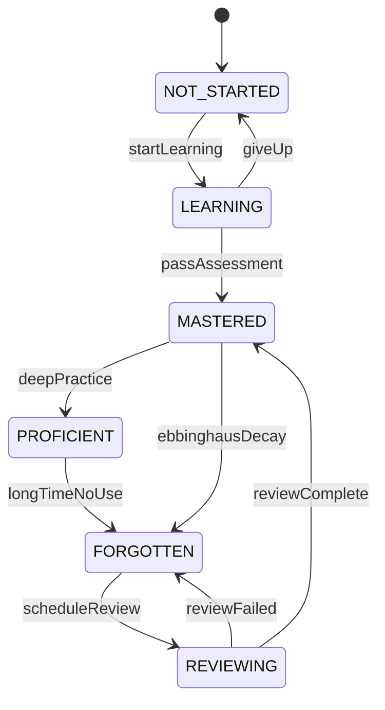

# 知识引擎设计 (Knowledge Engine)

## 1. 概述

知识引擎是 Shiyu AI Platform 最重要的基础设施层，统一管理知识点、教材、课程、学习路径、Embedding、搜索、推荐等能力。教育、办公、企业等其他业务域均可复用。

```
Knowledge Engine
|
+-- Graph             知识图谱 (DAG)
+-- Learning Path     学习路径算法
+-- Search            全文检索 (BM25 + Trie)
+-- Embedding         向量存储 + TopK
+-- Recommend         推荐索引
+-- Ability           能力模型 (Bloom Taxonomy)
+-- Resource          学习资源管理
+-- Relation          关系管理
```

## 2. 知识点分层模型

### 第一层：学段

```
幼儿园
+-- 小班
+-- 中班
+-- 大班

小学
+-- 一年级 ~ 六年级

初中
+-- 七年级 ~ 九年级

高中
+-- 高一 ~ 高三
```

### 第二层：学科

```
语文、数学、英语
物理、化学、生物
历史、地理、政治
科学、信息技术
音乐、体育、美术
```

### 第三层：教材版本

```
人教版、北师大版、苏教版
沪教版、教科版、湘教版、外研版
```

一个知识点可能对应多个教材：

```
二次函数
+-- 人教版 九年级上册
+-- 北师大版 九年级下册
+-- 苏教版 八年级
```

### 第四层：章节

```
数学 -> 第一章 有理数 -> 1.1 正数负数 -> 1.2 数轴 -> 1.3 相反数 -> 1.4 绝对值
```

### 第五层：知识点（核心）

```json
{
  "id": "math_001",
  "name": "绝对值",
  "difficulty": 2,
  "grade": "7",
  "subject": "数学",
  "description": "一个数在数轴上对应的点到原点的距离",
  "estimatedTime": 45,
  "suitableAge": [12, 14],
  "prerequisites": ["math_004", "math_005"],
  "subsequent": ["math_010"],
  "requiredAbilities": ["remember", "understand", "apply"]
}
```

### 第六层：知识图谱（DAG）

```
自然数 --> 整数 --> 负数 --> 数轴 --> 相反数 --> 绝对值 --> 有理数
```

这是 DAG（有向无环图），不是树。一个知识点可能有多个父节点：

```
函数
  ^
一次函数
  ^
二次函数
  ^
导数
```

## 3. 知识图谱

### 3.1 GraphStore 接口

```java
public interface GraphStore {

    Node getNode(Long id);

    List<Node> parents(Long id);

    List<Node> children(Long id);

    List<Node> related(Long id);

    List<Edge> edges(Long id);

    void addNode(Node node);

    void addEdge(Edge edge);

    void removeEdge(Long from, Long to, RelationType type);

    List<Long> topologicalSort(Long rootId);

    List<Long> dfs(Long startId);

    List<Long> bfs(Long startId);

    List<Long> findPath(Long from, Long to);

    List<Long> findMissingPrerequisites(Long targetId, Set<Long> masteredIds);
}
```

### 3.2 RogueMap 实现

```java
@Component
public class RogueMapGraphStore implements GraphStore {

    private final RogueMap rogueMap;

    @Override
    public Node getNode(Long id) {
        byte[] data = rogueMap.get(key("graph", id));
        return deserialize(data, Node.class);
    }

    @Override
    public List<Node> parents(Long id) {
        Node node = getNode(id);
        return node.getParentIds().stream()
            .map(this::getNode)
            .toList();
    }

    @Override
    public List<Node> children(Long id) {
        Node node = getNode(id);
        return node.getChildIds().stream()
            .map(this::getNode)
            .toList();
    }

    @Override
    public List<Long> topologicalSort(Long rootId) {
        List<Long> result = new ArrayList<>();
        Set<Long> visited = new HashSet<>();
        dfsVisit(rootId, visited, result);
        Collections.reverse(result);
        return result;
    }

    @Override
    public List<Long> findMissingPrerequisites(Long targetId, Set<Long> masteredIds) {
        List<Long> allPrereq = topologicalSort(targetId);
        allPrereq.remove(targetId);
        return allPrereq.stream()
            .filter(id -> !masteredIds.contains(id))
            .toList();
    }

    private String key(String prefix, Long id) {
        return prefix + ":" + id;
    }
}
```

RogueMap 存储格式：

```
key:  graph:1001
value:
{
  "id": 1001,
  "name": "绝对值",
  "parents": [1000, 999],
  "children": [1002],
  "related": [1003],
  "edges": [
    {"target": 1000, "type": "PRE"},
    {"target": 999, "type": "PRE"},
    {"target": 1002, "type": "NEXT"},
    {"target": 1003, "type": "SIMILAR"}
  ]
}
```

### 3.3 为什么不用 Neo4j

| 维度         | Neo4j              | RogueMap GraphStore        |
| ------------ | ------------------ | -------------------------- |
| 知识点数量   | 适合百万级         | 15000 个足够               |
| 关系边数量   | 适合百万级         | 10~20 万条边足够           |
| 查询延迟     | 网络 RTT + Cypher  | O(1) 内存直接访问          |
| GC 影响      | 独立进程           | 堆外内存，无 GC            |
| 部署复杂度   | 需要独立部署       | 嵌入式，零部署             |
| 未来扩展     | 已是图数据库       | 接口层不变，可替换实现     |

### 3.4 关系类型

```java
public enum RelationType {
    PRE,           // 前置知识
    NEXT,          // 后续知识
    INCLUDE,       // 包含关系（章 -> 节 -> 知识点）
    RELATED,       // 相关知识点
    SIMILAR,       // 相似知识点
    BELONG         // 属于某学科/学段
}
```

## 4. 知识图谱规模预估

| 学段     | 知识点数量 | 关系边数量 |
| -------- | ---------- | ---------- |
| 幼儿园   | ~100       | ~200       |
| 小学     | ~5000      | ~20000     |
| 初中     | ~4000      | ~30000     |
| 高中     | ~6000      | ~50000     |
| **合计** | **~15000** | **~100000**|

内存占用预估：每个节点约 1KB，总共约 15MB，完全可以在内存中操作。

## 5. 图算法

### 5.1 DFS（深度优先搜索）

用于生成学习路径。从目标知识点出发，递归访问所有前置知识。

```java
public List<Long> dfs(Long startId) {
    List<Long> result = new ArrayList<>();
    Set<Long> visited = new HashSet<>();
    dfsVisit(startId, visited, result);
    return result;
}

private void dfsVisit(Long id, Set<Long> visited, List<Long> result) {
    if (visited.contains(id)) return;
    visited.add(id);
    Node node = getNode(id);
    for (Long parentId : node.getParentIds()) {
        dfsVisit(parentId, visited, result);
    }
    result.add(id);
}
```

### 5.2 拓扑排序

保证学习顺序满足前置依赖。

```java
public List<Long> topologicalSort(Long rootId) {
    List<Long> result = new ArrayList<>();
    Set<Long> visited = new HashSet<>();
    dfsVisit(rootId, visited, result);
    Collections.reverse(result);
    return result;
}
```

### 5.3 缺失前置知识检测

```java
public List<Long> findMissingPrerequisites(Long targetId, Set<Long> masteredIds) {
    List<Long> allPrereq = topologicalSort(targetId);
    allPrereq.remove(targetId);
    return allPrereq.stream()
        .filter(id -> !masteredIds.contains(id))
        .toList();
}
```

### 5.4 学习路径生成

```java
public LearningPath generateLearningPath(Long targetId, StudentProfile profile) {
    List<Long> all = topologicalSort(targetId);
    List<Long> missing = all.stream()
        .filter(id -> !profile.isMastered(id))
        .toList();
    List<LearningStep> steps = missing.stream()
        .map(id -> {
            Knowledge k = knowledgeService.get(id);
            return new LearningStep(k, estimateTime(k, profile));
        })
        .toList();
    return new LearningPath(targetId, steps);
}
```

## 6. 能力模型 (Bloom Taxonomy)

### 6.1 六维度

| 维度       | 英文           | 说明                       |
| ---------- | -------------- | -------------------------- |
| 记忆       | Remember       | 能回忆基本事实             |
| 理解       | Understand     | 能解释概念含义             |
| 应用       | Apply          | 能在新情境中使用知识       |
| 分析       | Analyze        | 能分解信息并理解结构       |
| 评价       | Evaluate       | 能判断和论证               |
| 创造       | Create         | 能产生新的想法或作品       |

### 6.2 能力值存储

```json
{
  "studentId": 1,
  "knowledgeId": "math_001",
  "abilities": {
    "remember":   100,
    "understand": 90,
    "apply":      70,
    "analyze":    40,
    "evaluate":   20,
    "create":     10
  },
  "overallMastery": 72,
  "lastUpdated": "2026-06-27T10:00:00"
}
```

### 6.3 能力评估更新

每次做题/考试后，根据题目难度和能力维度权重更新：

```java
public void updateAbility(Long studentId, Long knowledgeId, PracticeResult result) {
    AbilityRecord record = abilityService.get(studentId, knowledgeId);
    double weight = result.getAccuracy();
    BloomDimension dimension = result.getQuestion().getAbilityDimension();
    double current = record.getScore(dimension);
    double updated = current + (100 - current) * weight * 0.1;
    record.setScore(dimension, Math.min(100, updated));
    abilityService.save(record);
}
```

## 7. Embedding

### 7.1 存储

通过 RogueMap Embedding 模块存储 float[] 向量：

```
key:   vector:1001
value: float[768] (知识点的语义向量)
```

### 7.2 TopK 查询

```java
public List<SearchResult> similaritySearch(String query, int topK) {
    float[] queryVec = embeddingService.embed(query);
    return vectorStore.topK(queryVec, topK).stream()
        .map(r -> new SearchResult(
            knowledgeService.get(r.getId()),
            r.getScore()
        ))
        .toList();
}
```

### 7.3 应用场景

- 知识点语义搜索："函数" -> TopK 返回一次函数、二次函数、导数
- 相似题目推荐
- 学习资源语义匹配

## 8. 搜索引擎

### 8.1 不需要 Elasticsearch 的理由

| 数据类型 | 数量     | 搜索方案                   |
| -------- | -------- | -------------------------- |
| 知识点   | 15000    | Trie + BM25 in RogueMap    |
| 课程     | 5000     | RogueMap 全文索引          |
| 题目     | ~100 万  | RogueMap 倒排索引          |

### 8.2 检索架构

```
SearchService
    |
    +-- KeywordSearch     BM25 + 倒排索引
    |
    +-- SemanticSearch    Embedding + TopK
    |
    +-- HybridSearch      融合关键词 + 语义
```

### 8.3 RogueMap 索引结构

```
search:term:二次     -> [1001, 1002, 1003, ...]    (posting list)
search:term:函数     -> [1001, 1005, 1010, ...]
search:term:绝对值   -> [1001]
```

## 9. 推荐系统

### 9.1 不需要 Redis 的理由

推荐索引存储：

```
recommend:user:1     -> { abilityVector, preferenceVector, history }
```

用户画像 + Embedding -> RogueMap TopK 查询，无需 Redis。

### 9.2 推荐维度

| 类型             | 算法                          | 说明                 |
| ---------------- | ----------------------------- | -------------------- |
| 知识点推荐       | 知识图谱 DFS + 能力差距       | 补前置知识           |
| 题目推荐         | 难度匹配 + 知识点覆盖         | 薄弱点专练           |
| 资源推荐         | Embedding 相似度              | 推荐相关视频/讲义    |
| 复习推荐         | 遗忘曲线 + 掌握度             | 优先复习即将遗忘的   |

## 10. 学习状态机



### 10.1 艾宾浩斯遗忘曲线

| 复习轮次 | 间隔   | 说明             |
| -------- | ------ | ---------------- |
| 第 1 次  | 1 天   | 快速巩固         |
| 第 2 次  | 3 天   | 短期记忆转中期   |
| 第 3 次  | 7 天   | 中期记忆巩固     |
| 第 4 次  | 15 天  | 中期转长期       |
| 第 5 次  | 30 天  | 长期记忆巩固     |
| 第 6 次  | 90 天  | 永久记忆         |

```java
public ReviewTask scheduleReview(Long studentId, Long knowledgeId, Instant learnedAt) {
    int[] intervals = {1, 3, 7, 15, 30, 90};
    Instant now = Instant.now();
    for (int i = 0; i < intervals.length; i++) {
        Instant reviewTime = learnedAt.plus(Duration.ofDays(intervals[i]));
        if (reviewTime.isAfter(now)) {
            return new ReviewTask(studentId, knowledgeId, reviewTime, i + 1);
        }
    }
    return null;
}
```

### 10.2 掌握度衰减公式

```
mastery(t) = initialMastery * e^(-lambda * t)

其中：
- t: 距上次学习/复习的天数
- lambda: 衰减系数（与复习轮次相关）
- 复习轮次越高，lambda 越小
```

| 复习轮次 | lambda  | 说明             |
| -------- | ------- | ---------------- |
| 0（未复习）| 0.20   | 衰减快           |
| 1         | 0.15    | 稍慢             |
| 2         | 0.10    | 中期             |
| 3         | 0.07    | 较慢             |
| 4         | 0.04    | 慢               |
| 5         | 0.02    | 极慢             |
| 6         | 0.01    | 接近永久         |
