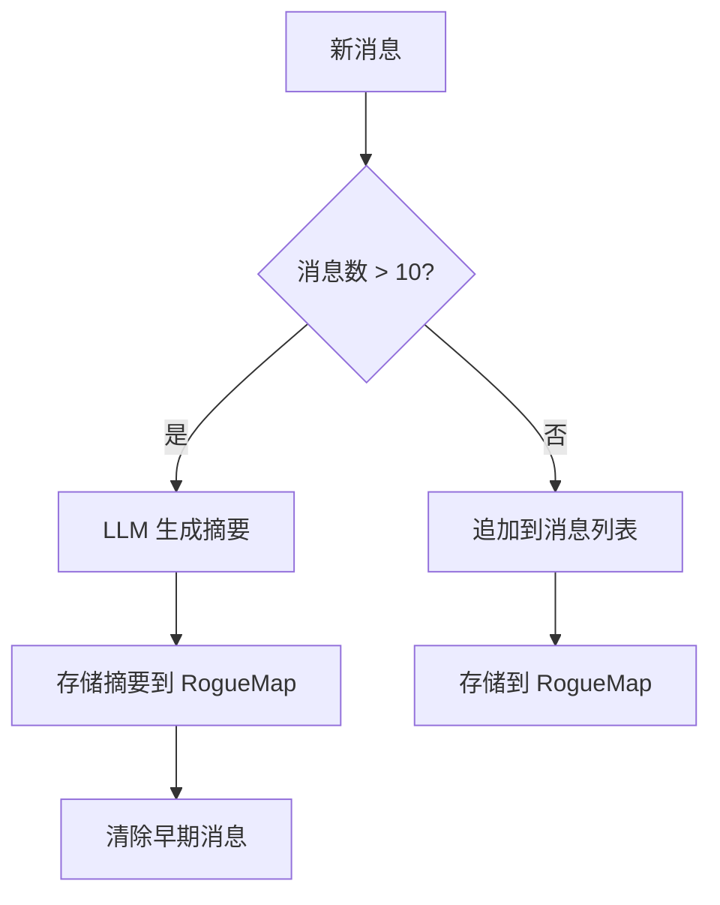
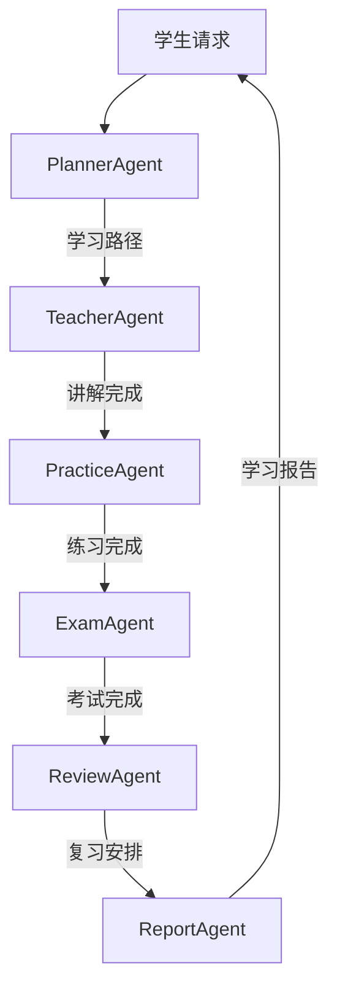
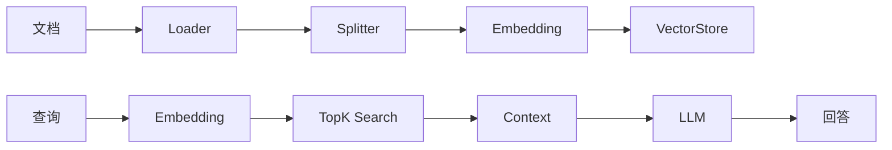

# AI 架构设计

## 1. 概述

AI 架构是 Shiyu AI Platform 的核心能力层，提供 ChatEngine、Agent 框架、Memory、RAG、MCP 工具、LiteFlow 工作流、LangGraph4j 复杂图等能力。

```
AI Architecture
|
+-- ChatEngine         统一对话引擎
+-- ModelAdapter       多模型适配
+-- Agent Framework    Agent框架 (AbstractAgent + 业务Agent)
+-- Memory             会话/摘要/长期记忆
+-- RAG                文档解析/检索/生成
+-- MCP                工具扩展
+-- LiteFlow           声明式流程编排
+-- LangGraph4j        复杂Agent状态机图
+-- Streaming          SSE/WebSocket流式输出
```

## 2. ChatEngine

### 2.1 设计

```java
public interface ChatEngine {

    ChatResponse chat(ChatRequest request);

    Flux<ChatResponse> stream(ChatRequest request);

    ChatResponse chatWithMemory(String sessionId, ChatRequest request);

    Flux<ChatResponse> streamWithMemory(String sessionId, ChatRequest request);
}
```

### 2.2 实现

```java
@Service
public class SpringAIChatEngine implements ChatEngine {

    private final ChatClient chatClient;
    private final MemoryService memoryService;

    @Override
    public ChatResponse chat(ChatRequest request) {
        return chatClient.prompt()
            .system(request.getSystemPrompt())
            .user(request.getUserMessage())
            .call()
            .chatResponse();
    }

    @Override
    public Flux<ChatResponse> stream(ChatRequest request) {
        return chatClient.prompt()
            .system(request.getSystemPrompt())
            .user(request.getUserMessage())
            .stream()
            .chatResponse();
    }

    @Override
    public ChatResponse chatWithMemory(String sessionId, ChatRequest request) {
        List<Message> history = memoryService.getHistory(sessionId, 10);
        memoryService.addMessage(sessionId, request.getUserMessage());
        return chatClient.prompt()
            .messages(history)
            .system(request.getSystemPrompt())
            .user(request.getUserMessage())
            .call()
            .chatResponse();
    }
}
```

## 3. ModelAdapter

### 3.1 统一接口

```java
public interface ModelAdapter {

    String provider();

    ChatClient createClient(ModelConfig config);

    EmbeddingModel embeddingModel(ModelConfig config);

    boolean supports(ModelCapability capability);
}
```

### 3.2 适配器实现

```java
@Component
public class OpenAIAdapter implements ModelAdapter {
    @Override
    public String provider() { return "openai"; }
}

@Component
public class SiliconFlowAdapter implements ModelAdapter {
    @Override
    public String provider() { return "siliconflow"; }
}

@Component
public class OpenRouterAdapter implements ModelAdapter {
    @Override
    public String provider() { return "openrouter"; }
}

@Component
public class LocalModelAdapter implements ModelAdapter {
    @Override
    public String provider() { return "local"; }
}
```

### 3.3 模型路由

```java
@Service
public class ModelRouter {

    private final Map<String, ModelAdapter> adapters;

    public ChatClient route(ModelConfig config) {
        ModelAdapter adapter = adapters.get(config.getProvider());
        return adapter.createClient(config);
    }
}
```

## 4. Memory

### 4.1 Memory 类型

```java
public interface MemoryService {
    void addMessage(String sessionId, Message message);
    List<Message> getHistory(String sessionId, int limit);
    String getSummary(String sessionId);
    void summarize(String sessionId);
    StudentMemory getStudentMemory(Long studentId);
    void updateStudentMemory(Long studentId, StudentMemory memory);
}
```

### 4.2 RogueMap Memory 存储

```
memory:session:{sessionId}     -> List<Message>           会话消息
memory:summary:{sessionId}     -> String                  会话摘要
memory:student:{studentId}     -> StudentMemory           学生长期记忆
  {
    "history": [...],
    "preferences": { "style": "visual", "pace": "medium" },
    "ability": { "remember": 80, "understand": 70, ... },
    "recentLearning": [...],
    "weakPoints": [...],
    "strongPoints": [...]
  }
```

### 4.3 记忆策略



## 5. Agent 框架

### 5.1 AbstractAgent

```java
public abstract class AbstractAgent {

    protected final ChatEngine chatEngine;
    protected final KnowledgeEngine knowledgeEngine;

    public abstract String name();
    public abstract String systemPrompt();
    public abstract AgentResponse execute(AgentRequest request);

    protected ChatResponse callLLM(String prompt) {
        return chatEngine.chat(ChatRequest.builder()
            .systemPrompt(systemPrompt())
            .userMessage(prompt)
            .build());
    }

    protected List<SearchResult> searchKnowledge(String query) {
        return knowledgeEngine.search(query, 5);
    }
}
```

### 5.2 TeacherAgent - 讲解

```java
@Component
public class TeacherAgent extends AbstractAgent {

    @Override
    public String name() { return "teacher"; }

    @Override
    public String systemPrompt() {
        return """
            你是一位专业的K12教师。
            根据学生的知识水平和学习进度，用简洁易懂的语言讲解知识点。
            使用类比、例子、图示来帮助学生理解。
            讲解后要检查学生是否理解。
            """;
    }

    @Override
    public AgentResponse execute(AgentRequest request) {
        Long knowledgeId = request.getKnowledgeId();
        Knowledge knowledge = knowledgeEngine.getKnowledge(knowledgeId);

        String context = buildContext(request.getStudentId(), knowledge);
        String prompt = format("""
            学生: %s
            当前学习: %s
            前置知识: %s
            请讲解这个知识点。
            """, context, knowledge.getName(), knowledge.getPrerequisites());

        ChatResponse response = callLLM(prompt);
        return AgentResponse.teaching(knowledge, response.getContent());
    }
}
```

### 5.3 PracticeAgent - 出题

```java
@Component
public class PracticeAgent extends AbstractAgent {

    @Override
    public String name() { return "practice"; }

    @Override
    public String systemPrompt() {
        return """
            你是一位出题专家。
            根据知识点、难度和学生能力水平生成练习题。
            题目类型：选择题、填空题、解答题。
            每道题给出参考答案和解析。
            """;
    }

    @Override
    public AgentResponse execute(AgentRequest request) {
        Long knowledgeId = request.getKnowledgeId();
        DifficultyLevel difficulty = request.getDifficulty();
        int count = request.getQuestionCount();

        String prompt = format("""
            知识点: %s
            难度: %s
            数量: %d
            请生成练习题。
            """, knowledgeEngine.getKnowledge(knowledgeId).getName(),
            difficulty, count);

        ChatResponse response = callLLM(prompt);
        List<Question> questions = questionParser.parse(response.getContent());
        return AgentResponse.practice(questions);
    }
}
```

### 5.4 ExamAgent - 考试

```java
@Component
public class ExamAgent extends AbstractAgent {

    @Override
    public String name() { return "exam"; }

    @Override
    public AgentResponse execute(AgentRequest request) {
        List<Long> knowledgeIds = request.getKnowledgeIds();
        ExamConfig config = request.getExamConfig();

        List<Question> pool = questionService.getByKnowledge(knowledgeIds);
        List<Question> selected = selectByDifficulty(pool, config);
        ExamPaper paper = buildPaper(selected, config);
        return AgentResponse.exam(paper);
    }
}
```

### 5.5 ReviewAgent - 复习

```java
@Component
public class ReviewAgent extends AbstractAgent {

    @Override
    public String name() { return "review"; }

    @Override
    public AgentResponse execute(AgentRequest request) {
        Long studentId = request.getStudentId();
        List<ReviewTask> tasks = reviewService.getPendingTasks(studentId);
        List<Long> toReview = tasks.stream()
            .sorted(Comparator.comparing(ReviewTask::getReviewTime))
            .limit(5)
            .map(ReviewTask::getKnowledgeId)
            .toList();

        String prompt = format("需要复习的知识: %s, 请生成复习题", toReview);
        ChatResponse response = callLLM(prompt);
        return AgentResponse.review(toReview, response.getContent());
    }
}
```

### 5.6 PlannerAgent - 规划

```java
@Component
public class PlannerAgent extends AbstractAgent {

    @Override
    public String name() { return "planner"; }

    @Override
    public AgentResponse execute(AgentRequest request) {
        Long studentId = request.getStudentId();
        Long targetKnowledgeId = request.getKnowledgeId();

        StudentProfile profile = studentService.getProfile(studentId);
        Set<Long> mastered = profile.getMasteredKnowledge();
        List<Long> missing = knowledgeEngine.graph()
            .findMissingPrerequisites(targetKnowledgeId, mastered);

        LearningPath path = knowledgeEngine.path()
            .generateLearningPath(targetKnowledgeId, profile);

        String prompt = format("""
            学生目标: %s
            缺失前置: %s
            学习路径: %s
            请生成学习计划和时间安排。
            """, targetKnowledgeId, missing, path);

        ChatResponse response = callLLM(prompt);
        return AgentResponse.plan(path, response.getContent());
    }
}
```

### 5.7 ReportAgent - 分析报告

```java
@Component
public class ReportAgent extends AbstractAgent {

    @Override
    public String name() { return "report"; }

    @Override
    public AgentResponse execute(AgentRequest request) {
        Long studentId = request.getStudentId();
        LearningAnalytics analytics = analyticsService.getAnalytics(studentId);

        String prompt = format("""
            学习数据: %s
            能力雷达图: %s
            薄弱点: %s
            请生成学习报告和改进建议。
            """, analytics, analytics.getAbilityRadar(),
            analytics.getWeakPoints());

        ChatResponse response = callLLM(prompt);
        return AgentResponse.report(response.getContent());
    }
}
```

### 5.8 Agent 协作流程



## 6. LiteFlow 工作流

### 6.1 Chain 定义 (实际实现)

```xml
<!-- 学习流程 (✅ 5/6 组件已实现) -->
<chain name="learningChain">
    THEN(
        checkKnowledgeCmp,
        loadResourceCmp,
        teacherCmp,
        practiceCmp,
        scoreCmp,
        updateMasteryCmp
    );
</chain>

<!-- 复习流程 (⏳ 全部占位) -->
<chain name="reviewChain">
    THEN(
        loadReviewTaskCmp,
        generateReviewQuestionsCmp,
        reviewScoreCmp,
        updateReviewMasteryCmp
    );
</chain>

<!-- 考试流程 (⏳ 全部占位) -->
<chain name="examChain">
    THEN(
        generateExamCmp,
        scoreExamCmp,
        analyzeExamCmp
    );
</chain>
```

> **注：** 设计文档曾规划 6 条链 (recommendChain / tutorChain / abilityChain)，
> 当前实际实现 3 条。复习和考试流程在 agent 层 (ReviewAgent / ExamAgent) 已可用，
> LiteFlow 链为后续补充。

### 6.2 组件实现状态

| 组件 | 所属链 | 状态 | 说明 |
|------|--------|------|------|
| checkKnowledgeCmp | learningChain | ✅ | 检查前置知识，检测缺失知识点 |
| loadResourceCmp | learningChain | ✅ | 加载关联学习资源 |
| teacherCmp | learningChain | ✅ | 调用 ChatEngine 进行 AI 讲解 |
| practiceCmp | learningChain | ✅ | 调用 ChatEngine 生成练习题 |
| scoreCmp | learningChain | ⚠️ | 占位实现，硬编码 60% 准确率 |
| updateMasteryCmp | learningChain | ✅ | 更新 Bloom 能力值 + 安排艾宾浩斯复习 |
| loadReviewTaskCmp | reviewChain | ⏳ | 占位 |
| generateReviewQuestionsCmp | reviewChain | ⏳ | 占位 |
| reviewScoreCmp | reviewChain | ⏳ | 占位 |
| updateReviewMasteryCmp | reviewChain | ⏳ | 占位 |
| generateExamCmp | examChain | ⏳ | 占位 |
| scoreExamCmp | examChain | ⏳ | 占位 |
| analyzeExamCmp | examChain | ⏳ | 占位 |

### 6.3 Component 示例

```java
// UpdateMasteryCmp — 学习完成后更新掌握度并安排复习
@Component("updateMasteryCmp")
public class UpdateMasteryCmp extends NodeComponent {

    private final AbilityService abilityService;
    private final ReviewScheduler reviewScheduler;  // 位于 education 模块

    @Override
    public void process() throws Exception {
        LearningContext ctx = this.getContextBean(LearningContext.class);

        // 1. 更新 Bloom 能力值
        double accuracy = ctx.getPracticeAccuracy();
        abilityService.update(ctx.getStudentId(), ctx.getKnowledgeId(),
                BloomTaxonomy.APPLY, accuracy);
        abilityService.update(ctx.getStudentId(), ctx.getKnowledgeId(),
                BloomTaxonomy.REMEMBER, Math.min(accuracy + 0.2, 1.0));

        // 2. 安排艾宾浩斯复习任务
        List<ReviewScheduler.ReviewTask> reviewTasks = reviewScheduler.scheduleAfterLearning(
                ctx.getStudentId(), ctx.getKnowledgeId(), Instant.now());
        ctx.setReviewDates(reviewTasks.stream()
                .map(ReviewScheduler.ReviewTask::reviewDate)
                .toList());
    }
}
```

## 7. LangGraph4j 复杂 Agent

### 7.1 场景

用户说"我要学习导数"时，需要多步协调：

```
Planner -> Knowledge Search -> Teacher -> Practice -> Review -> Summary
```

### 7.2 State 定义

```java
public class TutorState {
    private Long studentId;
    private Long targetKnowledgeId;
    private LearningPath path;
    private List<AgentResponse> steps;
    private PracticeResult practiceResult;
    private String summary;
}
```

### 7.3 Graph 定义

```java
@Configuration
public class TutorGraphConfig {

    @Bean
    public StateGraph<TutorState> tutorGraph(
            PlannerNode plannerNode,
            KnowledgeSearchNode searchNode,
            TeacherNode teacherNode,
            PracticeNode practiceNode,
            ReviewNode reviewNode) {

        return new StateGraph<>(TutorState.class)
            .addNode("planner", plannerNode::execute)
            .addNode("knowledgeSearch", searchNode::execute)
            .addNode("teacher", teacherNode::execute)
            .addNode("practice", practiceNode::execute)
            .addNode("review", reviewNode::execute)
            .addEdge(START, "planner")
            .addEdge("planner", "knowledgeSearch")
            .addEdge("knowledgeSearch", "teacher")
            .addEdge("teacher", "practice")
            .addConditionalEdges("practice", state ->
                state.getPracticeResult().getScore() < 0.6
                    ? "teacher" : "review")
            .addEdge("review", END);
    }
}
```

### 7.4 Node 实现

```java
@Component
public class PlannerNode {

    @Autowired
    private PlannerAgent plannerAgent;

    public TutorState execute(TutorState state) {
        AgentResponse response = plannerAgent.execute(
            AgentRequest.builder()
                .studentId(state.getStudentId())
                .knowledgeId(state.getTargetKnowledgeId())
                .build());
        state.setPath(response.getLearningPath());
        return state;
    }
}
```

## 8. MCP 工具扩展

### 8.1 工具定义

```java
@McpTool(name = "searchKnowledge", description = "搜索知识点")
public class SearchKnowledgeTool {

    @Autowired
    private KnowledgeEngine knowledgeEngine;

    public List<SearchResult> execute(String query) {
        return knowledgeEngine.search(query, 5);
    }
}

@McpTool(name = "searchQuestion", description = "搜索题目")
public class SearchQuestionTool {

    @Autowired
    private QuestionService questionService;

    public List<Question> execute(String query, int count) {
        return questionService.search(query, count);
    }
}

@McpTool(name = "generateExam", description = "生成考试试卷")
public class GenerateExamTool {

    @Autowired
    private ExamAgent examAgent;

    public ExamPaper execute(List<Long> knowledgeIds, ExamConfig config) {
        AgentResponse response = examAgent.execute(
            AgentRequest.builder()
                .knowledgeIds(knowledgeIds)
                .examConfig(config)
                .build());
        return response.getExamPaper();
    }
}

@McpTool(name = "generatePPT", description = "生成课件PPT")
public class GeneratePPTTool {

    public String execute(Long knowledgeId, String template) {
        Knowledge k = knowledgeEngine.getKnowledge(knowledgeId);
        String prompt = "根据知识点 '" + k.getName() + "' 生成PPT内容大纲";
        return chatEngine.chat(ChatRequest.of(prompt)).getContent();
    }
}

@McpTool(name = "generateCourse", description = "生成课程大纲")
public class GenerateCourseTool {

    public String execute(List<Long> knowledgeIds) {
        String names = knowledgeIds.stream()
            .map(id -> knowledgeEngine.getKnowledge(id).getName())
            .collect(Collectors.joining(", "));
        return chatEngine.chat(
            ChatRequest.of("根据知识点列表 [" + names + "] 生成课程大纲")
        ).getContent();
    }
}

@McpTool(name = "ocr", description = "图片文字识别")
public class OCRTool {

    public String execute(String imageUrl) {
        // 调用 OCR 服务
    }
}

@McpTool(name = "translate", description = "翻译文本")
public class TranslateTool {

    public String execute(String text, String targetLang) {
        return chatEngine.chat(
            ChatRequest.of("将以下文本翻译为 " + targetLang + ": " + text)
        ).getContent();
    }
}

@McpTool(name = "tts", description = "文字转语音")
public class TTSTool {

    public byte[] execute(String text) {
        // 调用 TTS 服务
    }
}

@McpTool(name = "asr", description = "语音转文字")
public class ASRTool {

    public String execute(byte[] audio) {
        // 调用 ASR 服务
    }
}
```

## 9. RAG

### 9.1 流程



### 9.2 配置

```java
@Configuration
public class RagConfig {

    @Bean
    public DocumentLoader documentLoader() {
        return new MultiFormatLoader();
    }

    @Bean
    public DocumentSplitter splitter() {
        return TokenTextSplitter.builder()
            .chunkSize(500)
            .overlap(50)
            .build();
    }

    @Bean
    public VectorStore vectorStore(RogueMap rogueMap, EmbeddingModel model) {
        return new RogueMapVectorStore(rogueMap, model);
    }
}
```

## 10. Streaming 输出

### 10.1 SSE

```java
@RestController
@RequestMapping("/api/ai")
public class AiStreamController {

    @Autowired
    private ChatEngine chatEngine;

    @GetMapping(value = "/chat/stream", produces = MediaType.TEXT_EVENT_STREAM_VALUE)
    public Flux<ServerSentEvent<String>> streamChat(@RequestParam String message) {
        return chatEngine.stream(ChatRequest.of(message))
            .map(r -> ServerSentEvent.builder(r.getContent()).build());
    }
}
```

### 10.2 WebSocket

```java
@Component
public class ChatWebSocketHandler extends TextWebSocketHandler {

    @Autowired
    private ChatEngine chatEngine;

    @Override
    protected void handleTextMessage(WebSocketSession session, TextMessage message) {
        chatEngine.stream(ChatRequest.of(message.getPayload()))
            .subscribe(response -> {
                try {
                    session.sendMessage(new TextMessage(response.getContent()));
                } catch (IOException e) {
                    throw new RuntimeException(e);
                }
            });
    }
}
```
