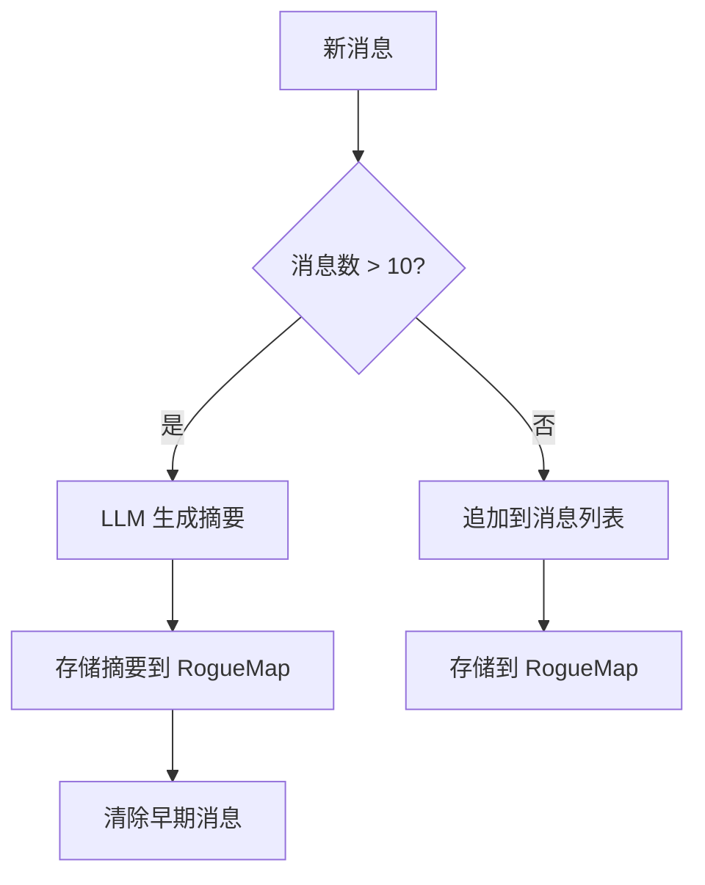
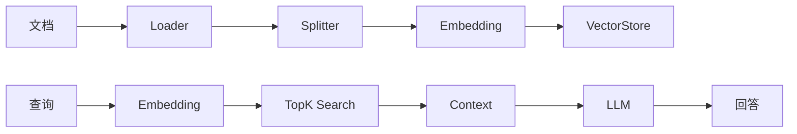

# AI 架构设计

## 1. 概述

AI 架构是 Shiyu AI Platform 的核心能力层，提供 ChatEngine、Agent 框架、Memory、RAG、MCP 工具、LiteFlow 工作流、LangGraph4j 复杂图等能力。

```
AI Architecture
|
+-- ChatEngine         统一对话引擎
+-- ModelAdapter       多模型适配
+-- Agent Framework    Agent框架 (AbstractAgent + 业务Agent)
+-- Memory             会话/摘要/长期记忆
+-- RAG                文档解析/检索/生成
+-- MCP                工具扩展
+-- LiteFlow           声明式流程编排
+-- LangGraph4j        复杂Agent状态机图
+-- Streaming          SSE/WebSocket流式输出
```

## 2. ChatEngine

### 2.1 设计

```java
public interface ChatEngine {

    ChatResponse chat(ChatRequest request);

    Flux<ChatResponse> stream(ChatRequest request);

    ChatResponse chatWithMemory(String sessionId, ChatRequest request);

    Flux<ChatResponse> streamWithMemory(String sessionId, ChatRequest request);
}
```

### 2.2 实现

```java
@Service
public class ChatEngineImpl implements ChatEngine {

    private final ChatClient chatClient;
    private final MemoryService memoryService;

    @Override
    public ChatResponse chat(ChatRequest request) {
        return chatClient.prompt()
            .system(request.getSystemPrompt())
            .user(request.getUserMessage())
            .call()
            .chatResponse();
    }

    @Override
    public Flux<ChatResponse> stream(ChatRequest request) {
        return chatClient.prompt()
            .system(request.getSystemPrompt())
            .user(request.getUserMessage())
            .stream()
            .chatResponse();
    }

    @Override
    public ChatResponse chatWithMemory(String sessionId, ChatRequest request) {
        List<Message> history = memoryService.getHistory(sessionId, 10);
        memoryService.addMessage(sessionId, request.getUserMessage());
        return chatClient.prompt()
            .messages(history)
            .system(request.getSystemPrompt())
            .user(request.getUserMessage())
            .call()
            .chatResponse();
    }
}
```

## 3. ModelAdapter

### 3.1 统一接口

```java
public interface ModelAdapter {

    String provider();

    ChatClient createClient(ModelConfig config);

    EmbeddingModel embeddingModel(ModelConfig config);

    boolean supports(ModelCapability capability);
}
```

### 3.2 适配器实现

```java
// 采用 2 种 Adapter 实现，通过 PlatformConfig + ModelManager 动态注册不同平台:
// 1. GenericPlatformAdapter — 所有兼容 OpenAI API 的平台 (OpenAI/SiliconFlow/OpenRouter/DeepSeek)
// 2. OllamaPlatformAdapter — 本地 Ollama 私有化部署 (Qwen/Llama 等)
//
// GenericPlatformAdapter 构造函数注入平台参数，统一使用 OpenAiChatModel 适配:
public class GenericPlatformAdapter extends AbstractModelAdapter {
    private final String platformType;
    private final String baseUrl;
    private final String apiKey;
    private final String defaultModel;

    public GenericPlatformAdapter(String platformType, String baseUrl, String apiKey, String defaultModel) {
        this.platformType = platformType;
        this.baseUrl = baseUrl;
        this.apiKey = apiKey;
        this.defaultModel = defaultModel;
    }

    @Override
    public ChatModel createChatModel() {
        return OpenAiChatModel.builder()
            .baseUrl(baseUrl)
            .apiKey(apiKey)
            .modelName(defaultModel)
            .build();
    }
}

// 各平台通过 PlatformConfig 配置自动创建 GenericPlatformAdapter 实例，
// 无需为每个平台编写独立的 Adapter 类。
```

### 3.3 模型路由

```java
@Service
public class ModelRouter {

    private final Map<String, ModelAdapter> adapters;

    public ChatClient route(ModelConfig config) {
        ModelAdapter adapter = adapters.get(config.getProvider());
        return adapter.createClient(config);
    }
}
```

## 4. Memory

### 4.1 Memory 类型

```java
public interface MemoryService {
    void addMessage(String sessionId, Message message);
    List<Message> getHistory(String sessionId, int limit);
    String getSummary(String sessionId);
    void summarize(String sessionId);
    StudentMemory getStudentMemory(Long studentId);
    void updateStudentMemory(Long studentId, StudentMemory memory);
}
```

### 4.2 RogueMap Memory 存储

```
memory:session:{sessionId}     -> List<Message>           会话消息
memory:summary:{sessionId}     -> String                  会话摘要
memory:student:{studentId}     -> StudentMemory           学生长期记忆
  {
    "history": [...],
    "preferences": { "style": "visual", "pace": "medium" },
    "ability": { "remember": 80, "understand": 70, ... },
    "recentLearning": [...],
    "weakPoints": [...],
    "strongPoints": [...]
  }
```

### 4.3 记忆策略



## 5. Agent 框架（LangGraph4j 图模式）

### 5.1 架构概览

Agent 引擎采用 LangGraph4j 图编排 + NodeFactory 动态节点创建架构，不再使用 AbstractAgent 继承模式。

```
Agent执行流程:
  AgentController.execute(agentId, input)
    -> AgentService.getOrLoadAgent(agentId)
      -> AgentLoader.loadFromDb()
        -> AgentLoader.buildGraph() // 用 NodeFactory 创建节点
          -> NodeFactory.createNode(config) // 按 NodeType 创建
    -> AgentVersion.getGraph().execute(input)
      -> Graph.compile() -> StateGraphBuilder.build()
        -> LLM: LlmCallNode / EDUCATION_TEACH / EDUCATION_PRACTICE
        -> Intent: IntentNode
        -> RAG: RagRetrievalNode / RagEnhancementNode
        -> Memory: ShortTermMemoryNode / LongTermMemoryNode / MemoryRetrievalNode
        -> Tool: ToolCallNode
        -> Condition: ConditionNode
        -> Transform: TransformNode
        -> AgentCall: AgentCallNode
        -> Education: AbilityQueryNode / PrereqCheckNode / ScoreAnalysisNode / ReviewScheduleNode
      -> AgentState output
```

### 5.2 NodeType 枚举（19种）

| NodeType | 类名 | 用途 |
|----------|------|------|
| DEFAULT | DefaultNode | 通用处理 |
| INTENT | IntentNode | 意图识别 |
| LLM_CALL | LlmCallNode | 大模型调用 |
| RAG_RETRIEVAL | RagRetrievalNode | 知识库检索 |
| RAG_ENHANCEMENT | RagEnhancementNode | 检索增强 |
| MEMORY_SHORT_TERM | ShortTermMemoryNode | 短期记忆 |
| MEMORY_LONG_TERM | LongTermMemoryNode | 长期记忆 |
| MEMORY_RETRIEVAL | MemoryRetrievalNode | 记忆检索 |
| TOOL_CALL | ToolCallNode | 工具调用 |
| CONDITION | ConditionNode | 条件分支 |
| TRANSFORM | TransformNode | 数据转换 |
| OUTPUT_FORMAT | OutputFormatNode | 输出格式化 |
| AGENT_CALL | AgentCallNode | 子Agent调用 |
| ABILITY_QUERY | AbilityQueryNode | 能力值查询 |
| EDUCATION_TEACH | TeachNode | AI讲解 |
| EDUCATION_PRACTICE | PracticeNode | 智能出题 |
| SCORE_ANALYSIS | ScoreAnalysisNode | 评分分析 |
| REVIEW_SCHEDULE | ReviewScheduleNode | 复习安排 |
| PREREQ_CHECK | PrereqCheckNode | 前置知识检查 |

### 5.3 节点输入参数定义

每个节点实现 getRequiredInputs()，标明每个参数的来源和是否必填。
定义自动存入 agent_version.ext_info.requiredInputs，通过 GET /admin/agent/{id} 可查询。

### 5.4 6 个教育 Agent

3个DB图配置（无Java包装类）：tutor-bot(5节点), math-practice-bot(3节点), knowledge-tutor(3节点)
3个Java Service（业务逻辑复杂）：ExamAgent, ReviewAgent, PlannerAgent, ReportAgent

调用方式：POST /api/agent/{agentId}/execute
## 6. LiteFlow 工作流

### 6.1 Chain 定义 (实际实现)

```xml
<!-- 学习流程 (✅ 5/6 组件已实现) -->
<chain name="learningChain">
    THEN(
        checkKnowledgeCmp,
        loadResourceCmp,
        teacherCmp,
        practiceCmp,
        scoreCmp,
        updateMasteryCmp
    );
</chain>

<!-- 复习流程 (⏳ 全部占位) -->
<chain name="reviewChain">
    THEN(
        loadReviewTaskCmp,
        generateReviewQuestionsCmp,
        reviewScoreCmp,
        updateReviewMasteryCmp
    );
</chain>

<!-- 考试流程 (⏳ 全部占位) -->
<chain name="examChain">
    THEN(
        generateExamCmp,
        scoreExamCmp,
        analyzeExamCmp
    );
</chain>
```

> **注：** 设计文档曾规划 6 条链 (recommendChain / tutorChain / abilityChain)，
> 当前实际实现 3 条。复习和考试流程在 agent 层 (ReviewAgent / ExamAgent) 已可用，
> LiteFlow 链为后续补充。

### 6.2 组件实现状态

| 组件 | 所属链 | 状态 | 说明 |
|------|--------|------|------|
| checkKnowledgeCmp | learningChain | ✅ | 检查前置知识，检测缺失知识点 |
| loadResourceCmp | learningChain | ✅ | 加载关联学习资源 |
| teacherCmp | learningChain | ✅ | 调用 ChatEngine 进行 AI 讲解 |
| practiceCmp | learningChain | ✅ | 调用 ChatEngine 生成练习题 |
| scoreCmp | learningChain | ⚠️ | 占位实现，硬编码 60% 准确率 |
| updateMasteryCmp | learningChain | ✅ | 更新 Bloom 能力值 + 安排艾宾浩斯复习 |
| loadReviewTaskCmp | reviewChain | ⏳ | 占位 |
| generateReviewQuestionsCmp | reviewChain | ⏳ | 占位 |
| reviewScoreCmp | reviewChain | ⏳ | 占位 |
| updateReviewMasteryCmp | reviewChain | ⏳ | 占位 |
| generateExamCmp | examChain | ⏳ | 占位 |
| scoreExamCmp | examChain | ⏳ | 占位 |
| analyzeExamCmp | examChain | ⏳ | 占位 |

### 6.3 Component 示例

```java
// UpdateMasteryCmp — 学习完成后更新掌握度并安排复习
@Component("updateMasteryCmp")
public class UpdateMasteryCmp extends NodeComponent {

    private final AbilityService abilityService;
    private final ReviewScheduler reviewScheduler;  // 位于 education 模块

    @Override
    public void process() throws Exception {
        LearningContext ctx = this.getContextBean(LearningContext.class);

        // 1. 更新 Bloom 能力值
        double accuracy = ctx.getPracticeAccuracy();
        abilityService.update(ctx.getStudentId(), ctx.getKnowledgeId(),
                BloomTaxonomy.APPLY, accuracy);
        abilityService.update(ctx.getStudentId(), ctx.getKnowledgeId(),
                BloomTaxonomy.REMEMBER, Math.min(accuracy + 0.2, 1.0));

        // 2. 安排艾宾浩斯复习任务
        List<ReviewScheduler.ReviewTask> reviewTasks = reviewScheduler.scheduleAfterLearning(
                ctx.getStudentId(), ctx.getKnowledgeId(), Instant.now());
        ctx.setReviewDates(reviewTasks.stream()
                .map(ReviewScheduler.ReviewTask::reviewDate)
                .toList());
    }
}
```

## 7. LangGraph4j 复杂 Agent

### 7.1 场景

用户说"我要学习导数"时，需要多步协调：

```
Planner -> Knowledge Search -> Teacher -> Practice -> Review -> Summary
```

### 7.2 State 定义

```java
public class TutorState {
    private Long studentId;
    private Long targetKnowledgeId;
    private LearningPath path;
    private List<AgentResponse> steps;
    private PracticeResult practiceResult;
    private String summary;
}
```

### 7.3 Graph 定义

```java
@Configuration
public class TutorGraphConfig {

    @Bean
    public StateGraph<TutorState> tutorGraph(
            PlannerNode plannerNode,
            KnowledgeSearchNode searchNode,
            TeacherNode teacherNode,
            PracticeNode practiceNode,
            ReviewNode reviewNode) {

        return new StateGraph<>(TutorState.class)
            .addNode("planner", plannerNode::execute)
            .addNode("knowledgeSearch", searchNode::execute)
            .addNode("teacher", teacherNode::execute)
            .addNode("practice", practiceNode::execute)
            .addNode("review", reviewNode::execute)
            .addEdge(START, "planner")
            .addEdge("planner", "knowledgeSearch")
            .addEdge("knowledgeSearch", "teacher")
            .addEdge("teacher", "practice")
            .addConditionalEdges("practice", state ->
                state.getPracticeResult().getScore() < 0.6
                    ? "teacher" : "review")
            .addEdge("review", END);
    }
}
```

### 7.4 Node 实现

```java
@Component
public class PlannerNode {

    @Autowired
    private PlannerAgent plannerAgent;

    public TutorState execute(TutorState state) {
        AgentResponse response = plannerAgent.execute(
            AgentRequest.builder()
                .studentId(state.getStudentId())
                .knowledgeId(state.getTargetKnowledgeId())
                .build());
        state.setPath(response.getLearningPath());
        return state;
    }
}
```

## 8. MCP 工具扩展

### 8.1 工具定义

```java


```

## 9. RAG

### 9.1 流程



### 9.2 配置

```java
@Configuration
public class RagConfig {

    @Bean
    public DocumentLoader documentLoader() {
        return new MultiFormatLoader();
    }

    @Bean
    public DocumentSplitter splitter() {
        return TokenTextSplitter.builder()
            .chunkSize(500)
            .overlap(50)
            .build();
    }

    @Bean
    public VectorStore vectorStore(RogueMap rogueMap, EmbeddingModel model) {
        return new RogueMapVectorStore(rogueMap, model);
    }
}
```

## 10. Streaming 输出

### 10.1 SSE

```java
@RestController
@RequestMapping("/api/ai")
public class AiStreamController {

    @Autowired
    private ChatEngine chatEngine;

    @GetMapping(value = "/chat/stream", produces = MediaType.TEXT_EVENT_STREAM_VALUE)
    public Flux<ServerSentEvent<String>> streamChat(@RequestParam String message) {
        return chatEngine.stream(ChatRequest.of(message))
            .map(r -> ServerSentEvent.builder(r.getContent()).build());
    }
}
```

### 10.2 WebSocket

```java
@Component
public class ChatWebSocketHandler extends TextWebSocketHandler {

    @Autowired
    private ChatEngine chatEngine;

    @Override
    protected void handleTextMessage(WebSocketSession session, TextMessage message) {
        chatEngine.stream(ChatRequest.of(message.getPayload()))
            .subscribe(response -> {
                try {
                    session.sendMessage(new TextMessage(response.getContent()));
                } catch (IOException e) {
                    throw new RuntimeException(e);
                }
            });
    }
}
```


// MCP 工具通过 ToolServiceImpl 统一注册和路由，见 shiyu-ai-mcp 模块
// 当前为开发/测试环境的 In-Memory 模拟实现，内置 5 个示例工具
// （天气查询、计算器、时间日期、随机数、文本统计）

// ToolService 接口定义：
// public interface ToolService {
//     ToolResult execute(String toolName, Map<String, Object> params);
//     List<ToolInfo> listTools();
// }

// 生产环境教育工具通过 Agent 框架的 ToolCallNode 直接路由，无需经过 MCP ToolServiceImpl。
// 工具路由由 agent_version.graph_config 中的工具节点配置定义：
//   searchKnowledge  -> KnowledgeSearchService
//   generateQuestion -> PracticeAgent / PracticeNode
//   teachKnowledge   -> TeacherAgent / TeachNode
//   generateExam     -> ExamAgent
//   getStudentAbility -> AbilityService
//   scheduleReview    -> ReviewScheduler
//   getLearningPath   -> KnowledgePathService
//   generateReport    -> ReportAgent
