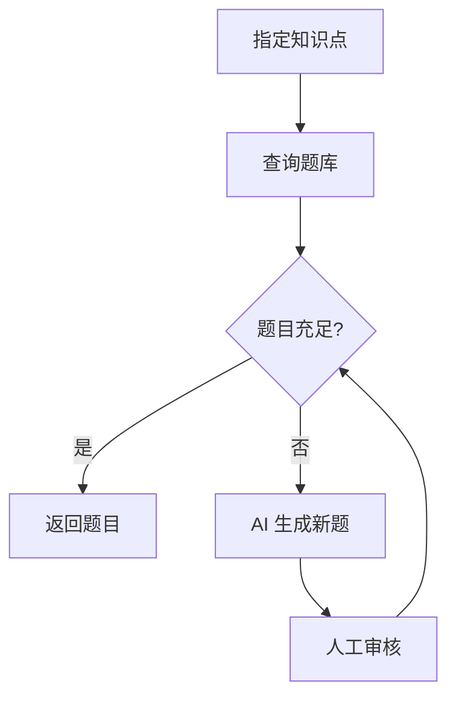
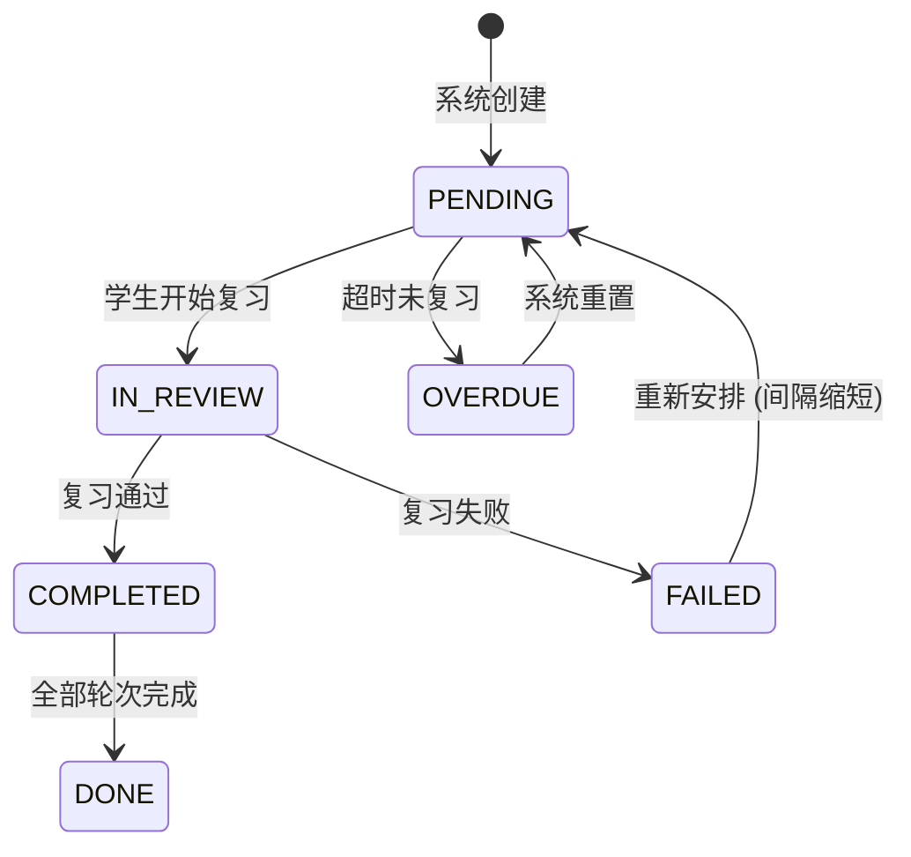

# 教育业务域设计 (Education Domain)

## 1. 概述

教育业务域是 Shiyu AI Platform 的首个业务域，基于知识引擎和 AI 能力层，实现完整的 K12 学习系统。

```
Education Domain
|
+-- Subject           学科
+-- Textbook          教材 (多版本)
+-- Chapter           章节
+-- Course            课程
+-- Question          题库 (基础/提升/竞赛)
+-- Exam              考试
+-- Review            复习 (艾宾浩斯)
+-- StudyPlan         学习计划
+-- Analytics         学习分析
+-- Achievement       成长档案
```

## 2. 学段设计

### 2.1 学段定义

```
学段 (Grade Level)
|
+-- K0 幼儿园
|   +-- 小班 (K0-1)
|   +-- 中班 (K0-2)
|   +-- 大班 (K0-3)
|
+-- K1 小学 (Grade 1-6)
|   +-- 一年级 ... 六年级
|
+-- K2 初中 (Grade 7-9)
|   +-- 七年级 ... 九年级
|
+-- K3 高中 (Grade 10-12)
    +-- 高一 ... 高三
```

### 2.2 各学段学科

**幼儿园**

```
语言表达、数学启蒙、科学探索、艺术创造、社会交往、健康运动
```

**小学**

```
语文、数学、英语、科学、道德与法治、音乐、体育、美术、信息技术
```

**初中**

```
语文、数学、英语、物理、化学、生物、历史、地理、道德与法治、
信息技术、音乐、体育、美术
```

**高中**

```
语文、数学、英语、物理、化学、生物、历史、地理、政治、
信息技术、通用技术、音乐、体育、美术
```

## 3. 教材版本

### 3.1 版本列表

| 版本代码  | 名称       | 覆盖学科                         |
| --------- | ---------- | -------------------------------- |
| PEP       | 人教版     | 全学科                           |
| BNUP      | 北师大版   | 语文、数学、英语等               |
| JSEP      | 苏教版     | 语文、数学等                     |
| SHEP      | 沪教版     | 数学、英语等                     |
| JKP       | 教科版     | 科学等                           |
| XJP       | 湘教版     | 地理等                           |
| FLTRP     | 外研版     | 英语                             |

### 3.2 教材映射

```json
{
  "textbook": {
    "id": "TB-PEP-MATH-9A",
    "name": "数学九年级上册",
    "version": "PEP",
    "subject": "MATH",
    "grade": 9,
    "semester": 1,
    "chapters": [
      {
        "id": "CH-001",
        "name": "第二十一章 一元二次方程",
        "sections": [
          {
            "id": "SEC-001",
            "name": "21.1 一元二次方程",
            "knowledgeIds": ["math_1001", "math_1002"]
          },
          {
            "id": "SEC-002",
            "name": "21.2 解一元二次方程",
            "knowledgeIds": ["math_1003", "math_1004", "math_1005"]
          }
        ]
      }
    ]
  }
}
```

## 4. 课程 (Course)

### 4.1 课程结构

```
Course
|
+-- id                 课程ID
+-- name               课程名称
+-- subject            所属学科
+-- grade              学段年级
+-- textbook           关联教材
+-- teacher            主讲教师
+-- description        课程描述
+-- cover               封面图
+-- totalHours         总课时
+-- chapters[]
    +-- Chapter
        +-- id
        +-- name       章节名称
        +-- order      排序
        +-- sections[]
            +-- Section
                +-- id
                +-- name
                +-- knowledgeIds[]   关联知识点
                +-- resources[]      关联资源
                +-- questions[]      关联题目
```

### 4.2 课程与知识点关系

一个课程可以对应多个知识点，一个知识点可以出现在多个课程/教材中：

```
course_knowledge
|
+-- course_id
+-- knowledge_id
+-- textbook_id
+-- chapter_id
+-- section_id
```

## 5. 题库 (Question)

### 5.1 题目类型

| 类型代码     | 名称     | 说明                   |
| ------------ | -------- | ---------------------- |
| CHOICE       | 选择题   | 单选/多选              |
| FILL         | 填空题   | 填写答案               |
| SOLVE        | 解答题   | 完整解题过程           |
| JUDGE        | 判断题   | 对/错                  |
| ESSAY        | 作文题   | 语文/英语写作          |
| EXPERIMENT   | 实验题   | 物理/化学实验设计      |

### 5.2 题目结构

```json
{
  "id": "Q-00001",
  "type": "CHOICE",
  "subject": "MATH",
  "grade": 9,
  "difficulty": 2,
  "knowledge": ["math_1001", "math_1002"],
  "knowledgeWeights": {
    "math_1001": 0.6,
    "math_1002": 0.4
  },
  "ability": "apply",
  "title": "已知一元二次方程 x² - 5x + 6 = 0，其根为 (  )",
  "options": ["A. x=1 或 x=6", "B. x=2 或 x=3", "C. x=-2 或 x=-3", "D. x=1 或 x=-6"],
  "answer": "B",
  "analysis": "利用因式分解：x² - 5x + 6 = (x-2)(x-3) = 0，所以 x=2 或 x=3",
  "source": "人教版九年级上册 21.2",
  "tags": ["一元二次方程", "因式分解"],
  "createdAt": "2026-01-01"
}
```

### 5.3 题目难度分级

| 级别 | 名称     | 说明                 | 占比建议 |
| ---- | -------- | -------------------- | -------- |
| 1    | 基础题   | 直接套用概念/公式    | 40%      |
| 2    | 提升题   | 需要综合应用         | 40%      |
| 3    | 拔高题   | 需要推理/变通        | 15%      |
| 4    | 竞赛题   | 高难度/创新          | 5%       |

### 5.4 题目与知识点关系

题目可以属于多个知识点（多对多）：

```
question_knowledge
|
+-- question_id
+-- knowledge_id
+-- weight         该知识点在本题中的权重 (0.0 ~ 1.0)
```

示例：

```
二元一次方程 + 函数 + 图像 -> 一道综合题
```

### 5.5 智能出题流程



## 6. 考试 (Exam)

### 6.1 考试类型

| 类型             | 说明                         |
| ---------------- | ---------------------------- |
| DAILY QUIZ       | 课堂小测 (1~5题)             |
| UNIT TEST        | 单元测试                     |
| MIDTERM          | 期中考试                     |
| FINAL            | 期末考试                     |
| MOCK             | 模拟考试 (中考/高考)         |
| AI GENERATED     | AI 智能组卷                  |

### 6.2 试卷结构

```
ExamPaper
|
+-- id
+-- name
+-- type
+-- subject
+-- grade
+-- duration (分钟)
+-- totalScore
+-- sections[]
    +-- ExamSection
        +-- name "选择题"
        +-- scorePerQuestion
        +-- questions[]
```

### 6.3 AI 智能组卷

```java
public ExamPaper generatePaper(ExamConfig config) {
    List<Long> knowledgeIds = config.getKnowledgeIds();
    Map<DifficultyLevel, Integer> distribution = config.getDifficultyDistribution();

    List<Question> selected = new ArrayList<>();

    for (var entry : distribution.entrySet()) {
        List<Question> pool = questionService.findByKnowledgeAndDifficulty(
            knowledgeIds, entry.getKey());
        selected.addAll(selectK(pool, entry.getValue(), knowledgeIds));
    }

    return ExamPaper.builder()
        .sections(buildSections(selected))
        .totalScore(calculateTotal(selected))
        .duration(config.getDuration())
        .build();
}
```

## 7. 复习 (Review)

### 7.1 复习任务生成

基于艾宾浩斯遗忘曲线自动安排：

```java
public class ReviewScheduler {

    private static final int[] INTERVALS = {1, 3, 7, 15, 30, 90};

    public void scheduleAfterLearning(Long studentId, Long knowledgeId) {
        Instant learnedAt = Instant.now();
        for (int i = 0; i < INTERVALS.length; i++) {
            Instant reviewTime = learnedAt.plus(Duration.ofDays(INTERVALS[i]));
            reviewRepository.save(new ReviewTask(
                studentId, knowledgeId, reviewTime, i + 1,
                ReviewStatus.PENDING
            ));
        }
    }

    public List<ReviewTask> getTodayTasks(Long studentId) {
        return reviewRepository.findByStudentAndDate(
            studentId, LocalDate.now());
    }
}
```

### 7.2 复习状态机



## 8. 学习计划 (Study Plan)

### 8.1 计划生成

```java
public StudyPlan generatePlan(StudyPlanRequest request) {
    Long studentId = request.getStudentId();
    Long targetKnowledgeId = request.getTargetKnowledgeId();
    LocalDate startDate = request.getStartDate();
    LocalDate endDate = request.getEndDate();

    StudentProfile profile = studentService.getProfile(studentId);
    List<Long> path = knowledgeEngine.path()
        .generateLearningPath(targetKnowledgeId, profile);

    long days = ChronoUnit.DAYS.between(startDate, endDate);
    int dailyCount = Math.ceilDiv(path.size(), (int) days);

    List<StudyPlanItem> items = new ArrayList<>();
    LocalDate date = startDate;
    for (int i = 0; i < path.size(); i++) {
        items.add(StudyPlanItem.builder()
            .knowledgeId(path.get(i))
            .date(date)
            .order(i + 1)
            .status(PlanStatus.PENDING)
            .build());
        if ((i + 1) % dailyCount == 0) {
            date = date.plusDays(1);
        }
    }

    return StudyPlan.builder()
        .studentId(studentId)
        .targetKnowledgeId(targetKnowledgeId)
        .items(items)
        .build();
}
```

### 8.2 计划调整

每日根据学习情况动态调整：

- 完成当日计划 -> 继续
- 未完成 -> 次日加量
- 掌握速度快 -> 跳过已掌握知识
- 掌握速度慢 -> 增加巩固时间

## 9. 学习分析 (Analytics)

### 9.1 分析维度

| 维度             | 指标                                       |
| ---------------- | ------------------------------------------ |
| 学习时长         | 日均学习时长、周累计                       |
| 知识点覆盖       | 已学/未学/已掌握                           |
| 能力分析         | Bloom 六维度雷达图                         |
| 准确率           | 各学科/各难度/各题型准确率                 |
| 复习效果         | 复习完成率、遗忘率                         |
| 进步趋势         | 周/月掌握知识点数量变化                    |
| 薄弱点           | 错题集中的知识点                           |
| 强项             | 高掌握度的知识点                           |

### 9.2 可视化

```
能力雷达图

         记忆
          |
    创造--+--理解
          |
    评价--+--应用
          |
         分析

掌握度分布
[========75%===>     ] 数学
[====60%==>          ] 物理
[========85%=====>   ] 英语
```

## 10. 成长档案 (Achievement)

### 10.1 档案内容

```json
{
  "studentId": 1,
  "name": "张小明",
  "grade": 9,
  "school": "某某中学",
  "createdAt": "2023-09-01",
  "learningDays": 200,
  "totalKnowledge": 150,
  "masteredKnowledge": 120,
  "totalQuestions": 2000,
  "correctRate": 0.78,
  "totalExams": 50,
  "averageScore": 85,
  "achievements": [
    {
      "type": "STREAK",
      "name": "连续学习30天",
      "date": "2026-03-01",
      "description": "连续30天完成学习计划"
    },
    {
      "type": "MASTERY",
      "name": "数学大师",
      "date": "2026-05-01",
      "description": "掌握九年级数学全部知识点"
    },
    {
      "type": "EXCELLENCE",
      "name": "优秀考生",
      "date": "2026-06-01",
      "description": "期末考试数学95分以上"
    }
  ],
  "weeklyReport": {
    "weeklyStudyHours": 10,
    "newKnowledge": 5,
    "practiceCount": 100,
    "accuracy": 0.82
  }
}
```

### 10.2 成就系统

| 成就类型     | 触发条件                                   |
| ------------ | ------------------------------------------ |
| STREAK       | 连续学习 N 天 (7/15/30/60/90)              |
| MASTERY      | 单学科/全学段知识点全部掌握                |
| EXCELLENCE   | 考试分数达到阈值                           |
| SPEED        | 短时间内完成大量学习                       |
| RECOVERY     | 复习后掌握度大幅提升                       |
| ALL_ROUND    | 多学科均衡发展                             |

## 11. 角色与权限

### 11.1 角色

| 角色             | 权限                                                     |
| ---------------- | -------------------------------------------------------- |
| STUDENT          | 学习、做题、考试、查看报告、与AI对话                     |
| TEACHER          | 管理课程、布置作业、批改、查看学生数据、使用AI           |
| PARENT           | 查看孩子学习报告、查看成长档案                           |
| ADMIN            | 系统管理、题库管理、教材管理、用户管理                   |
| GUEST            | 浏览公开资源                                             |

### 11.2 RBAC 模型

```
Role
  |
  +-- Permission
        |
        +-- Resource (API)
```

```sql
CREATE TABLE sys_role (
    id BIGINT PRIMARY KEY,
    name VARCHAR(50),
    code VARCHAR(50) UNIQUE
);

CREATE TABLE sys_permission (
    id BIGINT PRIMARY KEY,
    name VARCHAR(100),
    code VARCHAR(100) UNIQUE,
    resource_type VARCHAR(20),
    resource_url VARCHAR(200)
);

CREATE TABLE sys_role_permission (
    role_id BIGINT,
    permission_id BIGINT,
    PRIMARY KEY (role_id, permission_id)
);
```


---

> **当前状态（2026-07-02）：** 教育业务域已实现 93%。学科、教材、章节、课程、题库、考试、复习、学习计划、能力值、错题本、学习分析、学习状态机（DB持久化）、课程进度均已实现。缺失：成就系统、智能推荐、部分分析API（能力雷达图、薄弱点分析、趋势分析）。详见 [12-开发进度.md](./12-开发进度.md)
