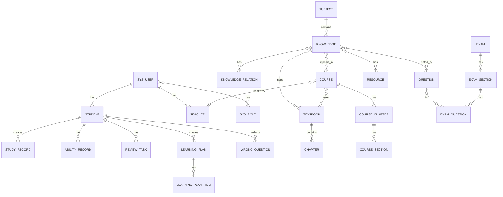

# 数据库设计

## 1. 数据分层策略

```
数据
|
+-- MySQL/SQLite          结构化业务数据 (用户/课程/考试/订单/日志)
|
+-- RogueMap              KV + Embedding + 缓存 + 图谱 + 推荐 + 搜索
    +-- knowledge:{id}                知识点详细
    +-- graph:{id}                    图谱节点 + 邻接表
    +-- vector:{id}                   语义向量
    +-- memory:session:{id}           会话记忆
    +-- memory:student:{id}           学生长期记忆
    +-- progress:student:{sid}:k:{kid} 学习进度
    +-- recommend:user:{uid}          用户推荐向量
    +-- search:term:{term}            倒排索引
    +-- cache:{type}:{id}             缓存
```

## 2. MySQL 表设计

### 2.1 用户与权限

```sql
CREATE TABLE sys_user (
    id           BIGINT PRIMARY KEY AUTO_INCREMENT,
    username     VARCHAR(50) NOT NULL UNIQUE,
    password     VARCHAR(200) NOT NULL,
    nickname     VARCHAR(100),
    email        VARCHAR(100),
    phone        VARCHAR(20),
    avatar       VARCHAR(500),
    status       TINYINT DEFAULT 1 COMMENT '1正常 0禁用',
    created_at   DATETIME DEFAULT CURRENT_TIMESTAMP,
    updated_at   DATETIME DEFAULT CURRENT_TIMESTAMP ON UPDATE CURRENT_TIMESTAMP,
    INDEX idx_username (username),
    INDEX idx_phone (phone)
);

CREATE TABLE sys_role (
    id           BIGINT PRIMARY KEY AUTO_INCREMENT,
    name         VARCHAR(50) NOT NULL,
    code         VARCHAR(50) NOT NULL UNIQUE,
    description  VARCHAR(500),
    created_at   DATETIME DEFAULT CURRENT_TIMESTAMP
);

CREATE TABLE sys_permission (
    id             BIGINT PRIMARY KEY AUTO_INCREMENT,
    name           VARCHAR(100) NOT NULL,
    code           VARCHAR(100) NOT NULL UNIQUE,
    parent_id      BIGINT DEFAULT 0,
    resource_type  VARCHAR(20) COMMENT 'menu/button/api',
    resource_url   VARCHAR(200),
    sort_order     INT DEFAULT 0
);

CREATE TABLE sys_user_role (
    user_id  BIGINT,
    role_id  BIGINT,
    PRIMARY KEY (user_id, role_id)
);

CREATE TABLE sys_role_permission (
    role_id        BIGINT,
    permission_id  BIGINT,
    PRIMARY KEY (role_id, permission_id)
);
```

### 2.2 学生与教师

```sql
CREATE TABLE student (
    id             BIGINT PRIMARY KEY AUTO_INCREMENT,
    user_id        BIGINT NOT NULL,
    student_no     VARCHAR(50) UNIQUE,
    name           VARCHAR(100) NOT NULL,
    gender         TINYINT COMMENT '1男 2女',
    birth_date     DATE,
    grade          INT NOT NULL COMMENT '年级 1~12, K0=0',
    grade_level    VARCHAR(10) COMMENT 'K0/K1/K2/K3',
    school         VARCHAR(200),
    class_name     VARCHAR(50),
    parent_id      BIGINT COMMENT '家长用户ID',
    learning_style VARCHAR(20) COMMENT 'visual/auditory/kinesthetic',
    created_at     DATETIME DEFAULT CURRENT_TIMESTAMP,
    updated_at     DATETIME DEFAULT CURRENT_TIMESTAMP ON UPDATE CURRENT_TIMESTAMP,
    INDEX idx_user (user_id),
    INDEX idx_grade (grade_level, grade),
    INDEX idx_school (school)
);

CREATE TABLE teacher (
    id             BIGINT PRIMARY KEY AUTO_INCREMENT,
    user_id        BIGINT NOT NULL,
    teacher_no     VARCHAR(50) UNIQUE,
    name           VARCHAR(100) NOT NULL,
    subject        VARCHAR(50),
    school         VARCHAR(200),
    title          VARCHAR(100) COMMENT '职称',
    phone          VARCHAR(20),
    created_at     DATETIME DEFAULT CURRENT_TIMESTAMP,
    INDEX idx_user (user_id),
    INDEX idx_subject (subject)
);
```

### 2.3 学段、学科、教材

```sql
CREATE TABLE subject (
    id           BIGINT PRIMARY KEY AUTO_INCREMENT,
    code         VARCHAR(20) NOT NULL UNIQUE,
    name         VARCHAR(50) NOT NULL,
    grade_level  VARCHAR(10) COMMENT '适用学段 K0/K1/K2/K3 或 ALL',
    icon         VARCHAR(200),
    sort_order   INT DEFAULT 0,
    status       TINYINT DEFAULT 1
);

CREATE TABLE textbook (
    id           BIGINT PRIMARY KEY AUTO_INCREMENT,
    code         VARCHAR(50) NOT NULL UNIQUE,
    name         VARCHAR(200) NOT NULL,
    version      VARCHAR(50) NOT NULL COMMENT 'PEP/BNUP/JSEP...',
    subject_code VARCHAR(20) NOT NULL,
    grade        INT NOT NULL,
    semester     TINYINT NOT NULL COMMENT '1上 2下',
    cover        VARCHAR(500),
    cover_url    VARCHAR(500),
    publisher    VARCHAR(100),
    publish_year INT,
    status       TINYINT DEFAULT 1,
    created_at   DATETIME DEFAULT CURRENT_TIMESTAMP,
    INDEX idx_subject (subject_code),
    INDEX idx_version (version),
    INDEX idx_grade (grade, semester)
);

CREATE TABLE chapter (
    id            BIGINT PRIMARY KEY AUTO_INCREMENT,
    textbook_id   BIGINT NOT NULL,
    name          VARCHAR(200) NOT NULL,
    order_no      INT NOT NULL,
    parent_id     BIGINT COMMENT '上级章节ID (章 -> 节)',
    level         TINYINT DEFAULT 1 COMMENT '1章 2节',
    created_at    DATETIME DEFAULT CURRENT_TIMESTAMP,
    INDEX idx_textbook (textbook_id),
    INDEX idx_parent (parent_id)
);
```

### 2.4 知识点

```sql
CREATE TABLE knowledge (
    id              BIGINT PRIMARY KEY AUTO_INCREMENT,
    code            VARCHAR(50) NOT NULL UNIQUE,
    name            VARCHAR(200) NOT NULL,
    subject_code    VARCHAR(20) NOT NULL,
    grade           INT,
    grade_level     VARCHAR(10),
    description     TEXT,
    difficulty      TINYINT COMMENT '1~4',
    estimated_time  INT COMMENT '预估学习时间(分钟)',
    suitable_age    VARCHAR(50) COMMENT '适合年龄范围 例如 12-14',
    status          TINYINT DEFAULT 1,
    created_at      DATETIME DEFAULT CURRENT_TIMESTAMP,
    updated_at      DATETIME DEFAULT CURRENT_TIMESTAMP ON UPDATE CURRENT_TIMESTAMP,
    INDEX idx_subject (subject_code),
    INDEX idx_grade (grade_level, grade),
    INDEX idx_code (code)
);

CREATE TABLE knowledge_relation (
    id            BIGINT PRIMARY KEY AUTO_INCREMENT,
    source_id     BIGINT NOT NULL COMMENT '源知识点ID',
    target_id     BIGINT NOT NULL COMMENT '目标知识点ID',
    relation_type VARCHAR(20) NOT NULL COMMENT 'PRE/NEXT/INCLUDE/RELATED/SIMILAR/BELONG',
    weight        DECIMAL(3,2) DEFAULT 1.0,
    created_at    DATETIME DEFAULT CURRENT_TIMESTAMP,
    INDEX idx_source (source_id),
    INDEX idx_target (target_id),
    INDEX idx_type (relation_type),
    UNIQUE INDEX uk_source_target_type (source_id, target_id, relation_type)
);

CREATE TABLE knowledge_textbook (
    knowledge_id BIGINT NOT NULL,
    textbook_id  BIGINT NOT NULL,
    chapter_id   BIGINT,
    sort_order   INT DEFAULT 0,
    PRIMARY KEY (knowledge_id, textbook_id)
);
```

### 2.5 课程

```sql
CREATE TABLE course (
    id            BIGINT PRIMARY KEY AUTO_INCREMENT,
    name          VARCHAR(200) NOT NULL,
    description   TEXT,
    subject_code  VARCHAR(20) NOT NULL,
    grade         INT,
    textbook_id   BIGINT,
    teacher_id    BIGINT,
    cover_url     VARCHAR(500),
    total_hours   INT COMMENT '总课时',
    status        TINYINT DEFAULT 1 COMMENT '0草稿 1发布 2下架',
    view_count    BIGINT DEFAULT 0,
    created_at    DATETIME DEFAULT CURRENT_TIMESTAMP,
    updated_at    DATETIME DEFAULT CURRENT_TIMESTAMP ON UPDATE CURRENT_TIMESTAMP,
    INDEX idx_subject (subject_code),
    INDEX idx_teacher (teacher_id),
    INDEX idx_textbook (textbook_id)
);

CREATE TABLE course_chapter (
    id          BIGINT PRIMARY KEY AUTO_INCREMENT,
    course_id   BIGINT NOT NULL,
    name        VARCHAR(200) NOT NULL,
    order_no    INT NOT NULL,
    created_at  DATETIME DEFAULT CURRENT_TIMESTAMP,
    INDEX idx_course (course_id)
);

CREATE TABLE course_section (
    id             BIGINT PRIMARY KEY AUTO_INCREMENT,
    chapter_id     BIGINT NOT NULL,
    name           VARCHAR(200) NOT NULL,
    order_no       INT NOT NULL,
    content_url    VARCHAR(500),
    video_url      VARCHAR(500),
    duration_min   INT COMMENT '时长(分钟)',
    created_at     DATETIME DEFAULT CURRENT_TIMESTAMP,
    INDEX idx_chapter (chapter_id)
);

CREATE TABLE course_knowledge (
    course_id     BIGINT NOT NULL,
    knowledge_id  BIGINT NOT NULL,
    section_id    BIGINT,
    sort_order    INT DEFAULT 0,
    PRIMARY KEY (course_id, knowledge_id),
    INDEX idx_knowledge (knowledge_id)
);
```

### 2.6 学习资源

```sql
CREATE TABLE resource (
    id             BIGINT PRIMARY KEY AUTO_INCREMENT,
    name           VARCHAR(200) NOT NULL,
    type           VARCHAR(20) NOT NULL COMMENT 'VIDEO/PDF/PPT/IMAGE/AUDIO/ANIMATION/QUIZ/EXPERIMENT/GAME',
    url            VARCHAR(500) NOT NULL,
    size_bytes     BIGINT,
    duration_sec   INT COMMENT '视频/音频时长(秒)',
    subject_code   VARCHAR(20),
    grade          INT,
    difficulty     TINYINT,
    cover_url      VARCHAR(500),
    description    TEXT,
    status         TINYINT DEFAULT 1,
    view_count     BIGINT DEFAULT 0,
    created_at     DATETIME DEFAULT CURRENT_TIMESTAMP,
    INDEX idx_subject (subject_code),
    INDEX idx_type (type)
);

CREATE TABLE resource_knowledge (
    resource_id   BIGINT NOT NULL,
    knowledge_id  BIGINT NOT NULL,
    sort_order    INT DEFAULT 0,
    PRIMARY KEY (resource_id, knowledge_id)
);
```

### 2.7 题库

```sql
CREATE TABLE question (
    id             BIGINT PRIMARY KEY AUTO_INCREMENT,
    code           VARCHAR(50) UNIQUE,
    type           VARCHAR(20) NOT NULL COMMENT 'CHOICE/FILL/SOLVE/JUDGE/ESSAY/EXPERIMENT',
    subject_code   VARCHAR(20) NOT NULL,
    grade          INT,
    difficulty     TINYINT NOT NULL COMMENT '1基础 2提升 3拔高 4竞赛',
    ability        VARCHAR(20) COMMENT 'remember/understand/apply/analyze/evaluate/create',
    title          TEXT NOT NULL,
    options        JSON COMMENT '选项 JSON 数组',
    answer         TEXT NOT NULL,
    analysi s       TEXT,
    source         VARCHAR(200),
    tags           JSON COMMENT '标签数组',
    status         TINYINT DEFAULT 1,
    used_count     BIGINT DEFAULT 0,
    created_at     DATETIME DEFAULT CURRENT_TIMESTAMP,
    updated_at     DATETIME DEFAULT CURRENT_TIMESTAMP ON UPDATE CURRENT_TIMESTAMP,
    INDEX idx_subject (subject_code),
    INDEX idx_grade_diff (grade, difficulty),
    INDEX idx_type (type)
);

CREATE TABLE question_knowledge (
    question_id   BIGINT NOT NULL,
    knowledge_id  BIGINT NOT NULL,
    weight        DECIMAL(3,2) DEFAULT 1.0 COMMENT '该知识点在本题中的权重',
    PRIMARY KEY (question_id, knowledge_id),
    INDEX idx_knowledge (knowledge_id)
);
```

### 2.8 考试

```sql
CREATE TABLE exam (
    id             BIGINT PRIMARY KEY AUTO_INCREMENT,
    name           VARCHAR(200) NOT NULL,
    type           VARCHAR(20) NOT NULL COMMENT 'DAILY_QUIZ/UNIT_TEST/MIDTERM/FINAL/MOCK/AI_GENERATED',
    subject_code   VARCHAR(20) NOT NULL,
    grade          INT NOT NULL,
    duration_min   INT NOT NULL COMMENT '考试时长(分钟)',
    total_score    INT NOT NULL,
    status         TINYINT DEFAULT 0 COMMENT '0草稿 1进行中 2已结束',
    teacher_id     BIGINT,
    start_time     DATETIME,
    end_time       DATETIME,
    created_at     DATETIME DEFAULT CURRENT_TIMESTAMP,
    INDEX idx_subject_grade (subject_code, grade),
    INDEX idx_status (status)
);

CREATE TABLE exam_section (
    id              BIGINT PRIMARY KEY AUTO_INCREMENT,
    exam_id         BIGINT NOT NULL,
    name            VARCHAR(100) NOT NULL,
    order_no        INT NOT NULL,
    score_per_q     DECIMAL(5,2) NOT NULL,
    created_at      DATETIME DEFAULT CURRENT_TIMESTAMP,
    INDEX idx_exam (exam_id)
);

CREATE TABLE exam_question (
    id             BIGINT PRIMARY KEY AUTO_INCREMENT,
    exam_id        BIGINT NOT NULL,
    section_id     BIGINT NOT NULL,
    question_id    BIGINT NOT NULL,
    order_no       INT NOT NULL,
    score          DECIMAL(5,2),
    INDEX idx_exam (exam_id),
    INDEX idx_question (question_id)
);
```

### 2.9 学习记录

```sql
CREATE TABLE study_record (
    id             BIGINT PRIMARY KEY AUTO_INCREMENT,
    student_id     BIGINT NOT NULL,
    knowledge_id   BIGINT NOT NULL,
    record_type    VARCHAR(20) NOT NULL COMMENT 'LEARN/PRACTICE/REVIEW/EXAM',
    course_id      BIGINT,
    question_id    BIGINT,
    exam_id        BIGINT,
    score          DECIMAL(5,2),
    accuracy       DECIMAL(5,4),
    duration_sec   INT COMMENT '学习时长(秒)',
    status         VARCHAR(20),
    note           TEXT,
    created_at     DATETIME DEFAULT CURRENT_TIMESTAMP,
    INDEX idx_student (student_id),
    INDEX idx_knowledge (knowledge_id),
    INDEX idx_student_date (student_id, created_at),
    INDEX idx_type (record_type)
);

CREATE TABLE ability_record (
    id             BIGINT PRIMARY KEY AUTO_INCREMENT,
    student_id     BIGINT NOT NULL,
    knowledge_id   BIGINT NOT NULL,
    remember       DECIMAL(5,2) DEFAULT 0,
    understand     DECIMAL(5,2) DEFAULT 0,
    apply_score    DECIMAL(5,2) DEFAULT 0,
    analyze_score  DECIMAL(5,2) DEFAULT 0,
    evaluate       DECIMAL(5,2) DEFAULT 0,
    create_score   DECIMAL(5,2) DEFAULT 0,
    overall        DECIMAL(5,2) DEFAULT 0,
    review_round   INT DEFAULT 0,
    last_study_at  DATETIME,
    updated_at     DATETIME DEFAULT CURRENT_TIMESTAMP ON UPDATE CURRENT_TIMESTAMP,
    UNIQUE INDEX uk_student_knowledge (student_id, knowledge_id),
    INDEX idx_student (student_id)
);

CREATE TABLE review_task (
    id              BIGINT PRIMARY KEY AUTO_INCREMENT,
    student_id      BIGINT NOT NULL,
    knowledge_id    BIGINT NOT NULL,
    review_time     DATETIME NOT NULL,
    round_no        INT NOT NULL COMMENT '第几次复习 1~6',
    status          VARCHAR(20) DEFAULT 'PENDING' COMMENT 'PENDING/IN_REVIEW/COMPLETED/FAILED/OVERDUE',
    result_score    DECIMAL(5,2),
    completed_at    DATETIME,
    created_at      DATETIME DEFAULT CURRENT_TIMESTAMP,
    INDEX idx_student_date (student_id, review_time),
    INDEX idx_status (status)
);

CREATE TABLE learning_plan (
    id              BIGINT PRIMARY KEY AUTO_INCREMENT,
    student_id      BIGINT NOT NULL,
    target_knowledge_id BIGINT,
    name            VARCHAR(200),
    start_date      DATE,
    end_date        DATE,
    status          VARCHAR(20) DEFAULT 'ACTIVE' COMMENT 'ACTIVE/COMPLETED/ABANDONED',
    created_at      DATETIME DEFAULT CURRENT_TIMESTAMP,
    INDEX idx_student (student_id)
);

CREATE TABLE learning_plan_item (
    id              BIGINT PRIMARY KEY AUTO_INCREMENT,
    plan_id         BIGINT NOT NULL,
    knowledge_id    BIGINT NOT NULL,
    plan_date       DATE NOT NULL,
    order_no        INT NOT NULL,
    status          VARCHAR(20) DEFAULT 'PENDING' COMMENT 'PENDING/IN_PROGRESS/COMPLETED/SKIPPED',
    completed_at    DATETIME,
    INDEX idx_plan (plan_id),
    INDEX idx_date (plan_date)
);
```

### 2.10 错题本

```sql
CREATE TABLE wrong_question (
    id            BIGINT PRIMARY KEY AUTO_INCREMENT,
    student_id    BIGINT NOT NULL,
    question_id   BIGINT NOT NULL,
    knowledge_id  BIGINT,
    student_answer TEXT,
    correct_times INT DEFAULT 0 COMMENT '连续做对次数',
    created_at    DATETIME DEFAULT CURRENT_TIMESTAMP,
    updated_at    DATETIME DEFAULT CURRENT_TIMESTAMP ON UPDATE CURRENT_TIMESTAMP,
    UNIQUE INDEX uk_student_question (student_id, question_id),
    INDEX idx_student_knowledge (student_id, knowledge_id)
);
```

### 2.11 操作日志

```sql
CREATE TABLE sys_log (
    id            BIGINT PRIMARY KEY AUTO_INCREMENT,
    user_id       BIGINT,
    operation     VARCHAR(100),
    method        VARCHAR(20),
    url           VARCHAR(500),
    ip            VARCHAR(50),
    request_data  TEXT,
    response_data TEXT,
    status        TINYINT,
    duration_ms   BIGINT,
    created_at    DATETIME DEFAULT CURRENT_TIMESTAMP,
    INDEX idx_user (user_id),
    INDEX idx_time (created_at)
);
```

## 3. RogueMap Key 规范

### 3.1 Key 命名规范

```
{namespace}:{sub-namespace}:{id}:{suffix}
```

| Key                                | 说明                   |
| ---------------------------------- | ---------------------- |
| `knowledge:{id}`                   | 知识点详细信息         |
| `graph:{id}`                       | 图谱节点 + 邻接关系    |
| `vector:{id}`                      | 语义向量               |
| `memory:session:{sessionId}`       | 会话消息历史           |
| `memory:summary:{sessionId}`       | 会话摘要               |
| `memory:student:{studentId}`       | 学生长期记忆           |
| `progress:{studentId}:{knowledgeId}` | 学习进度             |
| `recommend:user:{userId}`          | 用户推荐向量           |
| `search:term:{term}`               | 倒排索引 posting list  |
| `search:doc:{docId}`               | 文档原始内容           |
| `cache:course:{courseId}`          | 课程缓存               |
| `cache:question:{questionId}`      | 题目缓存               |
| `ttl:session:{sessionId}`          | TTL 控制               |

### 3.2 数据格式示例

**图谱节点：**

```json
// key: graph:1001
{
  "id": 1001,
  "name": "绝对值",
  "subject": "MATH",
  "grade": 7,
  "parents": [1000, 999],
  "children": [1002],
  "related": [1003],
  "edges": [
    {"target": 1000, "type": "PRE"},
    {"target": 1002, "type": "NEXT"},
    {"target": 1003, "type": "SIMILAR"}
  ]
}
```

**学习进度：**

```json
// key: progress:1:1001
{
  "studentId": 1,
  "knowledgeId": 1001,
  "status": "MASTERED",
  "mastery": 85,
  "abilities": {
    "remember": 95,
    "understand": 90,
    "apply": 75,
    "analyze": 60,
    "evaluate": 40,
    "create": 20
  },
  "reviewRound": 3,
  "lastStudyAt": "2026-06-27T10:00:00Z"
}
```

**倒排索引：**

```json
// key: search:term:二次
[1001, 1002, 1003, 2010, 2011]

// key: search:term:函数
[1001, 1002, 1003, 2001, 2002, 2003, 2004]
```

**学生长期记忆：**

```json
// key: memory:student:1
{
  "studentId": 1,
  "history": [...],
  "preferences": {
    "learningStyle": "visual",
    "difficultyPreference": 2,
    "preferredTime": "evening"
  },
  "ability": {
    "Math": {"remember": 85, "understand": 80, "apply": 70},
    "Physics": {"remember": 75, "understand": 65, "apply": 55}
  },
  "recentLearning": [
    {"knowledgeId": 1001, "date": "2026-06-26"},
    {"knowledgeId": 1002, "date": "2026-06-27"}
  ],
  "weakPoints": [1005, 1020, 1030],
  "strongPoints": [1001, 1002, 1003]
}
```

## 4. ER 图 (Mermaid)




---

> **当前状态（2026-07-02）：** 全部 51 张表的 DDL 在 `db/migration/ddl/` 目录下，按依赖顺序编号，每张表前有 DROP TABLE IF EXISTS。种子数据在 `db/migration/data/` 目录下。详见 [01-总体架构.md](./01-总体架构.md#5-db-初始化流程)。
