# ShiYu AI 企业级 AI 平台架构设计

> **Architecture Design Document (ADD)**  
> **Version:** 2.1  
> **Date:** 2026-07-10  
> **Status:** ✅ Phase 1 Complete

---

## 目录

- [第一章 项目背景与目标](#第一章-项目背景与目标)
- [第二章 总体架构设计](#第二章-总体架构设计)
- [第三章 设计原则](#第三章-设计原则)
- [第四章 技术选型分析](#第四章-技术选型分析)
- [第五章 当前架构问题分析](#第五章-当前架构问题分析)
- [第六章 目标模块架构](#第六章-目标模块架构)
- [第七章 DDD 领域模型](#第七章-ddd-领域模型)
- [第八章 Agent Runtime](#第八章-agent-runtime)
- [第九章 Workflow Engine](#第九章-workflow-engine)
- [第十章 Memory Center](#第十章-memory-center)
- [第十一章 Knowledge & RAG](#第十一章-knowledge--rag)
- [第十二章 VectorStore SPI](#第十二章-vectorstore-spi)
- [第十三章 Model Provider SPI](#第十三章-model-provider-spi)
- [第十四章 Tool & MCP](#第十四章-tool--mcp)
- [第十五章 Usage Center](#第十五章-usage-center)
- [第十六章 Observability](#第十六章-observability)
- [第十七章 数据库设计](#第十七章-数据库设计)
- [第十八章 安全与权限](#第十八章-安全与权限)
- [第十九章 部署架构](#第十九章-部署架构)
- [第二十章 RoadMap](#第二十章-roadmap)

---

## 第一章 项目背景与目标

### 1.1 项目定位

**ShiYu AI（拾羽 AI）** 是一个面向 AI 教育场景的企业级智能平台，旨在提供：

- 多模型接入的统一 AI 对话能力
- 可视化 Agent 编排与执行
- 知识库管理与 RAG 检索增强
- 教育领域智能辅导与评估

### 1.2 项目现状

#### 1.2.1 技术栈概览

| 维度 | 技术 | 版本 |
|------|------|------|
| 语言 | Java | 21 |
| 框架 | Spring Boot | 4.1.0 |
| AI 框架 | Spring AI / LangChain4j | 2.0.0 / 1.16.3 |
| Agent 引擎 | LangGraph4j | 1.8.19 |
| 工作流 | LiteFlow | 2.16.0 |
| 认证 | Sa-Token | 1.45.0 |
| ORM | MyBatis-Flex | 1.11.7 |
| 数据库 | H2（开发）/ MySQL（生产） | 2.4.240 / 9.4.0 |
| 向量检索 | JVector（HNSW） | 4.0.0-beta.6 |
| 嵌入模型 | BGE-small-zh（ONNX） | 本地 |
| 缓存 | Caffeine | 3.2.3 |
| API 文档 | SpringDoc + Knife4j | 3.0.2 / 4.5.0 |
| 可观测性 | OpenTelemetry + Micrometer | 已配置 |

#### 1.2.2 模块结构现状

```
shiyu-ai/
├── shiyu-common/           # 公共基础（6个子模块）
├── shiyu-ai-dal/           # 数据访问层
├── shiyu-ai-model/         # 模型适配 + 对话引擎 + 弹性策略 [NEW]
├── shiyu-ai-memory/        # 五层记忆管理 [NEW]
├── shiyu-ai-tool/          # 工具服务 + MCP 工具市场 [NEW]
├── shiyu-ai-vector/        # VectorStore SPI [NEW]
├── shiyu-ai-knowledge/     # 知识库与 RAG
├── shiyu-ai-agent/         # Agent 编排 + Runtime + 事件中心
├── shiyu-ai-usage/         # 用量统计中心 [NEW]
├── shiyu-ai-plugin/        # 插件系统（V3）[NEW]
├── shiyu-ai-education/     # 教育领域
├── shiyu-ai-auth/          # 认证授权
├── shiyu-ai-record/        # 记录管理
└── shiyu-ai-bootstrap/     # 启动模块
```

#### 1.2.3 数据规模

| 指标 | 数量 |
|------|------|
| Maven 模块 | 9 个 |
| 数据库表 | 50+ 张 |
| Java 类 | 500+ 个 |
| 前端页面 | 17 个视图模块 |

### 1.3 项目目标

#### 1.3.1 短期目标（V1-V2）

1. **完善 Agent Runtime**：支持暂停/恢复、检查点、执行历史
2. **构建 Memory 体系**：五层记忆（短期/工作/长期/语义/情景）
3. **抽象 VectorStore SPI**：支持 H2+HNSW、PGVector、Qdrant
4. **建立 Usage Center**：Token/Cost/Latency 多维统计

#### 1.3.2 中期目标（V3-V4）

1. **Plugin 系统**：支持第三方扩展热加载
2. **MCP 市场**：工具服务注册与发现
3. **多租户增强**：租户隔离与资源配额
4. **可观测性完善**：Trace/Metrics/Audit 全链路

#### 1.3.3 长期目标（V5+）

1. **企业版特性**：SSO、审计合规、数据脱敏
2. **分布式部署**：Kubernetes 原生支持
3. **边缘推理**：本地模型部署优化

### 1.4 约束条件

| 约束 | 说明 |
|------|------|
| 开发阶段 | 项目处于开发中，非生产环境 |
| 外部依赖 | 不引入 Redis 等外部中间件（开发阶段） |
| 数据库 | H2 开发环境优先，支持 MySQL/PostgreSQL 生产 |
| 兼容性 | JDK 21+，Spring Boot 4.x |

---

## 第二章 总体架构设计

### 2.1 逻辑架构

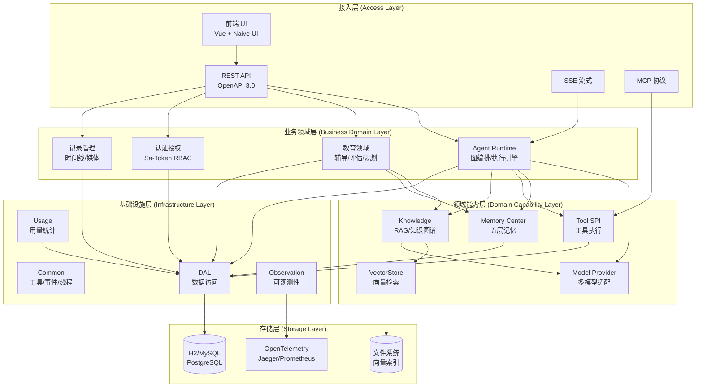
```mermaid
graph TB
    subgraph "接入层 (Access Layer)"
        UI[前端 UI<br/>Vue + Naive UI]
        API[REST API<br/>OpenAPI 3.0]
        SSE[SSE 流式]
        MCP[MCP 协议]
    end

    subgraph "业务领域层 (Business Domain Layer)"
        AGENT[Agent Runtime<br/>图编排/执行引擎]
        EDU[教育领域<br/>辅导/评估/规划]
        AUTH[认证授权<br/>Sa-Token RBAC]
        RECORD[记录管理<br/>时间线/媒体]
    end

    subgraph "领域能力层 (Domain Capability Layer)"
        MODEL[Model Provider<br/>多模型适配]
        MEMORY[Memory Center<br/>五层记忆]
        TOOL[Tool SPI<br/>工具执行]
        VECTOR[VectorStore<br/>向量检索]
        KNOWLEDGE[Knowledge<br/>RAG/知识图谱]
    end

    subgraph "基础设施层 (Infrastructure Layer)"
        COMMON[Common<br/>工具/事件/线程]
        DAL[DAL<br/>数据访问]
        OBS[Observation<br/>可观测性]
        USAGE[Usage<br/>用量统计]
    end

    subgraph "存储层 (Storage Layer)"
        DB[(H2/MySQL<br/>PostgreSQL)]
        FILE[(文件系统<br/>向量索引)]
        OTel[OpenTelemetry<br/>Jaeger/Prometheus]
    end

    UI --> API
    API --> AGENT
    API --> EDU
    API --> AUTH
    API --> RECORD
    SSE --> AGENT
    MCP --> TOOL

    AGENT --> MODEL
    AGENT --> MEMORY
    AGENT --> TOOL
    AGENT --> KNOWLEDGE
    
    EDU --> KNOWLEDGE
    EDU --> MEMORY
    
    KNOWLEDGE --> VECTOR
    KNOWLEDGE --> MODEL
    
    MEMORY --> DAL
    TOOL --> DAL
    
    AGENT --> DAL
    EDU --> DAL
    AUTH --> DAL
    RECORD --> DAL
    
    DAL --> DB
    VECTOR --> FILE
    OBS --> OTel
    USAGE --> DAL
```

### 2.2 分层职责

| 层级 | 职责 | 模块 |
|------|------|------|
| **接入层** | HTTP/SSE/MCP 协议处理，请求路由 | shiyu-ai-bootstrap, shiyu-common-web |
| **业务领域层** | 业务逻辑编排，领域规则 | shiyu-ai-agent, shiyu-ai-education, shiyu-ai-auth, shiyu-ai-record |
| **领域能力层** | 可复用的 AI 能力 | shiyu-ai-model, shiyu-ai-memory, shiyu-ai-tool, shiyu-ai-vector, shiyu-ai-knowledge |
| **基础设施层** | 通用工具、数据访问、可观测性 | shiyu-common-*, shiyu-ai-dal, shiyu-ai-observation, shiyu-ai-usage |
| **存储层** | 数据持久化 | H2/MySQL/PostgreSQL, 文件系统, OTel 后端 |

### 2.3 模块依赖关系

```mermaid
graph LR
    BOOT[bootstrap] --> AGENT
    BOOT --> EDU[education]
    BOOT --> AUTH[auth]
    BOOT --> RECORD[record]
    BOOT --> USAGE[usage]
    BOOT --> PLUGIN[plugin]

    AGENT --> KNOWLEDGE[knowledge]
    AGENT --> MODEL[model]
    AGENT --> DAL[dal]

    AGENT -.-> MEMORY[memory]
    AGENT -.-> TOOL[tool]
    AGENT -.-> USAGE[usage]

    KNOWLEDGE --> VECTOR[vector]
    KNOWLEDGE --> MODEL
    KNOWLEDGE --> DAL

    MODEL --> DAL
    
    note right of AGENT : memory+tool+usage 已内聚到 agent 模块

    EDU --> KNOWLEDGE
    EDU --> DAL

    AUTH --> DAL
    RECORD --> DAL
    USAGE --> DAL

    DAL --> COMMON[common]
    AGENT --> COMMON
    KNOWLEDGE --> COMMON
```

### 2.4 核心数据流

#### 2.4.1 Agent 执行流程

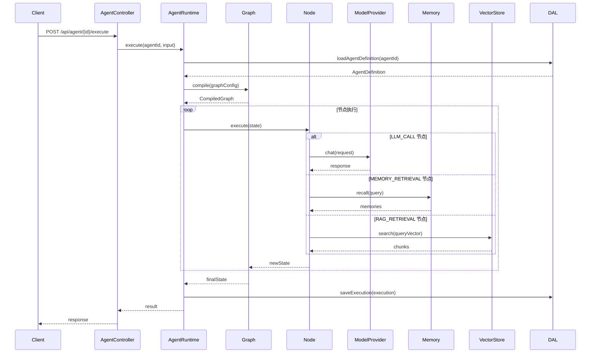
```mermaid
sequenceDiagram
    participant Client
    participant AgentController
    participant AgentRuntime
    participant Graph
    participant Node
    participant ModelProvider
    participant Memory
    participant VectorStore
    participant DAL

    Client->>AgentController: POST /api/agent/{id}/execute
    AgentController->>AgentRuntime: execute(agentId, input)
    AgentRuntime->>DAL: loadAgentDefinition(agentId)
    DAL-->>AgentRuntime: AgentDefinition
    
    AgentRuntime->>Graph: compile(graphConfig)
    Graph-->>AgentRuntime: CompiledGraph
    
    loop 节点执行
        AgentRuntime->>Node: execute(state)
        
        alt LLM_CALL 节点
            Node->>ModelProvider: chat(request)
            ModelProvider-->>Node: response
        else MEMORY_RETRIEVAL 节点
            Node->>Memory: recall(query)
            Memory-->>Node: memories
        else RAG_RETRIEVAL 节点
            Node->>VectorStore: search(queryVector)
            VectorStore-->>Node: chunks
        end
        
        Node-->>Graph: newState
    end
    
    Graph-->>AgentRuntime: finalState
    AgentRuntime->>DAL: saveExecution(execution)
    AgentRuntime-->>AgentController: result
    AgentController-->>Client: response
```

#### 2.4.2 RAG 检索流程

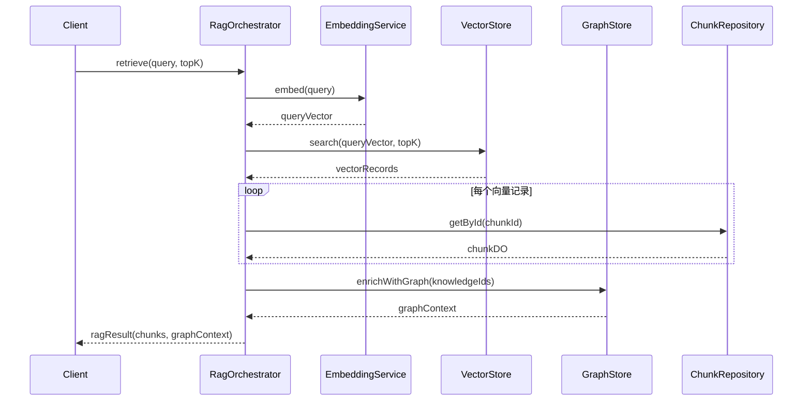
```mermaid
sequenceDiagram
    participant Client
    participant RagOrchestrator
    participant EmbeddingService
    participant VectorStore
    participant GraphStore
    participant ChunkRepository

    Client->>RagOrchestrator: retrieve(query, topK)
    RagOrchestrator->>EmbeddingService: embed(query)
    EmbeddingService-->>RagOrchestrator: queryVector
    
    RagOrchestrator->>VectorStore: search(queryVector, topK)
    VectorStore-->>RagOrchestrator: vectorRecords
    
    loop 每个向量记录
        RagOrchestrator->>ChunkRepository: getById(chunkId)
        ChunkRepository-->>RagOrchestrator: chunkDO
    end
    
    RagOrchestrator->>GraphStore: enrichWithGraph(knowledgeIds)
    GraphStore-->>RagOrchestrator: graphContext
    
    RagOrchestrator-->>Client: ragResult(chunks, graphContext)
```

### 2.5 部署架构

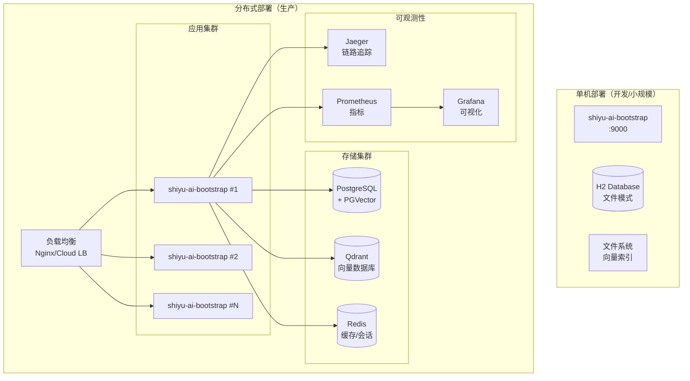
```mermaid
graph TB
    subgraph "单机部署（开发/小规模）"
        APP[shiyu-ai-bootstrap<br/>:9000]
        H2[(H2 Database<br/>文件模式)]
        FS[文件系统<br/>向量索引]
    end

    subgraph "分布式部署（生产）"
        LB[负载均衡<br/>Nginx/Cloud LB]
        
        subgraph "应用集群"
            APP1[shiyu-ai-bootstrap #1]
            APP2[shiyu-ai-bootstrap #2]
            APP3[shiyu-ai-bootstrap #N]
        end
        
        subgraph "存储集群"
            PG[(PostgreSQL<br/>+ PGVector)]
            QDRANT[(Qdrant<br/>向量数据库)]
            REDIS[(Redis<br/>缓存/会话)]
        end
        
        subgraph "可观测性"
            JAEGER[Jaeger<br/>链路追踪]
            PROM[Prometheus<br/>指标]
            GRAFANA[Grafana<br/>可视化]
        end
        
        LB --> APP1
        LB --> APP2
        LB --> APP3
        
        APP1 --> PG
        APP1 --> QDRANT
        APP1 --> REDIS
        
        APP1 --> JAEGER
        APP1 --> PROM
        PROM --> GRAFANA
    end
```

---

## 第三章 设计原则

### 3.1 核心原则

| 原则 | 说明 | 实践 |
|------|------|------|
| **SPI-First** | 关键能力通过 SPI 接口抽象 | VectorStore、MemoryStore、ToolExecutor、ModelAdapter |
| **DDD 分层** | 领域驱动设计，清晰分层 | DO/BO/VO 分离，Repository 模式 |
| **事件驱动** | 模块间通过事件解耦 | DomainEvent、Spring Event、EventBus |
| **约定优于配置** | 合理默认值，减少配置 | 默认平台、默认模型、默认线程池 |
| **渐进式复杂度** | 简单场景简单实现，复杂场景可扩展 | H2 → PostgreSQL，内存 → 分布式缓存 |

### 3.2 SOLID 原则应用

#### 3.2.1 单一职责原则 (SRP)

**问题**：当前 `shiyu-ai-core` 模块职责过重，同时承担：
- 模型适配（ModelManager、ModelAdapter）
- 对话引擎（ChatEngine）
- 记忆管理（MemoryService）
- 工具服务（ToolService）
- 嵌入服务（EmbeddingService）

**重构方案**：拆分为独立模块

```
shiyu-ai-core/  （已移除 ✅）
├── 拆出 → shiyu-ai-model/       # 模型适配 + ChatEngine
├── 拆出 → shiyu-ai-memory/      # 记忆管理
├── 拆出 → shiyu-ai-tool/        # 工具服务
└── ChatEngine → shiyu-ai-model/chat/  # 对话引擎
```

#### 3.2.2 开闭原则 (OCP)

**问题**：`NodeFactory.createNodeWithDependencies()` 使用大型 switch 表达式，新增节点类型需修改源码。

```java
// 当前实现（违反 OCP）
private BaseNode createNodeWithDependencies(NodeType type, NodeConfig config) {
    return switch (type) {
        case INTENT -> new IntentNode(...);
        case LLM_CALL -> new LlmCallNode(...);
        case TOOL_CALL -> new ToolCallNode(...);
        // 新增节点类型必须修改此处
    };
}
```

**重构方案**：注册式工厂 + Spring 自动发现

```java
// 重构后（符合 OCP）
@Component
public class NodeFactory {
    private final Map<NodeType, NodeCreator> creators = new ConcurrentHashMap<>();
    
    @Autowired
    public void registerCreators(List<NodeCreator> creatorList) {
        creatorList.forEach(c -> creators.put(c.getType(), c));
    }
    
    public BaseNode createNode(NodeType type, NodeConfig config) {
        NodeCreator creator = creators.get(type);
        if (creator == null) {
            throw new IllegalArgumentException("Unknown node type: " + type);
        }
        return creator.create(config);
    }
}

// 新增节点只需实现 Creator
@Component
public class CustomNodeCreator implements NodeCreator {
    @Override
    public NodeType getType() { return NodeType.CUSTOM; }
    
    @Override
    public BaseNode create(NodeConfig config) {
        return new CustomNode(config);
    }
}
```

#### 3.2.3 依赖倒置原则 (DIP)

**问题**：`shiyu-ai-knowledge` 直接依赖 JVector 实现，无法切换到其他向量数据库。

```java
// 当前实现（违反 DIP）
public class HnswVectorStore implements VectorStore {
    private GraphIndexBuilder builder;  // 直接依赖 JVector
    private OnHeapGraphIndex graphIndex;
}
```

**重构方案**：SPI 接口 + 多实现

```java
// SPI 接口（在 shiyu-ai-vector 模块）
public interface VectorStore {
    void upsert(VectorRecord record);
    List<VectorRecord> search(float[] queryVector, int topK);
    void delete(String id);
}

// 实现 1：JVector（开发环境）
public class JVectorStore implements VectorStore { ... }

// 实现 2：PGVector（生产环境）
public class PgVectorStore implements VectorStore { ... }

// 实现 3：Qdrant（大规模）
public class QdrantVectorStore implements VectorStore { ... }

// 工厂 + 配置
@Configuration
public class VectorStoreAutoConfiguration {
    @Bean
    @ConditionalOnProperty(name = "shiyu.vector.type", havingValue = "jvector")
    public VectorStore jVectorStore() { return new JVectorStore(); }
    
    @Bean
    @ConditionalOnProperty(name = "shiyu.vector.type", havingValue = "pgvector")
    public VectorStore pgVectorStore() { return new PgVectorStore(); }
}
```

### 3.3 事件驱动设计

#### 3.3.1 事件定义

```java
// 基础事件
public abstract class DomainEvent {
    private final String eventId = UUID.randomUUID().toString();
    private final Instant occurredAt = Instant.now();
    private final String eventType;
}

// Agent 执行事件
public class AgentExecutionStartedEvent extends DomainEvent {
    private final String executionId;
    private final String agentId;
    private final Map<String, Object> input;
}

public class AgentExecutionCompletedEvent extends DomainEvent {
    private final String executionId;
    private final Map<String, Object> output;
    private final long durationMs;
}

public class AgentExecutionFailedEvent extends DomainEvent {
    private final String executionId;
    private final Throwable error;
}

// 模型调用事件
public class ModelCallEvent extends DomainEvent {
    private final String platform;
    private final String model;
    private final int promptTokens;
    private final int completionTokens;
    private final long latencyMs;
}

// 记忆事件
public class MemorySavedEvent extends DomainEvent {
    private final String sessionId;
    private final MemoryType type;
    private final String content;
}
```

#### 3.3.2 事件发布与订阅

```java
// 事件发布器
@Component
public class EventPublisher {
    private final ApplicationEventPublisher springEventPublisher;
    
    public void publish(DomainEvent event) {
        springEventPublisher.publishEvent(event);
    }
}

// 事件订阅（Spring 方式）
@Component
public class UsageEventListener {
    
    @EventListener
    @Async
    public void onModelCall(ModelCallEvent event) {
        // 记录 Token 用量
        usageCollector.recordTokenUsage(
            event.getPlatform(),
            event.getModel(),
            event.getPromptTokens(),
            event.getCompletionTokens()
        );
    }
    
    @EventListener
    @Async
    public void onAgentExecutionCompleted(AgentExecutionCompletedEvent event) {
        // 记录执行成功
        auditService.log("AGENT_EXECUTE", event.getExecutionId());
    }
}
```

### 3.4 分层规范

#### 3.4.1 数据对象分层

```
┌─────────────────────────────────────────────────────────┐
│  Controller 层                                          │
│  ├── Request（入参 DTO）                                │
│  └── VO（出参视图对象）                                 │
├─────────────────────────────────────────────────────────┤
│  Service 层                                             │
│  └── BO（业务对象，可组合多个 DO）                      │
├─────────────────────────────────────────────────────────┤
│  Repository 层                                          │
│  ├── BO（对外返回）                                     │
│  └── DO（内部使用，映射数据库行）                       │
├─────────────────────────────────────────────────────────┤
│  Mapper 层                                              │
│  └── DO（纯数据库映射）                                 │
└─────────────────────────────────────────────────────────┘
```

#### 3.4.2 BO 归属规范

**调整**：BO 应收归到 `dal.bo.{domain}/` 下，与 `repository.{domain}/` 对应。

```
com.shiyu.ai.dal/
├── dataobject/                    # DO：数据库行映射
│   ├── auth/UserDO.java
│   └── agent/AgentDefDO.java
│
├── bo/                            # BO：Repository 对外暴露
│   ├── auth/
│   │   ├── UserBO.java            # 可能组合 UserDO + RoleDO
│   │   └── RoleBO.java
│   └── agent/
│       └── AgentDefBO.java
│
├── mapper/                        # MyBatis Mapper
│   └── auth/UserMapper.java
│
└── repository/                    # Repository：返回 BO
    └── auth/
        └── UserRepository.java    # 返回 UserBO
```

**理由**：
- BO 是 Repository 的返回值，与 Repository 一对一绑定
- 上层 Service 只依赖 `repository` 和 `bo`，不直接接触 DO/mapper
- 避免 BO 散落在各业务模块顶层包

---

## 第四章 技术选型分析

### 4.1 技术栈评估

| 技术 | 评分 | 评价 | 建议 |
|------|------|------|------|
| **Java 21** | 10/10 | 虚拟线程、Record、Pattern Matching | 保持 |
| **Spring Boot 4.1** | 9/10 | 最新稳定版，GraalVM 支持 | 保持 |
| **Spring AI 2.0** | 7/10 | 官方支持，但 API 变动频繁 | 谨慎使用，封装适配层 |
| **LangChain4j** | 8/10 | 功能完善，社区活跃 | 保持 |
| **LangGraph4j** | 8/10 | 图编排能力强 | 保持，但需补充 Runtime |
| **LiteFlow** | 7/10 | 规则引擎成熟 | 用于工作流编排 |
| **Sa-Token** | 8/10 | 轻量级，功能全面 | 保持 |
| **MyBatis-Flex** | 8/10 | 比 MyBatis-Plus 更灵活 | 保持 |
| **H2** | 7/10 | 开发友好，生产不推荐 | 开发环境保持 |
| **JVector** | 8/10 | 纯 Java HNSW，无原生依赖 | 开发保持，生产建议 PGVector |
| **Caffeine** | 9/10 | 高性能本地缓存 | 保持 |

### 4.2 关键技术决策

#### 4.2.1 为什么选择 LangGraph4j 而非 Spring AI 原生？

| 维度 | LangGraph4j | Spring AI |
|------|-------------|-----------|
| 图编排 | 原生支持状态图 | 需自行实现 |
| 节点类型 | 可扩展 | 固定 |
| 条件分支 | 原生支持 | 需自行实现 |
| 流式执行 | 支持 | 支持 |
| 检查点 | 需自行实现 | 需自行实现 |
| 社区 | 较小但专注 | 大但分散 |

**结论**：LangGraph4j 更适合复杂 Agent 编排场景。

#### 4.2.2 为什么选择 JVector 而非 Milvus？

| 维度 | JVector | Milvus |
|------|---------|--------|
| 部署 | 纯 Java，无外部依赖 | 需独立部署 |
| 开发体验 | 开箱即用 | 需配置 |
| 性能 | 中等（单机） | 高（分布式） |
| 规模 | 百万级 | 十亿级 |
| 生产就绪 | 否 | 是 |

**结论**：
- 开发阶段：JVector（简单、快速）
- 生产阶段：PGVector（与 PostgreSQL 集成）或 Qdrant（大规模）

#### 4.2.3 为什么选择 Sa-Token 而非 Spring Security？

| 维度 | Sa-Token | Spring Security |
|------|----------|-----------------|
| 学习曲线 | 低 | 高 |
| 功能 | 全面（RBAC、OAuth2、SSO） | 全面 |
| 配置复杂度 | 低 | 高 |
| 文档 | 中文友好 | 英文为主 |
| 社区 | 国内活跃 | 国际主流 |

**结论**：Sa-Token 更适合国内项目，开发效率高。

### 4.3 待引入技术

| 技术 | 用途 | 优先级 |
|------|------|--------|
| **Resilience4j** | 熔断、限流、降级 | P1 |
| **MapStruct** | 对象映射（已引入，需规范使用） | P2 |
| **Flyway** | 数据库迁移 | P1 |
| **Testcontainers** | 集成测试 | P2 |

### 4.4 不推荐引入的技术

| 技术 | 原因 |
|------|------|
| **Redis** | 开发阶段不需要，Caffeine 足够 |
| **Kafka** | 事件量不大，Spring Event 足够 |
| **Elasticsearch** | 向量检索用 PGVector，全文检索暂不需要 |
| **gRPC** | REST + SSE 已满足需求 |

---

## 第五章 当前架构问题分析

### 5.1 问题分级

| 级别 | 定义 | 数量 |
|------|------|------|
| **P0** | 阻断性问题，必须立即修复 | 5 |
| **P1** | 重要问题，影响扩展性 | 8 |
| **P2** | 优化项，提升代码质量 | 12 |

### 5.2 P0 问题

#### 5.2.1 Core 模块职责过重

**问题描述**：`shiyu-ai-core` 同时承担模型适配、对话引擎、记忆管理、工具服务、嵌入服务等多项职责。

**影响**：
- 模块边界模糊，依赖关系复杂
- 难以独立测试和替换
- 循环依赖风险高

**代码定位**：
```
shiyu-ai-core/src/main/java/com/shiyu/ai/core/
├── ChatEngine.java              # 对话引擎
├── langchain4j/
│   ├── ModelAdapter.java        # 模型适配
│   ├── ModelManager.java        # 模型管理
│   └── impl/
├── memory/
│   ├── MemoryService.java       # 记忆服务
│   └── impl/MemoryServiceImpl.java
├── mcp/
│   ├── ToolService.java         # 工具服务
│   └── impl/ToolServiceImpl.java
└── embedding/
    ├── EmbeddingService.java    # 嵌入服务
    └── impl/LangChain4jEmbeddingService.java
```

**重构方案**：拆分为 4 个独立模块

```
shiyu-ai-model/       # 模型适配（ModelAdapter、ModelManager）
shiyu-ai-memory/      # 记忆管理（MemoryService）
shiyu-ai-tool/        # 工具服务（ToolService、MCP）
shiyu-ai-vector/      # 向量检索（从 knowledge 拆出）
```

#### 5.2.2 Agent Runtime 不完整

**问题描述**：当前 Agent 执行缺少生命周期管理、检查点、暂停/恢复等核心能力。

**代码定位**：
- `AgentService.execute()` 直接调用 `Graph.execute()`，无中间状态管理
- `BaseNode.apply()` 有重试和超时，但无检查点
- 执行历史仅记录开始/结束，无中间节点状态

**缺失能力**：
- 暂停/恢复（Pause/Resume）
- 检查点（Checkpoint）
- 执行状态机（State Machine）
- 超时控制（全局超时）
- 补偿机制（Compensation）

**重构方案**：见第八章 Agent Runtime 详细设计。

#### 5.2.3 Memory 体系太薄

**问题描述**：当前仅有短期记忆（对话历史）和长期记忆（持久化），缺少工作记忆、语义记忆、情景记忆。

**代码定位**：
```java
// MemoryServiceImpl.java
public class MemoryServiceImpl implements MemoryService {
    // 仅支持：
    // - saveMessage()：短期记忆
    // - saveLongTermMemory()：长期记忆
    // - searchLongTermMemory()：关键词搜索
}
```

**缺失能力**：
- 工作记忆（Agent 执行上下文）
- 语义记忆（向量检索）
- 情景记忆（任务经历）
- 记忆压缩（摘要、合并）
- 记忆召回策略（相似度、重要性）

**重构方案**：见第十章 Memory Center 详细设计。

#### 5.2.4 VectorStore 与 JVector 耦合

**问题描述**：`HnswVectorStore` 直接依赖 JVector API，无法切换到其他向量数据库。

**代码定位**：
```java
// HnswVectorStore.java
import io.github.jbellis.jvector.graph.GraphIndexBuilder;
import io.github.jbellis.jvector.graph.OnHeapGraphIndex;

public class HnswVectorStore implements VectorStore {
    private GraphIndexBuilder builder;  // 直接依赖 JVector
}
```

**影响**：
- 无法切换到 PGVector、Qdrant 等生产级向量数据库
- 测试困难（需 mock JVector）

**重构方案**：见第十二章 VectorStore SPI 详细设计。

#### 5.2.5 缺少 Usage Center

**问题描述**：无 Token 用量统计、成本计算、配额管理。

**影响**：
- 无法监控模型调用成本
- 无法实施配额限制
- 无法按租户/用户计费

**重构方案**：见第十五章 Usage Center 详细设计。

### 5.3 P1 问题

#### 5.3.1 NodeFactory 违反开闭原则

**问题描述**：`NodeFactory.createNodeWithDependencies()` 使用大型 switch 表达式。

**代码定位**：
```java
// NodeFactory.java:320-380
private BaseNode createNodeWithDependencies(NodeType type, NodeConfig config) {
    return switch (type) {
        case INTENT -> new IntentNode(config, intentService);
        case LLM_CALL -> new LlmCallNode(config, chatEngine, modelManager);
        case TOOL_CALL -> new ToolCallNode(config, toolService);
        case RAG_RETRIEVAL -> new RagRetrievalNode(config, ragService);
        // ... 8 种类型
    };
}
```

**影响**：新增节点类型必须修改此方法，违反开闭原则。

**重构方案**：注册式工厂，见第三章 3.2.2。

#### 5.3.2 事件中心缺失

**问题描述**：仅有 `DomainEvent` 抽象类，无事件发布/订阅机制。

**代码定位**：
```java
// DomainEvent.java
public abstract class DomainEvent {
    private final String eventId = UUID.randomUUID().toString();
    private final Instant occurredAt = Instant.now();
}
// 无 EventPublisher、无 EventListener
```

**影响**：
- 模块间耦合度高
- 无法轻松添加审计、监控、通知等功能

**重构方案**：见第三章 3.3 事件驱动设计。

#### 5.3.3 可观测性未集成

**问题描述**：已配置 OpenTelemetry 和 Micrometer，但未实际集成到业务代码。

**代码定位**：
```yaml
# shiyu-common.yml
management:
  tracing:
    sampling:
      probability: 1.0
  metrics:
    tags:
      application: ${spring.application.name}
```

**影响**：
- 无法追踪 Agent 执行链路
- 无法监控模型调用延迟
- 无法审计用户操作

**重构方案**：见第十六章 Observability 详细设计。

#### 5.3.4 BO 归属混乱

**问题描述**：BO 散落在各业务模块顶层包，未统一归到 DAL 模块。

**代码定位**：
```
shiyu-ai-dal/src/main/java/
├── com/shiyu/ai/auth/bo/UserBO.java           # auth 模块的 BO
├── com/shiyu/ai/aiagent/bo/AgentDefBO.java    # agent 模块的 BO
├── com/shiyu/ai/record/bo/RecordBO.java       # record 模块的 BO
└── com/shiyu/ai/model/bo/AiPlatformBO.java    # model 模块的 BO
```

**影响**：
- 包结构不统一
- DAL 模块边界模糊

**重构方案**：见第三章 3.4.2 BO 归属规范。

#### 5.3.5 缺少数据库迁移工具

**问题描述**：DDL 脚本手动管理，无版本控制。

**代码定位**：
```
shiyu-ai-dal/src/main/resources/db/migration/ddl/
├── 01__schema_common.sql
├── 02__schema_auth.sql
├── 03__schema_agent.sql
└── ...
```

**影响**：
- 多环境部署时容易遗漏
- 无法自动回滚

**重构方案**：引入 Flyway。

### 5.4 P2 问题

| 问题 | 描述 | 建议 |
|------|------|------|
| 日志脱敏 | `CaptchaServiceImpl` 记录验证码明文 | 移除验证码内容 |
| Token 安全 | Sa-Token 格式暴露 userId | 改为纯随机 Token |
| 反序列化风险 | `SaTokenDaoImpl` 使用 Java 原生序列化 | 改用 JSON |
| 默认密码共享 | `PasswordUtils.DEFAULT_PASSWORD` 全局共享 | 每次生成独立密码 |
| MySQL 坐标 | `mysql-connector-java` 已重命名 | 改为 `mysql-connector-j` |
| XSS 验证器 | 未使用 Jsoup 净化 | 升级验证逻辑 |
| 线程池配置 | 部分池未配置拒绝策略 | 统一配置 CallerRunsPolicy |
| 缓存过期 | Caffeine 缓存与 Token 过期不同步 | 对齐过期时间 |
| 限流单机 | `LoginRateLimiter` 仅单机有效 | 多实例需 Redis |
| 验证码清理 | Map 无定期清理 | 添加 ScheduledTask |
| 异常处理 | 部分 Service 吞掉异常 | 统一异常传播 |
| 测试覆盖 | 无单元测试 | 补充核心逻辑测试 |

### 5.5 问题汇总

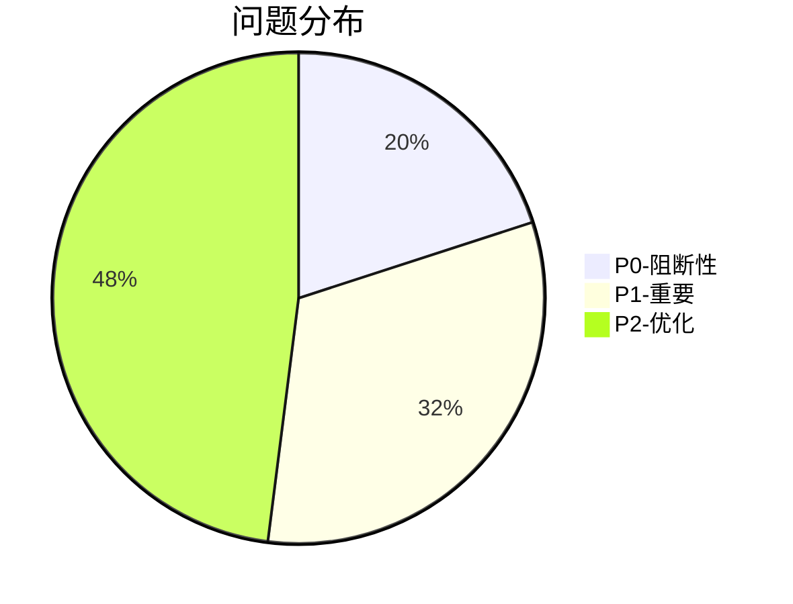
```mermaid
pie title 问题分布
    "P0-阻断性" : 5
    "P1-重要" : 8
    "P2-优化" : 12
```

| 模块 | P0 | P1 | P2 |
|------|----|----|-----|
| shiyu-ai-core | 3 | 2 | 3 |
| shiyu-ai-agent | 1 | 2 | 2 |
| shiyu-ai-knowledge | 1 | 0 | 1 |
| shiyu-ai-auth | 0 | 1 | 4 |
| shiyu-common | 0 | 2 | 2 |
| 全局 | 0 | 1 | 0 |

---

## 第六章 目标模块架构

### 6.1 目标目录结构

```
shiyu-ai/
│
├── pom.xml                                          # 父POM
│
│  ══════════════════════════════════════════════════
│  第一层：基础设施层 (Infrastructure)
│  ══════════════════════════════════════════════════
│
├── shiyu-common/                                    # 公共基础（保持现有）
│   ├── shiyu-common-bom/                            # BOM版本管理
│   ├── shiyu-common-core/                           # Result、异常、工具类、事件
│   │   └── src/main/java/com/shiyu/ai/common/core/
│   │       ├── api/                                 # Result, PageQuery, PageData
│   │       ├── config/                              # ShiYuProperties, AsyncConfig
│   │       ├── domain/                              # BaseEntity, LoginUser
│   │       ├── enums/                               # 业务枚举
│   │       ├── exception/                           # 异常体系
│   │       ├── event/                               # EventBus, DomainEvent, EventPublisher
│   │       ├── tx/                                  # 事务钩子
│   │       └── utils/                               # 工具类
│   ├── shiyu-common-web/                            # XSS、OpenAPI、Filter
│   ├── shiyu-common-mybatis/                        # MyBatis-Flex封装
│   ├── shiyu-common-thread/                         # 线程池、虚拟线程、OTel
│   └── shiyu-common-excel/                          # Excel导入导出
│
├── shiyu-ai-dal/                                    # 数据访问层
│   └── src/main/java/com/shiyu/ai/dal/
│       ├── config/                                  # DalConfig, TenantConfig
│       ├── dataobject/                              # DO对象（按领域分包）
│       │   ├── agent/                               # AgentDefDO, AgentVersionDO...
│       │   ├── auth/                                # UserDO, RoleDO, TenantDO...
│       │   ├── education/                           # StudentDO, ExamDO, AbilityDO...
│       │   ├── knowledge/                           # KnowledgeDO, KnowledgeChunkDO...
│       │   ├── memory/                              # ConversationMessageDO, LongTermMemoryDO
│       │   ├── model/                               # AiPlatformDO, AiModelDO
│       │   ├── record/                              # RecordDO, ProfileDO, MediaDO
│       │   └── usage/                               # UsageRecordDO, TokenUsageDO, CostRecordDO
│       ├── bo/                                      # BO对象（收归此处）
│       │   ├── agent/                               # AgentDefBO, AgentVersionBO
│       │   ├── auth/                                # UserBO, RoleBO, TenantBO
│       │   ├── education/                           # StudentBO, AbilityBO
│       │   ├── knowledge/                           # KnowledgeBO
│       │   ├── memory/                              # ConversationMessageBO, LongTermMemoryBO
│       │   ├── model/                               # AiPlatformBO, AiModelBO
│       │   ├── record/                              # RecordBO, ProfileBO
│       │   └── usage/                               # UsageRecordBO
│       ├── mapper/                                  # MyBatis Mapper接口
│       └── repository/                              # Repository实现（返回BO）
│
│  ══════════════════════════════════════════════════
│  第二层：领域能力层 (Domain Capabilities)
│  ══════════════════════════════════════════════════
│
├── shiyu-ai-model/                                  # 新增：Model Provider SPI
│   └── src/main/java/com/shiyu/ai/model/
│       ├── spi/                                     # ModelProviderSpi接口
│       │   ├── ChatModelProvider.java
│       │   ├── EmbeddingModelProvider.java
│       │   ├── ImageModelProvider.java
│       │   ├── AudioModelProvider.java
│       │   └── RerankModelProvider.java
│       ├── adapter/                                 # 适配器实现
│       │   ├── AbstractModelAdapter.java
│       │   ├── GenericPlatformAdapter.java
│       │   └── OllamaPlatformAdapter.java
│       ├── registry/                                # ModelRegistry
│       │   ├── ModelRegistry.java
│       │   └── ModelRegistryImpl.java
│       ├── resilience/                              # 弹性策略
│       │   ├── FallbackStrategy.java
│       │   ├── CircuitBreaker.java
│       │   ├── RateLimiter.java
│       │   └── LoadBalancer.java
│       ├── config/
│       └── embedding/                               # EmbeddingService
│           ├── EmbeddingService.java
│           └── impl/LangChain4jEmbeddingService.java
│
├── shiyu-ai-memory/                                 # 新增：Memory Center
│   └── src/main/java/com/shiyu/ai/memory/
│       ├── spi/                                     # MemorySpi
│       │   ├── MemoryStore.java
│       │   └── MemoryCodec.java
│       ├── shortterm/                               # 短期记忆
│       ├── working/                                 # 工作记忆
│       ├── longterm/                                # 长期记忆
│       ├── semantic/                                # 语义记忆
│       ├── episodic/                                # 情景记忆
│       ├── compressor/                              # 记忆压缩
│       ├── recall/                                  # 记忆召回
│       ├── merge/                                   # 记忆合并
│       └── config/
│
├── shiyu-ai-tool/                                   # 新增：Tool SPI
│   └── src/main/java/com/shiyu/ai/tool/
│       ├── spi/                                     # ToolSpi
│       │   ├── ToolExecutor.java
│       │   ├── ToolDefinition.java
│       │   └── ToolResult.java
│       ├── registry/                                # 工具注册中心
│       ├── builtin/                                 # 内置工具
│       ├── mcp/                                     # MCP工具
│       ├── remote/                                  # 远程工具
│       ├── permission/                              # 工具权限
│       └── config/
│
├── shiyu-ai-vector/                                 # 新增：VectorStore SPI
│   └── src/main/java/com/shiyu/ai/vector/
│       ├── spi/                                     # VectorStoreSpi
│       │   ├── VectorStore.java
│       │   ├── VectorRecord.java
│       │   └── VectorSearchRequest.java
│       ├── impl/
│       │   ├── hnsw/                                # HNSW实现
│       │   ├── jvector/                             # JVector实现
│       │   ├── pgvector/                            # PGVector实现
│       │   ├── qdrant/                              # Qdrant实现
│       │   └── memory/                              # 内存实现
│       ├── factory/                                 # VectorStoreFactory
│       ├── index/                                   # 索引管理
│       └── config/
│
│  ══════════════════════════════════════════════════
│  第三层：业务领域层 (Business Domains)
│  ══════════════════════════════════════════════════
│
├── shiyu-ai-agent/                                  # Agent Runtime（重构）
│   └── src/main/java/com/shiyu/ai/agent/
│       ├── runtime/                                 # 运行时核心
│       │   ├── AgentRuntime.java
│       │   ├── AgentExecutor.java
│       │   ├── AgentScheduler.java
│       │   └── AgentWorker.java
│       ├── execution/                               # 执行管理
│       │   ├── Execution.java
│       │   ├── ExecutionStatus.java
│       │   ├── ExecutionRepository.java
│       │   └── ExecutionHistoryService.java
│       ├── checkpoint/                              # 检查点
│       │   ├── Checkpoint.java
│       │   ├── CheckpointStore.java
│       │   ├── DbCheckpointStore.java
│       │   └── CheckpointManager.java
│       ├── lifecycle/                               # 生命周期
│       │   ├── AgentLifecycle.java
│       │   ├── AgentStateMachine.java
│       │   └── AgentState.java
│       ├── graph/                                   # 图编排
│       │   ├── Graph.java
│       │   ├── StateGraphBuilder.java
│       │   ├── ConditionEdge.java
│       │   └── SubGraph.java
│       ├── node/                                    # 节点
│       │   ├── BaseNode.java
│       │   ├── NodeFactory.java
│       │   ├── NodeConfig.java
│       │   ├── NodeOutput.java
│       │   ├── agent/
│       │   ├── condition/
│       │   ├── intent/
│       │   ├── llm/
│       │   ├── memory/
│       │   ├── rag/
│       │   ├── tool/
│       │   ├── transform/
│       │   └── output/
│       ├── builder/                                 # Agent构建器
│       ├── cache/                                   # Agent缓存
│       ├── definition/                              # Agent定义
│       ├── retry/                                   # 重试策略
│       ├── timeout/                                 # 超时管理
│       ├── compensation/                            # 补偿机制
│       ├── education/                               # 教育Agent
│       ├── workflow/                                # LiteFlow工作流
│       ├── controller/
│       ├── service/
│       ├── request/
│       └── vo/
│
├── shiyu-ai-knowledge/                              # Knowledge & RAG（重构）
│   └── src/main/java/com/shiyu/ai/knowledge/
│       ├── document/                                # 文档管理
│       │   ├── Document.java
│       │   ├── DocumentLoader.java
│       │   ├── DocumentParser.java
│       │   ├── PdfDocumentParser.java
│       │   ├── WordDocumentParser.java
│       │   └── MarkdownDocumentParser.java
│       ├── chunk/                                   # 分块
│       │   ├── ChunkSplitter.java
│       │   ├── ChineseChunkSplitter.java
│       │   ├── TokenChunkSplitter.java
│       │   └── SemanticChunkSplitter.java
│       ├── ingestion/                               # 文档入库流程
│       │   ├── DocumentIngestionPipeline.java
│       │   ├── IngestionStep.java
│       │   └── IngestionContext.java
│       ├── rag/                                     # RAG编排
│       │   ├── RagOrchestrator.java
│       │   ├── retriever/
│       │   │   ├── Retriever.java
│       │   │   ├── VectorRetriever.java
│       │   │   ├── GraphRetriever.java
│       │   │   └── HybridRetriever.java
│       │   ├── reranker/
│       │   │   ├── Reranker.java
│       │   │   └── LlmReranker.java
│       │   └── enhancer/
│       │       ├── RagEnhancer.java
│       │       └── ContextWindowEnhancer.java
│       ├── graph/                                   # 知识图谱
│       ├── search/                                  # 搜索
│       ├── path/                                    # 学习路径
│       ├── service/
│       ├── controller/
│       └── config/
│
├── shiyu-ai-education/                              # 教育领域（保持现有）
├── shiyu-ai-auth/                                   # 认证授权（保持现有）
├── shiyu-ai-record/                                 # 记录管理（保持现有）
│
│  ══════════════════════════════════════════════════
│  第四层：平台服务层 (Platform Services)
│  ══════════════════════════════════════════════════
│
├── shiyu-ai-usage/                                  # 新增：Usage Center
│   └── src/main/java/com/shiyu/ai/usage/
│       ├── collector/                               # 用量采集
│       │   ├── UsageCollector.java
│       │   ├── TokenUsageCollector.java
│       │   ├── ToolUsageCollector.java
│       │   └── EmbeddingUsageCollector.java
│       ├── statistics/                              # 统计
│       │   ├── UsageStatisticsService.java
│       │   ├── UsageDimension.java
│       │   └── UsageAggregator.java
│       ├── cost/                                    # 成本计算
│       │   ├── CostCalculator.java
│       │   ├── ModelPricing.java
│       │   └── CostReport.java
│       ├── quota/                                   # 配额管理
│       │   ├── QuotaManager.java
│       │   ├── QuotaPolicy.java
│       │   └── QuotaChecker.java
│       ├── controller/
│       ├── service/
│       └── config/
│
├── shiyu-ai-observation/                            # 新增：Observability
│   └── src/main/java/com/shiyu/ai/observation/
│       ├── trace/                                   # → OTel → Jaeger（不存DB）
│       │   ├── TraceContext.java
│       │   └── SpanFactory.java
│       ├── metrics/                                 # → Micrometer → Prometheus（不存DB）
│       │   ├── AgentMetrics.java
│       │   ├── ModelMetrics.java
│       │   ├── KnowledgeMetrics.java
│       │   └── MemoryMetrics.java
│       ├── audit/                                   # 存DB（合规需要）
│       │   ├── AuditLog.java
│       │   ├── AuditEvent.java
│       │   └── AuditService.java
│       ├── timeline/                                # 存DB（用户可查看）
│       │   ├── ExecutionTimeline.java
│       │   └── TimelineService.java
│       └── config/
│
│  ══════════════════════════════════════════════════
│  第五层：启动层 (Bootstrap)
│  ══════════════════════════════════════════════════
│
├── shiyu-ai-bootstrap/                              # 启动模块
│   └── src/main/java/com/shiyu/ai/bootstrap/
│       ├── ShiyuBootstrapApplication.java
│       └── config/
│
└── shiyu-ui/                                        # 前端
    ├── apps/
    └── packages/
```

### 6.2 模块职责说明

| 模块 | 职责 | 依赖 |
|------|------|------|
| **shiyu-common** | 通用工具、异常、事件、线程池 | 无 |
| **shiyu-ai-dal** | 数据访问、DO/BO 定义、Repository | common |
| **shiyu-ai-model** | 多模型适配、弹性策略、嵌入服务 | dal, common |
| **shiyu-ai-memory** | 五层记忆、压缩、召回、合并 | dal, model, common |
| **shiyu-ai-tool** | 工具执行、MCP、内置工具、权限 | dal, common |
| **shiyu-ai-vector** | 向量存储 SPI、多实现 | common |
| **shiyu-ai-agent** | Agent Runtime、图编排、执行引擎 | model, memory, tool, knowledge, dal, common |
| **shiyu-ai-knowledge** | 文档解析、RAG、知识图谱 | vector, model, dal, common |
| **shiyu-ai-education** | 教育领域业务逻辑 | knowledge, dal, common |
| **shiyu-ai-auth** | 认证授权、RBAC | dal, common |
| **shiyu-ai-record** | 记录管理、时间线 | dal, common |
| **shiyu-ai-usage** | 用量统计、成本计算、配额 | dal, model, common |
| **shiyu-ai-observation** | 可观测性、审计、时间线 | dal, common |
| **shiyu-ai-bootstrap** | 启动入口、配置聚合 | 所有模块 |

### 6.3 模块依赖图

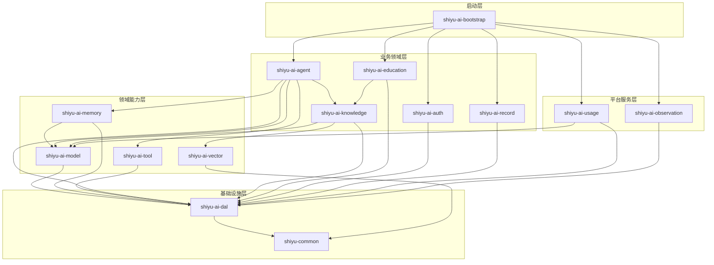
```mermaid
graph TB
    subgraph "基础设施层"
        COMMON[shiyu-common]
        DAL[shiyu-ai-dal]
    end

    subgraph "领域能力层"
        MODEL[shiyu-ai-model]
        MEMORY[shiyu-ai-memory]
        TOOL[shiyu-ai-tool]
        VECTOR[shiyu-ai-vector]
    end

    subgraph "业务领域层"
        AGENT[shiyu-ai-agent]
        KNOWLEDGE[shiyu-ai-knowledge]
        EDU[shiyu-ai-education]
        AUTH[shiyu-ai-auth]
        RECORD[shiyu-ai-record]
    end

    subgraph "平台服务层"
        USAGE[shiyu-ai-usage]
        OBS[shiyu-ai-observation]
    end

    subgraph "启动层"
        BOOT[shiyu-ai-bootstrap]
    end

    DAL --> COMMON
    MODEL --> DAL
    MEMORY --> DAL
    MEMORY --> MODEL
    TOOL --> DAL
    VECTOR --> COMMON

    AGENT --> MODEL
    AGENT --> MEMORY
    AGENT --> TOOL
    AGENT --> KNOWLEDGE
    AGENT --> DAL

    KNOWLEDGE --> VECTOR
    KNOWLEDGE --> MODEL
    KNOWLEDGE --> DAL

    EDU --> KNOWLEDGE
    EDU --> DAL

    AUTH --> DAL
    RECORD --> DAL

    USAGE --> DAL
    USAGE --> MODEL

    OBS --> DAL

    BOOT --> AGENT
    BOOT --> EDU
    BOOT --> AUTH
    BOOT --> RECORD
    BOOT --> USAGE
    BOOT --> OBS
```

### 6.4 核心变化总结

| 变化 | 说明 |
|------|------|
| `shiyu-ai-core` 拆分 | 拆为 `model` / `memory` / `tool` 三个独立模块 |
| 新增 `shiyu-ai-vector` | VectorStore SPI 从 knowledge 独立 |
| 新增 `shiyu-ai-usage` | Usage Center（Token/Cost/Latency） |
| 新增 `shiyu-ai-observation` | 可观测性（Trace/Metrics/Audit/Timeline） |
| BO 收归 DAL | 所有 BO 移至 `dal.bo.{domain}/` 下 |
| Agent 包名调整 | `aiagent` → `agent` |
| Knowledge 内部重构 | 拆出 document/chunk/ingestion/rag 子包 |
| Observation 分层存储 | Metrics/Traces 不存 DB，Audit/Timeline 存 DB |

---

## 第七章 DDD 领域模型

### 7.1 领域划分

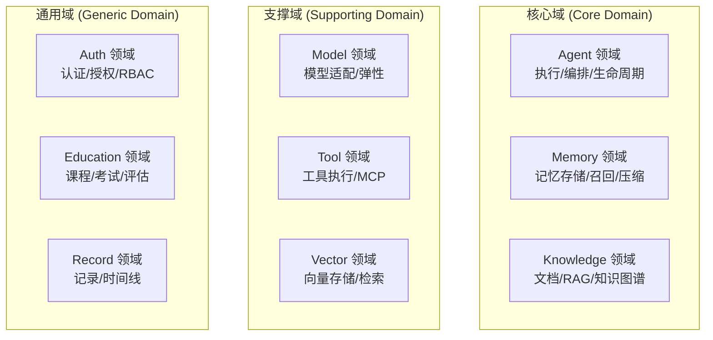
```mermaid
graph TB
    subgraph "核心域 (Core Domain)"
        AGENT[Agent 领域<br/>执行/编排/生命周期]
        MEMORY[Memory 领域<br/>记忆存储/召回/压缩]
        KNOWLEDGE[Knowledge 领域<br/>文档/RAG/知识图谱]
    end

    subgraph "支撑域 (Supporting Domain)"
        MODEL[Model 领域<br/>模型适配/弹性]
        TOOL[Tool 领域<br/>工具执行/MCP]
        VECTOR[Vector 领域<br/>向量存储/检索]
    end

    subgraph "通用域 (Generic Domain)"
        AUTH[Auth 领域<br/>认证/授权/RBAC]
        EDUCATION[Education 领域<br/>课程/考试/评估]
        RECORD[Record 领域<br/>记录/时间线]
    end
```

### 7.2 聚合根设计

#### 7.2.1 Agent 聚合

```java
// 聚合根
public class AgentDefinition {
    private String agentId;
    private String name;
    private String description;
    private Long ownerId;
    private String currentVersion;
    private Map<String, Object> extInfo;
    
    // 聚合内实体
    private List<AgentVersion> versions;
    
    // 领域行为
    public AgentVersion publishVersion(String versionNumber, GraphConfig graphConfig) {
        AgentVersion version = AgentVersion.create(this.agentId, versionNumber, graphConfig);
        this.versions.add(version);
        this.currentVersion = versionNumber;
        return version;
    }
    
    public AgentVersion getVersion(String versionNumber) {
        return versions.stream()
            .filter(v -> v.getVersionNumber().equals(versionNumber))
            .findFirst()
            .orElseThrow(() -> new AgentVersionNotFoundException(versionNumber));
    }
}

// 聚合内实体
public class AgentVersion {
    private String versionId;
    private String agentId;
    private String versionNumber;
    private VersionStatus status;  // DRAFT, PUBLISHED, ARCHIVED
    private GraphConfig graphConfig;
    private CanvasConfig canvasConfig;
    private LocalDateTime createdAt;
    
    public void publish() {
        if (this.status != VersionStatus.DRAFT) {
            throw new IllegalStateException("Only DRAFT version can be published");
        }
        this.status = VersionStatus.PUBLISHED;
    }
}

// 值对象
public record GraphConfig(
    Map<String, NodeConfig> nodes,
    Map<String, List<String>> edges,
    Map<String, ConditionEdgeConfig> conditionalEdges,
    String startNode,
    String endNode
) {}

public record NodeConfig(
    String nodeId,
    NodeType type,
    Map<String, Object> properties,
    RetryConfig retry,
    TimeoutConfig timeout
) {}
```

#### 7.2.2 Memory 聚合

```java
// 聚合根
public class MemorySession {
    private String sessionId;
    private Long userId;
    private String agentId;
    
    // 聚合内实体
    private ShortTermMemory shortTermMemory;
    private WorkingMemory workingMemory;
    private List<LongTermMemory> longTermMemories;
    
    // 领域行为
    public void addMessage(String role, String content) {
        shortTermMemory.addMessage(role, content);
        
        // 超过阈值时触发压缩
        if (shortTermMemory.size() > shortTermMemory.getMaxSize()) {
            String summary = shortTermMemory.compress();
            saveToLongTerm(summary);
        }
    }
    
    public void setWorkingVariable(String key, Object value) {
        workingMemory.set(key, value);
    }
    
    public Object getWorkingVariable(String key) {
        return workingMemory.get(key);
    }
}

// 实体
public class ShortTermMemory {
    private String sessionId;
    private List<ChatMessage> messages;
    private int maxSize;
    
    public void addMessage(String role, String content) {
        messages.add(new ChatMessage(role, content, LocalDateTime.now()));
    }
    
    public String compress() {
        // 滑动窗口压缩
        if (messages.size() <= maxSize) {
            return "";
        }
        List<ChatMessage> toCompress = messages.subList(0, messages.size() - maxSize);
        messages = new ArrayList<>(messages.subList(messages.size() - maxSize, messages.size()));
        return buildSummary(toCompress);
    }
}

// 值对象
public record ChatMessage(
    String role,
    String content,
    LocalDateTime timestamp
) {}
```

#### 7.2.3 Knowledge 聚合

```java
// 聚合根
public class Knowledge {
    private Long id;
    private String code;
    private String name;
    private String description;
    private DifficultyLevel difficulty;
    private String category;
    private List<String> tags;
    
    // 聚合内实体
    private List<KnowledgeRelation> relations;
    private List<KnowledgeDocument> documents;
    
    // 领域行为
    public void addRelation(Knowledge target, RelationType type, double weight) {
        KnowledgeRelation relation = new KnowledgeRelation(this.id, target.getId(), type, weight);
        this.relations.add(relation);
    }
    
    public List<Knowledge> getPrerequisites() {
        return relations.stream()
            .filter(r -> r.getType() == RelationType.PRE)
            .map(r -> loadKnowledge(r.getTargetId()))
            .collect(Collectors.toList());
    }
}

// 实体
public class KnowledgeDocument {
    private Long id;
    private String title;
    private String content;
    private DocumentType docType;
    private String source;
    
    // 聚合内实体
    private List<DocumentChunk> chunks;
    
    public void splitChunks(ChunkSplitter splitter) {
        this.chunks = splitter.split(this.content);
    }
}

// 值对象
public record DocumentChunk(
    int index,
    String content,
    float[] embedding,
    Map<String, Object> metadata
) {}
```

### 7.3 领域事件

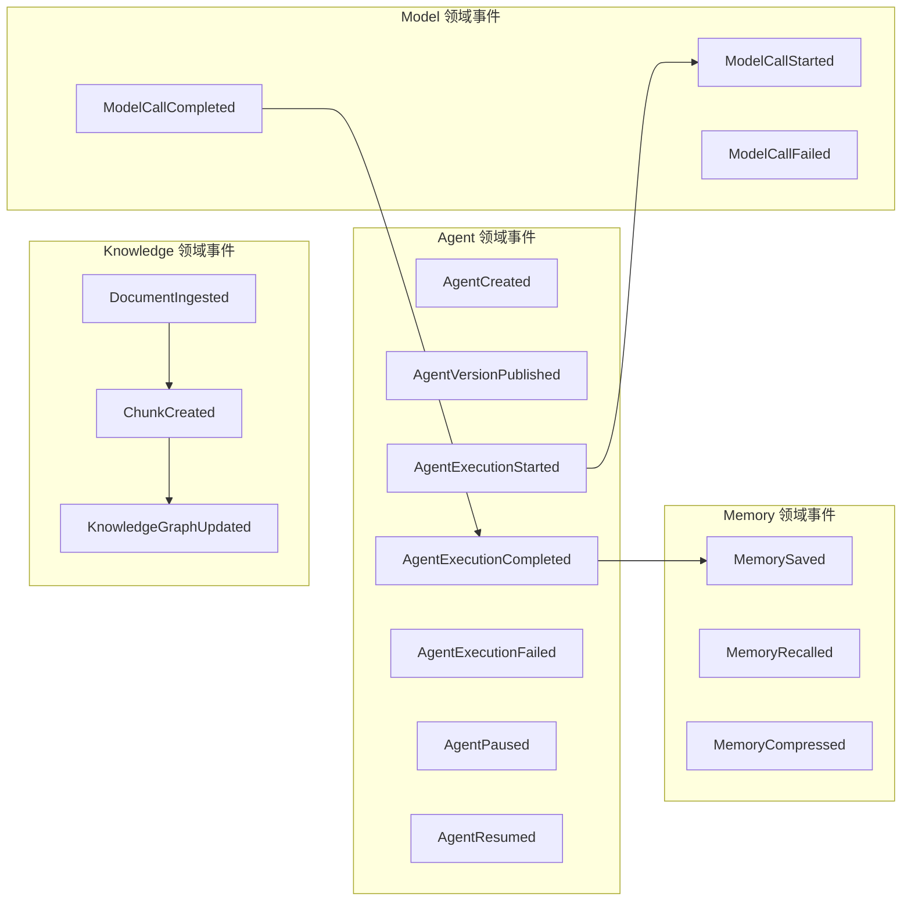
```mermaid
graph LR
    subgraph "Agent 领域事件"
        AE1[AgentCreated]
        AE2[AgentVersionPublished]
        AE3[AgentExecutionStarted]
        AE4[AgentExecutionCompleted]
        AE5[AgentExecutionFailed]
        AE6[AgentPaused]
        AE7[AgentResumed]
    end

    subgraph "Memory 领域事件"
        ME1[MemorySaved]
        ME2[MemoryRecalled]
        ME3[MemoryCompressed]
    end

    subgraph "Knowledge 领域事件"
        KE1[DocumentIngested]
        KE2[ChunkCreated]
        KE3[KnowledgeGraphUpdated]
    end

    subgraph "Model 领域事件"
        MOE1[ModelCallStarted]
        MOE2[ModelCallCompleted]
        MOE3[ModelCallFailed]
    end

    AE3 --> MOE1
    MOE2 --> AE4
    AE4 --> ME1
    KE1 --> KE2
    KE2 --> KE3
```

### 7.4 Repository 接口

```java
// Agent Repository
public interface AgentRepository {
    AgentDefinition findById(String agentId);
    AgentDefinition findByOwner(Long ownerId, String agentId);
    List<AgentDefinition> findAllByOwner(Long ownerId);
    void save(AgentDefinition agent);
    void delete(String agentId);
}

// Memory Repository
public interface MemoryRepository {
    MemorySession findBySessionId(String sessionId);
    void save(MemorySession session);
    void delete(String sessionId);
    List<LongTermMemory> searchLongTerm(Long userId, String agentId, String query, int topK);
}

// Knowledge Repository
public interface KnowledgeRepository {
    Knowledge findById(Long id);
    Knowledge findByCode(String code);
    List<Knowledge> findByCategory(String category);
    void save(Knowledge knowledge);
    void delete(Long id);
}
```

---

## 第八章 Agent Runtime

### 8.1 概述

Agent Runtime 是 shiyu-ai 的核心执行引擎，负责：

- Agent 生命周期管理（创建、运行、暂停、恢复、取消）
- 图编排执行（节点调度、条件分支、循环）
- 执行状态持久化（检查点、恢复）
- 资源管理（超时、重试、补偿）

### 8.2 架构设计

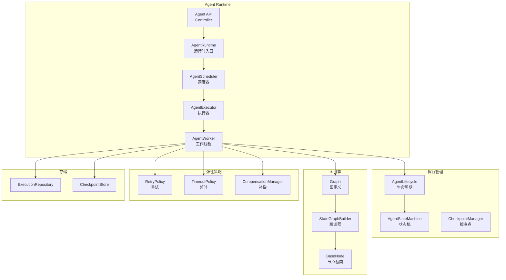
```mermaid
graph TB
    subgraph "Agent Runtime"
        API[Agent API<br/>Controller]
        RUNTIME[AgentRuntime<br/>运行时入口]
        SCHEDULER[AgentScheduler<br/>调度器]
        EXECUTOR[AgentExecutor<br/>执行器]
        WORKER[AgentWorker<br/>工作线程]
    end

    subgraph "执行管理"
        LIFECYCLE[AgentLifecycle<br/>生命周期]
        STATEMACHINE[AgentStateMachine<br/>状态机]
        CHECKPOINT[CheckpointManager<br/>检查点]
    end

    subgraph "图引擎"
        GRAPH[Graph<br/>图定义]
        BUILDER[StateGraphBuilder<br/>编译器]
        NODE[BaseNode<br/>节点基类]
    end

    subgraph "弹性策略"
        RETRY[RetryPolicy<br/>重试]
        TIMEOUT[TimeoutPolicy<br/>超时]
        COMPENSATION[CompensationManager<br/>补偿]
    end

    subgraph "存储"
        EXECRepo[ExecutionRepository]
        CPRepo[CheckpointStore]
    end

    API --> RUNTIME
    RUNTIME --> SCHEDULER
    SCHEDULER --> EXECUTOR
    EXECUTOR --> WORKER
    
    WORKER --> LIFECYCLE
    LIFECYCLE --> STATEMACHINE
    WORKER --> GRAPH
    GRAPH --> BUILDER
    BUILDER --> NODE
    
    WORKER --> RETRY
    WORKER --> TIMEOUT
    WORKER --> COMPENSATION
    
    WORKER --> EXECRepo
    WORKER --> CPRepo
```

### 8.3 生命周期状态机

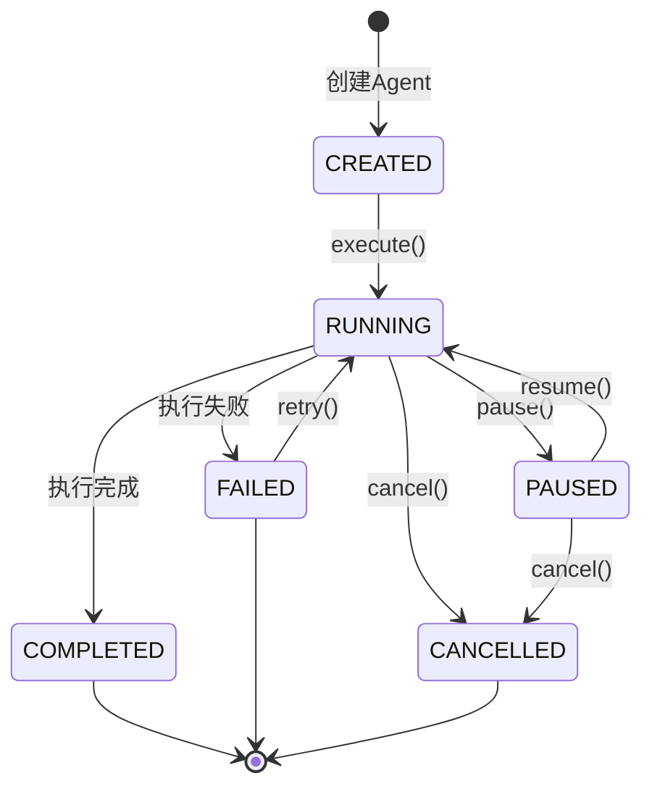
```mermaid
stateDiagram-v2
    [*] --> CREATED: 创建Agent
    CREATED --> RUNNING: execute()
    RUNNING --> PAUSED: pause()
    PAUSED --> RUNNING: resume()
    RUNNING --> COMPLETED: 执行完成
    RUNNING --> FAILED: 执行失败
    RUNNING --> CANCELLED: cancel()
    PAUSED --> CANCELLED: cancel()
    FAILED --> RUNNING: retry()
    COMPLETED --> [*]
    FAILED --> [*]
    CANCELLED --> [*]
```

### 8.4 核心接口设计

#### 8.4.1 AgentRuntime

```java
public interface AgentRuntime {
    
    /**
     * 同步执行 Agent
     */
    ExecutionResult execute(String agentId, Map<String, Object> input);
    
    /**
     * 流式执行 Agent
     */
    Flux<ExecutionEvent> executeStream(String agentId, Map<String, Object> input);
    
    /**
     * 暂停执行
     */
    void pause(String executionId);
    
    /**
     * 恢复执行
     */
    void resume(String executionId);
    
    /**
     * 取消执行
     */
    void cancel(String executionId);
    
    /**
     * 查询执行状态
     */
    ExecutionStatus getStatus(String executionId);
    
    /**
     * 获取执行历史
     */
    List<Execution> getHistory(String agentId, int limit);
}
```

#### 8.4.2 Execution

```java
public class Execution {
    private String executionId;
    private String agentId;
    private String version;
    private ExecutionStatus status;
    
    // 输入输出
    private Map<String, Object> input;
    private Map<String, Object> output;
    private Throwable error;
    
    // 执行信息
    private Long userId;
    private String sessionId;
    private LocalDateTime startTime;
    private LocalDateTime endTime;
    private long durationMs;
    
    // 节点执行历史
    private List<NodeExecution> nodeExecutions;
    
    // 检查点
    private Checkpoint lastCheckpoint;
}

public class NodeExecution {
    private String nodeId;
    private NodeType nodeType;
    private ExecutionStatus status;
    private Map<String, Object> input;
    private Map<String, Object> output;
    private LocalDateTime startTime;
    private LocalDateTime endTime;
    private long durationMs;
    private int retryCount;
    private String errorMessage;
}

public enum ExecutionStatus {
    PENDING,
    RUNNING,
    PAUSED,
    COMPLETED,
    FAILED,
    CANCELLED
}
```

#### 8.4.3 Checkpoint

```java
public class Checkpoint {
    private String checkpointId;
    private String executionId;
    private String nodeId;           // 当前节点
    private Map<String, Object> state;  // 图状态
    private LocalDateTime createdAt;
    
    // 序列化状态
    private byte[] serializedState;
}

public interface CheckpointStore {
    void save(Checkpoint checkpoint);
    Checkpoint load(String executionId);
    void delete(String executionId);
    List<Checkpoint> list(String executionId);
}

// DB 实现
public class DbCheckpointStore implements CheckpointStore {
    private final CheckpointMapper checkpointMapper;
    
    @Override
    public void save(Checkpoint checkpoint) {
        checkpointMapper.insert(toDataObject(checkpoint));
    }
    
    @Override
    public Checkpoint load(String executionId) {
        CheckpointDO dobj = checkpointMapper.selectLatestByExecutionId(executionId);
        return toDomain(dobj);
    }
}
```

### 8.5 执行流程

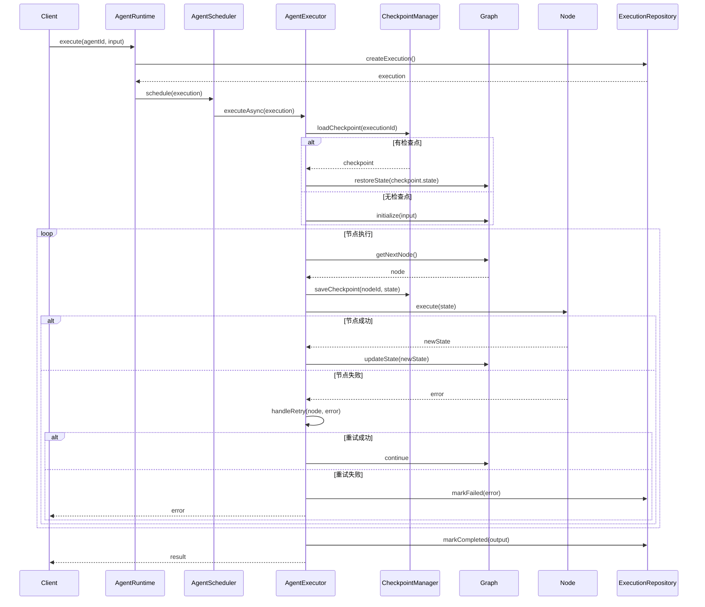
```mermaid
sequenceDiagram
    participant Client
    participant AgentRuntime
    participant AgentScheduler
    participant AgentExecutor
    participant CheckpointManager
    participant Graph
    participant Node
    participant ExecutionRepository

    Client->>AgentRuntime: execute(agentId, input)
    AgentRuntime->>ExecutionRepository: createExecution()
    ExecutionRepository-->>AgentRuntime: execution
    
    AgentRuntime->>AgentScheduler: schedule(execution)
    AgentScheduler->>AgentExecutor: executeAsync(execution)
    
    AgentExecutor->>CheckpointManager: loadCheckpoint(executionId)
    alt 有检查点
        CheckpointManager-->>AgentExecutor: checkpoint
        AgentExecutor->>Graph: restoreState(checkpoint.state)
    else 无检查点
        AgentExecutor->>Graph: initialize(input)
    end
    
    loop 节点执行
        AgentExecutor->>Graph: getNextNode()
        Graph-->>AgentExecutor: node
        
        AgentExecutor->>CheckpointManager: saveCheckpoint(nodeId, state)
        
        AgentExecutor->>Node: execute(state)
        
        alt 节点成功
            Node-->>AgentExecutor: newState
            AgentExecutor->>Graph: updateState(newState)
        else 节点失败
            Node-->>AgentExecutor: error
            AgentExecutor->>AgentExecutor: handleRetry(node, error)
            alt 重试成功
                AgentExecutor->>Graph: continue
            else 重试失败
                AgentExecutor->>ExecutionRepository: markFailed(error)
                AgentExecutor-->>Client: error
            end
        end
    end
    
    AgentExecutor->>ExecutionRepository: markCompleted(output)
    AgentExecutor-->>Client: result
```

### 8.6 暂停/恢复机制

```java
public class AgentExecutor {
    
    private final Map<String, CompletableFuture<?>> runningExecutions = new ConcurrentHashMap<>();
    private final Map<String, PausedExecution> pausedExecutions = new ConcurrentHashMap<>();
    
    public void pause(String executionId) {
        CompletableFuture<?> future = runningExecutions.get(executionId);
        if (future != null) {
            // 标记为暂停状态
            executionRepository.updateStatus(executionId, ExecutionStatus.PAUSED);
            
            // 保存当前状态到检查点
            Checkpoint checkpoint = checkpointManager.createCheckpoint(executionId);
            checkpointManager.save(checkpoint);
            
            // 取消正在执行的任务
            future.cancel(false);  // 不中断，等待当前节点完成
            
            // 记录暂停信息
            pausedExecutions.put(executionId, new PausedExecution(checkpoint));
        }
    }
    
    public void resume(String executionId) {
        PausedExecution paused = pausedExecutions.remove(executionId);
        if (paused != null) {
            // 恢复状态
            executionRepository.updateStatus(executionId, ExecutionStatus.RUNNING);
            
            // 从检查点恢复执行
            executeFromCheckpoint(executionId, paused.getCheckpoint());
        }
    }
    
    private void executeFromCheckpoint(String executionId, Checkpoint checkpoint) {
        Execution execution = executionRepository.findById(executionId);
        Graph graph = loadGraph(execution.getAgentId(), execution.getVersion());
        
        // 恢复图状态
        graph.restoreState(checkpoint.getState());
        
        // 从暂停的节点继续执行
        executeNodes(execution, graph, checkpoint.getNodeId());
    }
}
```

### 8.7 超时与重试

```java
// 超时策略
public class TimeoutPolicy {
    private final long globalTimeoutMs;    // 全局超时
    private final long nodeTimeoutMs;      // 节点超时
    
    public <T> T executeWithTimeout(Supplier<T> action, String executionId) {
        CompletableFuture<T> future = CompletableFuture.supplyAsync(action);
        
        try {
            return future.get(globalTimeoutMs, TimeUnit.MILLISECONDS);
        } catch (TimeoutException e) {
            future.cancel(true);
            throw new AgentExecutionTimeoutException(executionId, globalTimeoutMs);
        }
    }
}

// 重试策略
public class RetryPolicy {
    private final int maxRetries;
    private final long initialDelayMs;
    private final double backoffMultiplier;
    
    public <T> T executeWithRetry(Supplier<T> action, RetryConfig config) {
        int attempt = 0;
        long delay = config.getInitialDelayMs();
        
        while (true) {
            try {
                return action.get();
            } catch (Exception e) {
                attempt++;
                if (attempt >= config.getMaxRetries()) {
                    throw new AgentExecutionRetryExhaustedException(attempt, e);
                }
                
                log.warn("Node execution failed, retrying in {}ms (attempt {}/{})", 
                    delay, attempt, config.getMaxRetries());
                
                try {
                    Thread.sleep(delay);
                } catch (InterruptedException ie) {
                    Thread.currentThread().interrupt();
                    throw new RuntimeException(ie);
                }
                
                delay *= config.getBackoffMultiplier();
            }
        }
    }
}
```

### 8.8 数据库设计

```sql
-- 执行记录表
CREATE TABLE agent_execution (
    id BIGINT PRIMARY KEY AUTO_INCREMENT,
    execution_id VARCHAR(128) NOT NULL UNIQUE,
    agent_id VARCHAR(128) NOT NULL,
    version VARCHAR(32),
    status VARCHAR(32) NOT NULL,  -- PENDING/RUNNING/PAUSED/COMPLETED/FAILED/CANCELLED
    
    -- 输入输出
    input_data CLOB,              -- JSON
    output_data CLOB,             -- JSON
    error_message VARCHAR(1024),
    
    -- 执行信息
    user_id BIGINT,
    session_id VARCHAR(128),
    start_time TIMESTAMP,
    end_time TIMESTAMP,
    duration_ms BIGINT,
    
    -- 租户
    tenant_id BIGINT,
    workspace_id BIGINT,
    
    create_time TIMESTAMP DEFAULT CURRENT_TIMESTAMP,
    update_time TIMESTAMP DEFAULT CURRENT_TIMESTAMP ON UPDATE CURRENT_TIMESTAMP,
    
    INDEX idx_agent_id (agent_id),
    INDEX idx_user_id (user_id),
    INDEX idx_status (status),
    INDEX idx_tenant_id (tenant_id)
);

-- 节点执行记录表
CREATE TABLE node_execution (
    id BIGINT PRIMARY KEY AUTO_INCREMENT,
    execution_id VARCHAR(128) NOT NULL,
    node_id VARCHAR(128) NOT NULL,
    node_type VARCHAR(32) NOT NULL,
    status VARCHAR(32) NOT NULL,
    
    input_data CLOB,              -- JSON
    output_data CLOB,             -- JSON
    error_message VARCHAR(1024),
    
    start_time TIMESTAMP,
    end_time TIMESTAMP,
    duration_ms BIGINT,
    retry_count INT DEFAULT 0,
    
    create_time TIMESTAMP DEFAULT CURRENT_TIMESTAMP,
    
    INDEX idx_execution_id (execution_id),
    INDEX idx_node_id (node_id),
    FOREIGN KEY (execution_id) REFERENCES agent_execution(execution_id)
);

-- 检查点表
CREATE TABLE agent_checkpoint (
    id BIGINT PRIMARY KEY AUTO_INCREMENT,
    checkpoint_id VARCHAR(128) NOT NULL UNIQUE,
    execution_id VARCHAR(128) NOT NULL,
    node_id VARCHAR(128) NOT NULL,
    
    state_data CLOB,              -- JSON 序列化的图状态
    serialized_state BLOB,        -- 二进制序列化
    
    create_time TIMESTAMP DEFAULT CURRENT_TIMESTAMP,
    
    INDEX idx_execution_id (execution_id),
    FOREIGN KEY (execution_id) REFERENCES agent_execution(execution_id)
);
```

---

## 第九章 Workflow Engine

### 9.1 概述

Workflow Engine 基于 LiteFlow 实现，用于编排复杂的聊天流程和业务流程。

### 9.2 架构设计

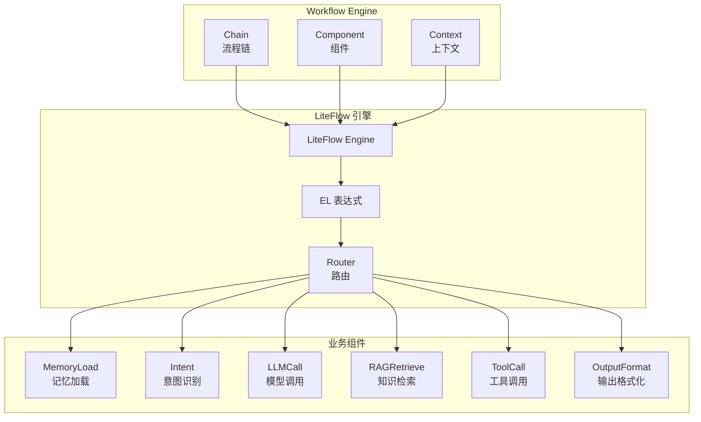
```mermaid
graph TB
    subgraph "Workflow Engine"
        CHAIN[Chain<br/>流程链]
        COMPONENT[Component<br/>组件]
        CONTEXT[Context<br/>上下文]
    end

    subgraph "LiteFlow 引擎"
        ENGINE[LiteFlow Engine]
        EL[EL 表达式]
        ROUTER[Router<br/>路由]
    end

    subgraph "业务组件"
        MEM[MemoryLoad<br/>记忆加载]
        INT[Intent<br/>意图识别]
        LLM[LLMCall<br/>模型调用]
        RAG[RAGRetrieve<br/>知识检索]
        TOOL[ToolCall<br/>工具调用]
        FMT[OutputFormat<br/>输出格式化]
    end

    CHAIN --> ENGINE
    COMPONENT --> ENGINE
    CONTEXT --> ENGINE
    
    ENGINE --> EL
    EL --> ROUTER
    
    ROUTER --> MEM
    ROUTER --> INT
    ROUTER --> LLM
    ROUTER --> RAG
    ROUTER --> TOOL
    ROUTER --> FMT
```

### 9.3 LiteFlow 配置

```yaml
# liteflow 配置
liteflow:
  rule-source: config/flow/*.el.xml
  print-execution-log: true
  when-max-wait-seconds: 15
  when-max-wait-seconds-for-card: 15
  retry-count: 0
  when-max-wait-seconds-for-group: 15
  enable: true
```

### 9.4 流程定义示例

```xml
<!-- flow/chat-flow.el.xml -->

<!-- 主聊天流程 -->
<chain name="chatFlow">
    THEN(
        memoryLoad,
        intent,
        router
    );
</chain>

<!-- 路由到子流程 -->
<chain name="router">
    SWITCH(intentResult).to(
        chatDirect,
        chatCoT,
        chatToT,
        chatRAG
    );
</chain>

<!-- 直接对话 -->
<chain name="chatDirect">
    THEN(
        llmCall,
        outputFormat,
        memorySave
    );
</chain>

<!-- 思维链对话 -->
<chain name="chatCoT">
    THEN(
        llmCall,
        cotProcess,
        llmCall,
        outputFormat,
        memorySave
    );
</chain>

<!-- RAG 对话 -->
<chain name="chatRAG">
    THEN(
        ragRetrieve,
        ragEnhance,
        llmCall,
        outputFormat,
        memorySave
    );
</chain>
```

### 9.5 组件实现

```java
// 意图识别组件
@Component("intent")
public class IntentComponent extends NodeComponent {
    
    @Autowired
    private IntentService intentService;
    
    @Override
    public void process() {
        ChatContext context = this.getContextBean(ChatContext.class);
        String userInput = context.getUserInput();
        
        IntentResult result = intentService.recognize(userInput);
        context.setIntentResult(result);
        
        this.setResultItem("intentResult", result.getCategory());
    }
}

// 记忆加载组件
@Component("memoryLoad")
public class MemoryLoadComponent extends NodeComponent {
    
    @Autowired
    private MemoryService memoryService;
    
    @Override
    public void process() {
        ChatContext context = this.getContextBean(ChatContext.class);
        String sessionId = context.getSessionId();
        
        List<ChatMessage> history = memoryService.loadShortTerm(sessionId);
        context.setChatHistory(history);
        
        List<LongTermMemory> longTerm = memoryService.loadLongTerm(
            context.getUserId(), context.getAgentId(), context.getUserInput(), 5
        );
        context.setLongTermMemories(longTerm);
    }
}

// RAG 检索组件
@Component("ragRetrieve")
public class RagRetrieveComponent extends NodeComponent {
    
    @Autowired
    private RagOrchestrator ragOrchestrator;
    
    @Override
    public void process() {
        ChatContext context = this.getContextBean(ChatContext.class);
        String query = context.getUserInput();
        
        RagResult result = ragOrchestrator.retrieve(query, 5);
        context.setRagResult(result);
    }
}
```

### 9.6 上下文管理

```java
public class ChatContext {
    // 请求信息
    private String sessionId;
    private Long userId;
    private String agentId;
    private String userInput;
    
    // 记忆
    private List<ChatMessage> chatHistory;
    private List<LongTermMemory> longTermMemories;
    
    // 意图
    private IntentResult intentResult;
    
    // RAG
    private RagResult ragResult;
    
    // 响应
    private String assistantResponse;
    private List<ToolCallResult> toolResults;
    
    // 指标
    private long startTime;
    private int promptTokens;
    private int completionTokens;
}
```

---

## 第十章 Memory Center

### 10.1 概述

Memory Center 提供五层记忆体系，支持 Agent 在不同场景下的记忆需求。

### 10.2 五层记忆模型

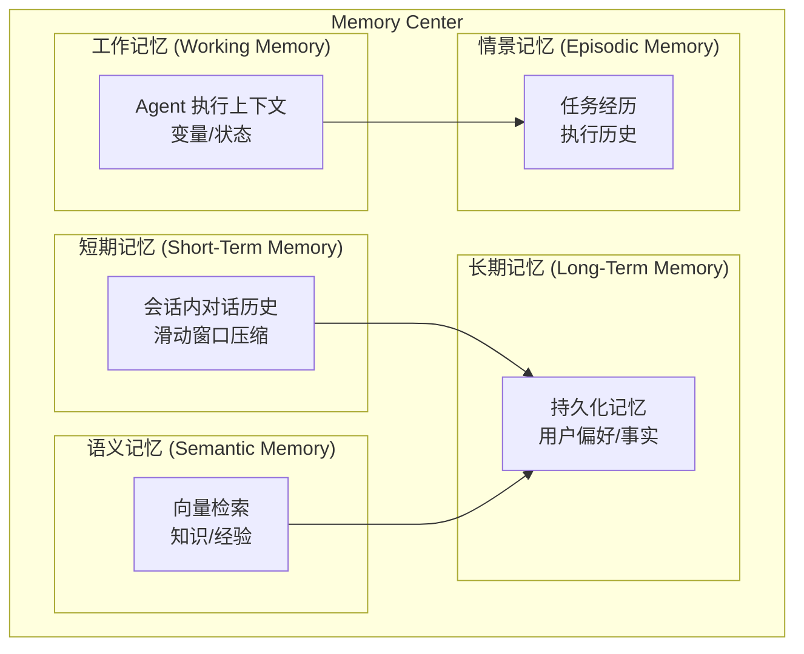
```mermaid
graph TB
    subgraph "Memory Center"
        subgraph "短期记忆 (Short-Term Memory)"
            STM[会话内对话历史<br/>滑动窗口压缩]
        end
        
        subgraph "工作记忆 (Working Memory)"
            WM[Agent 执行上下文<br/>变量/状态]
        end
        
        subgraph "长期记忆 (Long-Term Memory)"
            LTM[持久化记忆<br/>用户偏好/事实]
        end
        
        subgraph "语义记忆 (Semantic Memory)"
            SEM[向量检索<br/>知识/经验]
        end
        
        subgraph "情景记忆 (Episodic Memory)"
            EPI[任务经历<br/>执行历史]
        end
    end

    STM --> LTM
    WM --> EPI
    SEM --> LTM
```

### 10.3 记忆类型详解

| 类型 | 用途 | 存储 | 生命周期 | 示例 |
|------|------|------|----------|------|
| **短期记忆** | 会话内对话历史 | DB + 缓存 | 会话级 | 最近 10 轮对话 |
| **工作记忆** | Agent 执行上下文 | 内存 | 执行级 | 中间变量、状态 |
| **长期记忆** | 用户偏好、事实 | DB | 永久 | 用户喜欢 Python |
| **语义记忆** | 向量检索 | VectorStore | 永久 | 相似问题/答案 |
| **情景记忆** | 任务经历 | DB | 永久 | 上次执行结果 |

### 10.4 核心接口设计

#### 10.4.1 MemoryStore SPI

```java
public interface MemoryStore {
    
    /**
     * 保存记忆
     */
    void save(Memory memory);
    
    /**
     * 批量保存
     */
    void saveBatch(List<Memory> memories);
    
    /**
     * 查询记忆
     */
    List<Memory> query(MemoryQuery query);
    
    /**
     * 删除记忆
     */
    void delete(String memoryId);
    
    /**
     * 按会话删除
     */
    void deleteBySession(String sessionId);
}

public class Memory {
    private String memoryId;
    private MemoryType type;           // SHORT_TERM, WORKING, LONG_TERM, SEMANTIC, EPISODIC
    private String sessionId;
    private Long userId;
    private String agentId;
    
    // 内容
    private String role;               // user, assistant, system
    private String content;
    private float[] embedding;         // 语义记忆使用
    
    // 元数据
    private String category;           // 分类
    private String memoryKey;          // 键
    private double importance;         // 重要性 0-1
    private String source;             // 来源
    
    // 时间
    private LocalDateTime createdAt;
    private LocalDateTime accessedAt;
    private int accessCount;
    
    // 扩展
    private Map<String, Object> metadata;
}

public class MemoryQuery {
    private MemoryType type;
    private String sessionId;
    private Long userId;
    private String agentId;
    private String keyword;
    private float[] queryVector;       // 语义检索
    private int topK;
    private Double minImportance;
    private LocalDateTime startTime;
    private LocalDateTime endTime;
}
```

#### 10.4.2 各层记忆实现

```java
// 短期记忆
@Component
public class ShortTermMemoryStore implements MemoryStore {
    
    private final ConversationMessageRepository repository;
    private final Cache<String, List<ChatMessage>> cache;  // Caffeine
    
    @Override
    public void save(Memory memory) {
        ConversationMessageBO bo = toBO(memory);
        repository.insert(bo);
        
        // 更新缓存
        String key = memory.getSessionId();
        List<ChatMessage> messages = cache.get(key, k -> new ArrayList<>());
        messages.add(new ChatMessage(memory.getRole(), memory.getContent(), memory.getCreatedAt()));
        
        // 滑动窗口压缩
        if (messages.size() > MAX_MESSAGES) {
            messages = messages.subList(messages.size() - MAX_MESSAGES, messages.size());
        }
        cache.put(key, messages);
    }
    
    @Override
    public List<Memory> query(MemoryQuery query) {
        String key = query.getSessionId();
        List<ChatMessage> messages = cache.getIfPresent(key);
        
        if (messages == null) {
            // 从 DB 加载
            List<ConversationMessageBO> bos = repository.selectRecentBySession(key, MAX_MESSAGES);
            messages = bos.stream().map(this::toChatMessage).collect(Collectors.toList());
            cache.put(key, messages);
        }
        
        return messages.stream().map(this::toMemory).collect(Collectors.toList());
    }
}

// 工作记忆
@Component
public class WorkingMemoryStore implements MemoryStore {
    
    private final Map<String, Map<String, Object>> workingMemory = new ConcurrentHashMap<>();
    
    @Override
    public void save(Memory memory) {
        String key = memory.getSessionId();
        Map<String, Object> vars = workingMemory.computeIfAbsent(key, k -> new ConcurrentHashMap<>());
        vars.put(memory.getMemoryKey(), memory.getContent());
    }
    
    public void setVariable(String sessionId, String key, Object value) {
        Map<String, Object> vars = workingMemory.computeIfAbsent(sessionId, k -> new ConcurrentHashMap<>());
        vars.put(key, value);
    }
    
    public Object getVariable(String sessionId, String key) {
        Map<String, Object> vars = workingMemory.get(sessionId);
        return vars != null ? vars.get(key) : null;
    }
    
    public void clear(String sessionId) {
        workingMemory.remove(sessionId);
    }
}

// 语义记忆
@Component
public class SemanticMemoryStore implements MemoryStore {
    
    private final VectorStore vectorStore;
    private final EmbeddingService embeddingService;
    private final LongTermMemoryRepository repository;
    
    @Override
    public void save(Memory memory) {
        // 生成嵌入
        float[] embedding = embeddingService.embed(memory.getContent());
        memory.setEmbedding(embedding);
        
        // 存入向量库
        VectorRecord record = new VectorRecord(
            memory.getMemoryId(),
            embedding,
            Map.of(
                "userId", memory.getUserId(),
                "agentId", memory.getAgentId(),
                "content", memory.getContent(),
                "importance", memory.getImportance()
            )
        );
        vectorStore.upsert(record);
        
        // 同时存入 DB（用于精确查询）
        repository.insert(toBO(memory));
    }
    
    @Override
    public List<Memory> query(MemoryQuery query) {
        if (query.getQueryVector() != null) {
            // 向量检索
            List<VectorRecord> results = vectorStore.search(query.getQueryVector(), query.getTopK());
            return results.stream().map(this::toMemory).collect(Collectors.toList());
        } else if (query.getKeyword() != null) {
            // 关键词检索
            List<LongTermMemoryBO> bos = repository.searchByKeyword(
                query.getKeyword(), query.getUserId(), query.getAgentId(), query.getTopK()
            );
            return bos.stream().map(this::toMemory).collect(Collectors.toList());
        }
        return List.of();
    }
}
```

### 10.5 记忆压缩

```java
public interface MemoryCompressor {
    
    /**
     * 压缩记忆
     */
    String compress(List<ChatMessage> messages);
    
    /**
     * 是否可以压缩
     */
    boolean canCompress(List<ChatMessage> messages);
}

// LLM 摘要压缩
@Component
public class LlmSummarizeCompressor implements MemoryCompressor {
    
    @Autowired
    private ChatEngine chatEngine;
    
    @Override
    public String compress(List<ChatMessage> messages) {
        String history = formatMessages(messages);
        String prompt = "请对以下对话进行简要总结，提取关键信息（100字以内）：\n\n" + history;
        
        ChatResponse response = chatEngine.chat(
            ChatRequest.builder().prompt(prompt).build()
        );
        
        return response.isSuccess() ? response.getContent() : history.substring(0, Math.min(500, history.length()));
    }
    
    @Override
    public boolean canCompress(List<ChatMessage> messages) {
        return messages.size() > 10;
    }
}

// 滑动窗口压缩
@Component
public class SlidingWindowCompressor implements MemoryCompressor {
    
    private final int windowSize;
    
    public SlidingWindowCompressor(@Value("${shiyu.memory.window-size:10}") int windowSize) {
        this.windowSize = windowSize;
    }
    
    @Override
    public String compress(List<ChatMessage> messages) {
        if (messages.size() <= windowSize) {
            return "";
        }
        
        List<ChatMessage> toCompress = messages.subList(0, messages.size() - windowSize);
        return formatMessages(toCompress);
    }
    
    @Override
    public boolean canCompress(List<ChatMessage> messages) {
        return messages.size() > windowSize;
    }
}
```

### 10.6 记忆召回策略

```java
public interface MemoryRecallStrategy {
    
    /**
     * 召回记忆
     */
    List<Memory> recall(MemoryRecallRequest request);
}

// 相似度召回
@Component
public class SimilarityRecallStrategy implements MemoryRecallStrategy {
    
    @Autowired
    private SemanticMemoryStore semanticMemoryStore;
    @Autowired
    private EmbeddingService embeddingService;
    
    @Override
    public List<Memory> recall(MemoryRecallRequest request) {
        float[] queryVector = embeddingService.embed(request.getQuery());
        
        MemoryQuery query = MemoryQuery.builder()
            .type(MemoryType.SEMANTIC)
            .userId(request.getUserId())
            .agentId(request.getAgentId())
            .queryVector(queryVector)
            .topK(request.getTopK())
            .build();
        
        return semanticMemoryStore.query(query);
    }
}

// 重要性召回
@Component
public class ImportanceRecallStrategy implements MemoryRecallStrategy {
    
    @Autowired
    private LongTermMemoryRepository repository;
    
    @Override
    public List<Memory> recall(MemoryRecallRequest request) {
        List<LongTermMemoryBO> bos = repository.selectTopByImportance(
            request.getUserId(), request.getAgentId(), request.getTopK()
        );
        return bos.stream().map(this::toMemory).collect(Collectors.toList());
    }
}

// 混合召回
@Component
public class HybridRecallStrategy implements MemoryRecallStrategy {
    
    @Autowired
    private List<MemoryRecallStrategy> strategies;
    
    @Override
    public List<Memory> recall(MemoryRecallRequest request) {
        List<Memory> allMemories = new ArrayList<>();
        
        for (MemoryRecallStrategy strategy : strategies) {
            List<Memory> memories = strategy.recall(request);
            allMemories.addAll(memories);
        }
        
        // 去重 + 排序
        return allMemories.stream()
            .collect(Collectors.toMap(Memory::getMemoryId, m -> m, (m1, m2) -> m1))
            .values()
            .stream()
            .sorted((m1, m2) -> Double.compare(m2.getImportance(), m1.getImportance()))
            .limit(request.getTopK())
            .collect(Collectors.toList());
    }
}
```

### 10.7 数据库设计

```sql
-- 短期记忆（对话消息）
CREATE TABLE conversation_message (
    id BIGINT PRIMARY KEY AUTO_INCREMENT,
    session_id VARCHAR(128) NOT NULL,
    user_id BIGINT,
    agent_id VARCHAR(128),
    role VARCHAR(32) NOT NULL,        -- user, assistant, system
    content CLOB NOT NULL,
    
    create_time TIMESTAMP DEFAULT CURRENT_TIMESTAMP,
    
    INDEX idx_session_id (session_id),
    INDEX idx_user_id (user_id),
    INDEX idx_agent_id (agent_id)
);

-- 长期记忆
CREATE TABLE long_term_memory (
    id BIGINT PRIMARY KEY AUTO_INCREMENT,
    user_id BIGINT NOT NULL,
    agent_id VARCHAR(128),
    category VARCHAR(64),             -- summary, preference, fact, ...
    memory_key VARCHAR(256),
    content CLOB NOT NULL,
    importance DOUBLE DEFAULT 0.5,    -- 0-1
    source VARCHAR(256),              -- 来源（session_id 等）
    
    create_time TIMESTAMP DEFAULT CURRENT_TIMESTAMP,
    update_time TIMESTAMP DEFAULT CURRENT_TIMESTAMP ON UPDATE CURRENT_TIMESTAMP,
    
    INDEX idx_user_id (user_id),
    INDEX idx_agent_id (agent_id),
    INDEX idx_category (category),
    INDEX idx_importance (importance)
);

-- 情景记忆（执行历史）
CREATE TABLE episodic_memory (
    id BIGINT PRIMARY KEY AUTO_INCREMENT,
    execution_id VARCHAR(128) NOT NULL,
    agent_id VARCHAR(128) NOT NULL,
    user_id BIGINT,
    session_id VARCHAR(128),
    
    -- 任务信息
    task_type VARCHAR(64),
    task_description CLOB,
    
    -- 结果
    status VARCHAR(32),               -- SUCCESS, FAILED
    result_summary CLOB,
    error_message VARCHAR(1024),
    
    -- 指标
    duration_ms BIGINT,
    node_count INT,
    
    create_time TIMESTAMP DEFAULT CURRENT_TIMESTAMP,
    
    INDEX idx_execution_id (execution_id),
    INDEX idx_agent_id (agent_id),
    INDEX idx_user_id (user_id),
    INDEX idx_session_id (session_id)
);
```

---

## 第十一章 Knowledge & RAG

### 11.1 概述

Knowledge 模块提供完整的知识管理能力，包括：

- 文档解析与入库（PDF、Word、Markdown、HTML）
- 智能分块（中文分词、语义分块）
- RAG 检索增强（向量检索 + 知识图谱）
- 重排序与上下文增强

### 11.2 架构设计

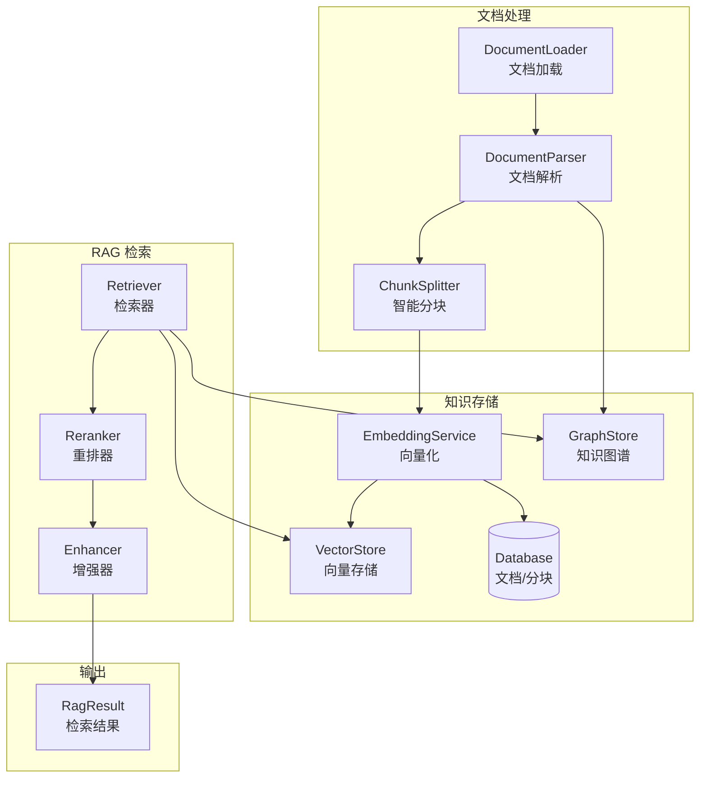
```mermaid
graph TB
    subgraph "文档处理"
        LOADER[DocumentLoader<br/>文档加载]
        PARSER[DocumentParser<br/>文档解析]
        SPLITTER[ChunkSplitter<br/>智能分块]
    end

    subgraph "知识存储"
        EMBED[EmbeddingService<br/>向量化]
        VSTORE[VectorStore<br/>向量存储]
        GSTORE[GraphStore<br/>知识图谱]
        DB[(Database<br/>文档/分块)]
    end

    subgraph "RAG 检索"
        RETRIEVER[Retriever<br/>检索器]
        RERANKER[Reranker<br/>重排器]
        ENHANCER[Enhancer<br/>增强器]
    end

    subgraph "输出"
        RESULT[RagResult<br/>检索结果]
    end

    LOADER --> PARSER
    PARSER --> SPLITTER
    SPLITTER --> EMBED
    EMBED --> VSTORE
    EMBED --> DB
    
    PARSER --> GSTORE
    
    RETRIEVER --> VSTORE
    RETRIEVER --> GSTORE
    RETRIEVER --> RERANKER
    RERANKER --> ENHANCER
    ENHANCER --> RESULT
```

### 11.3 文档处理流水线

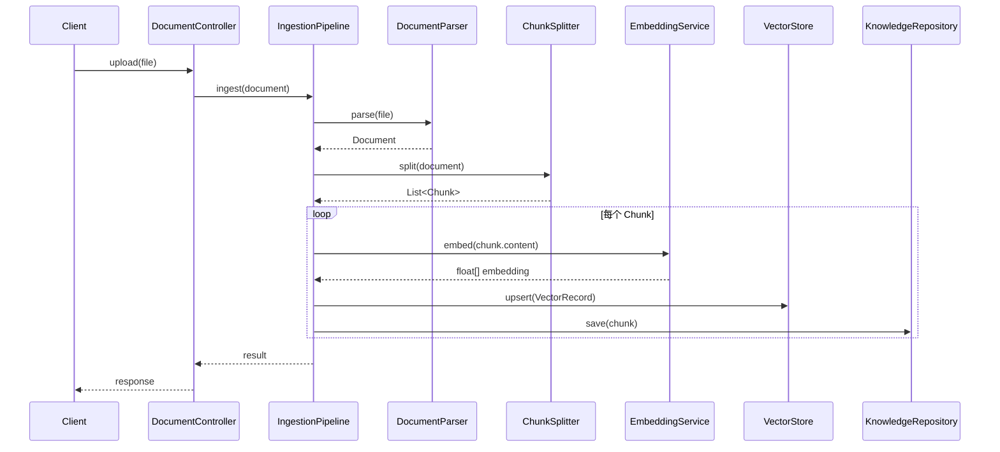
```mermaid
sequenceDiagram
    participant Client
    participant DocumentController
    participant IngestionPipeline
    participant DocumentParser
    participant ChunkSplitter
    participant EmbeddingService
    participant VectorStore
    participant KnowledgeRepository

    Client->>DocumentController: upload(file)
    DocumentController->>IngestionPipeline: ingest(document)
    
    IngestionPipeline->>DocumentParser: parse(file)
    DocumentParser-->>IngestionPipeline: Document
    
    IngestionPipeline->>ChunkSplitter: split(document)
    ChunkSplitter-->>IngestionPipeline: List<Chunk>
    
    loop 每个 Chunk
        IngestionPipeline->>EmbeddingService: embed(chunk.content)
        EmbeddingService-->>IngestionPipeline: float[] embedding
        IngestionPipeline->>VectorStore: upsert(VectorRecord)
        IngestionPipeline->>KnowledgeRepository: save(chunk)
    end
    
    IngestionPipeline-->>DocumentController: result
    DocumentController-->>Client: response
```

### 11.4 核心接口设计

#### 11.4.1 DocumentParser SPI

```java
public interface DocumentParser {
    
    /**
     * 支持的文档类型
     */
    List<String> supportedTypes();
    
    /**
     * 解析文档
     */
    Document parse(InputStream input, String filename) throws IOException;
}

// PDF 解析器
@Component
public class PdfDocumentParser implements DocumentParser {
    
    @Override
    public List<String> supportedTypes() {
        return List.of("pdf");
    }
    
    @Override
    public Document parse(InputStream input, String filename) throws IOException {
        PDDocument pdf = Loader.loadPDF(input);
        PDFTextStripper stripper = new PDFTextStripper();
        String content = stripper.getText(pdf);
        
        return Document.builder()
            .filename(filename)
            .content(content)
            .type(DocumentType.PDF)
            .pageCount(pdf.getNumberOfPages())
            .build();
    }
}

// Markdown 解析器
@Component
public class MarkdownDocumentParser implements DocumentParser {
    
    @Override
    public List<String> supportedTypes() {
        return List.of("md", "markdown");
    }
    
    @Override
    public Document parse(InputStream input, String filename) throws IOException {
        String content = new String(input.readAllBytes(), StandardCharsets.UTF_8);
        
        return Document.builder()
            .filename(filename)
            .content(content)
            .type(DocumentType.MARKDOWN)
            .build();
    }
}
```

#### 11.4.2 ChunkSplitter SPI

```java
public interface ChunkSplitter {
    
    /**
     * 分块
     */
    List<DocumentChunk> split(String content, ChunkConfig config);
}

// 中文分块器
@Component
public class ChineseChunkSplitter implements ChunkSplitter {
    
    @Override
    public List<DocumentChunk> split(String content, ChunkConfig config) {
        int chunkSize = config.getChunkSize();      // 默认 512
        int overlap = config.getOverlap();           // 默认 50
        
        List<DocumentChunk> chunks = new ArrayList<>();
        
        // 按段落分割
        String[] paragraphs = content.split("\n\n+");
        
        StringBuilder current = new StringBuilder();
        int index = 0;
        
        for (String paragraph : paragraphs) {
            if (current.length() + paragraph.length() > chunkSize && current.length() > 0) {
                chunks.add(new DocumentChunk(index++, current.toString(), null, Map.of()));
                
                // 保留重叠
                String text = current.toString();
                if (text.length() > overlap) {
                    current = new StringBuilder(text.substring(text.length() - overlap));
                } else {
                    current = new StringBuilder();
                }
            }
            current.append(paragraph).append("\n\n");
        }
        
        if (current.length() > 0) {
            chunks.add(new DocumentChunk(index, current.toString(), null, Map.of()));
        }
        
        return chunks;
    }
}

// 语义分块器
@Component
public class SemanticChunkSplitter implements ChunkSplitter {
    
    @Autowired
    private EmbeddingService embeddingService;
    
    @Override
    public List<DocumentChunk> split(String content, ChunkConfig config) {
        // 按句子分割
        List<String> sentences = splitSentences(content);
        
        List<DocumentChunk> chunks = new ArrayList<>();
        List<String> currentSentences = new ArrayList<>();
        float[] lastEmbedding = null;
        
        for (String sentence : sentences) {
            float[] embedding = embeddingService.embed(sentence);
            
            if (lastEmbedding != null) {
                double similarity = cosineSimilarity(embedding, lastEmbedding);
                
                // 相似度低于阈值，开始新块
                if (similarity < config.getSemanticThreshold()) {
                    chunks.add(createChunk(chunks.size(), currentSentences));
                    currentSentences.clear();
                }
            }
            
            currentSentences.add(sentence);
            lastEmbedding = embedding;
        }
        
        if (!currentSentences.isEmpty()) {
            chunks.add(createChunk(chunks.size(), currentSentences));
        }
        
        return chunks;
    }
}
```

#### 11.4.3 Retriever SPI

```java
public interface Retriever {
    
    /**
     * 检索
     */
    List<RetrievedChunk> retrieve(String query, int topK);
}

// 向量检索器
@Component
public class VectorRetriever implements Retriever {
    
    @Autowired
    private VectorStore vectorStore;
    @Autowired
    private EmbeddingService embeddingService;
    
    @Override
    public List<RetrievedChunk> retrieve(String query, int topK) {
        float[] queryVector = embeddingService.embed(query);
        List<VectorRecord> results = vectorStore.search(queryVector, topK);
        
        return results.stream()
            .map(r -> new RetrievedChunk(
                r.id(),
                (String) r.metadata().get("content"),
                (double) r.metadata().getOrDefault("_score", 0.0),
                r.metadata()
            ))
            .collect(Collectors.toList());
    }
}

// 知识图谱检索器
@Component
public class GraphRetriever implements Retriever {
    
    @Autowired
    private GraphStore graphStore;
    
    @Override
    public List<RetrievedChunk> retrieve(String query, int topK) {
        // 从查询中提取关键词
        List<String> keywords = extractKeywords(query);
        
        List<RetrievedChunk> results = new ArrayList<>();
        
        for (String keyword : keywords) {
            // 查找匹配的知识节点
            List<GraphNode> nodes = graphStore.searchNodes(keyword, 5);
            
            for (GraphNode node : nodes) {
                // 获取上下文
                List<Long> parents = graphStore.parents(node.getId());
                List<Long> children = graphStore.children(node.getId());
                List<Long> related = graphStore.related(node.getId());
                
                String context = buildContext(node, parents, children, related);
                results.add(new RetrievedChunk(
                    "graph_" + node.getId(),
                    context,
                    0.8,
                    Map.of("nodeId", node.getId(), "type", "graph")
                ));
            }
        }
        
        return results.stream()
            .limit(topK)
            .collect(Collectors.toList());
    }
}

// 混合检索器
@Component
public class HybridRetriever implements Retriever {
    
    @Autowired
    private VectorRetriever vectorRetriever;
    @Autowired
    private GraphRetriever graphRetriever;
    
    @Override
    public List<RetrievedChunk> retrieve(String query, int topK) {
        List<RetrievedChunk> vectorResults = vectorRetriever.retrieve(query, topK);
        List<RetrievedChunk> graphResults = graphRetriever.retrieve(query, topK / 2);
        
        // 合并 + 去重 + 排序
        Map<String, RetrievedChunk> merged = new LinkedHashMap<>();
        
        for (RetrievedChunk chunk : vectorResults) {
            merged.put(chunk.id(), chunk);
        }
        
        for (RetrievedChunk chunk : graphResults) {
            merged.putIfAbsent(chunk.id(), chunk);
        }
        
        return merged.values().stream()
            .sorted((a, b) -> Double.compare(b.score(), a.score()))
            .limit(topK)
            .collect(Collectors.toList());
    }
}
```

#### 11.4.4 Reranker SPI

```java
public interface Reranker {
    
    /**
     * 重排序
     */
    List<RetrievedChunk> rerank(String query, List<RetrievedChunk> chunks, int topK);
}

// LLM 重排器
@Component
public class LlmReranker implements Reranker {
    
    @Autowired
    private ChatEngine chatEngine;
    
    @Override
    public List<RetrievedChunk> rerank(String query, List<RetrievedChunk> chunks, int topK) {
        // 构建重排 prompt
        StringBuilder prompt = new StringBuilder();
        prompt.append("请对以下内容与查询的相关性进行排序（1-10分）：\n\n");
        prompt.append("查询：").append(query).append("\n\n");
        
        for (int i = 0; i < chunks.size(); i++) {
            prompt.append("内容").append(i + 1).append("：").append(chunks.get(i).content()).append("\n");
        }
        
        prompt.append("\n请输出每个内容的评分（JSON格式）：[{\"index\": 1, \"score\": 8}, ...]");
        
        ChatResponse response = chatEngine.chat(
            ChatRequest.builder().prompt(prompt.toString()).build()
        );
        
        if (response.isSuccess()) {
            // 解析评分
            List<Score> scores = parseScores(response.getContent());
            
            // 按评分排序
            return chunks.stream()
                .sorted((a, b) -> {
                    double scoreA = getScore(scores, chunks.indexOf(a));
                    double scoreB = getScore(scores, chunks.indexOf(b));
                    return Double.compare(scoreB, scoreA);
                })
                .limit(topK)
                .collect(Collectors.toList());
        }
        
        return chunks.stream().limit(topK).collect(Collectors.toList());
    }
}
```

### 11.5 RagOrchestrator 重构

```java
@Service
public class RagOrchestrator {
    
    @Autowired
    private Retriever retriever;
    @Autowired
    private Reranker reranker;
    @Autowired
    private RagEnhancer enhancer;
    
    public RagResult retrieve(String query, int topK) {
        // 1. 检索
        List<RetrievedChunk> chunks = retriever.retrieve(query, topK * 2);
        
        // 2. 重排
        chunks = reranker.rerank(query, chunks, topK);
        
        // 3. 增强
        chunks = enhancer.enhance(query, chunks);
        
        // 4. 构建结果
        return new RagResult(chunks, buildGraphContext(chunks));
    }
}
```

### 11.6 数据库设计

```sql
-- 知识文档表
CREATE TABLE knowledge_document (
    id BIGINT PRIMARY KEY AUTO_INCREMENT,
    knowledge_id BIGINT,
    title VARCHAR(512) NOT NULL,
    content CLOB,
    doc_type VARCHAR(32),              -- ARTICLE, TEXTBOOK, LECTURE, REFERENCE
    source VARCHAR(512),
    author VARCHAR(256),
    page_count INT,
    word_count INT,
    
    status VARCHAR(32) DEFAULT 'PENDING',  -- PENDING, PROCESSING, COMPLETED, FAILED
    error_message VARCHAR(1024),
    
    create_time TIMESTAMP DEFAULT CURRENT_TIMESTAMP,
    update_time TIMESTAMP DEFAULT CURRENT_TIMESTAMP ON UPDATE CURRENT_TIMESTAMP,
    
    INDEX idx_knowledge_id (knowledge_id),
    INDEX idx_status (status)
);

-- 文档分块表
CREATE TABLE knowledge_chunk (
    id BIGINT PRIMARY KEY AUTO_INCREMENT,
    document_id BIGINT NOT NULL,
    chunk_index INT NOT NULL,
    content CLOB NOT NULL,
    embedding JSON,                    -- float[] 存储为 JSON
    metadata JSON,                     -- 元数据
    
    create_time TIMESTAMP DEFAULT CURRENT_TIMESTAMP,
    
    INDEX idx_document_id (document_id),
    INDEX idx_chunk_index (document_id, chunk_index)
);
```

---

## 第十二章 VectorStore SPI

### 12.1 概述

VectorStore SPI 提供统一的向量存储接口，支持多种后端实现：

- **JVector**：纯 Java HNSW，开发环境
- **PGVector**：PostgreSQL 扩展，生产环境
- **Qdrant**：专业向量数据库，大规模场景
- **InMemory**：内存实现，测试用

### 12.2 架构设计

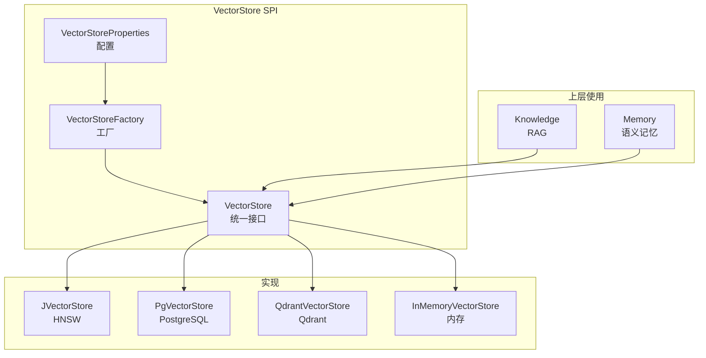
```mermaid
graph TB
    subgraph "VectorStore SPI"
        API[VectorStore<br/>统一接口]
        FACTORY[VectorStoreFactory<br/>工厂]
        CONFIG[VectorStoreProperties<br/>配置]
    end

    subgraph "实现"
        JVECTOR[JVectorStore<br/>HNSW]
        PGVECTOR[PgVectorStore<br/>PostgreSQL]
        QDRANT[QdrantVectorStore<br/>Qdrant]
        MEMORY[InMemoryVectorStore<br/>内存]
    end

    subgraph "上层使用"
        KNOWLEDGE[Knowledge<br/>RAG]
        MEMORY2[Memory<br/>语义记忆]
    end

    API --> JVECTOR
    API --> PGVECTOR
    API --> QDRANT
    API --> MEMORY
    
    FACTORY --> API
    CONFIG --> FACTORY
    
    KNOWLEDGE --> API
    MEMORY2 --> API
```

### 12.3 核心接口设计

```java
public interface VectorStore {
    
    /**
     * 插入或更新
     */
    void upsert(VectorRecord record);
    
    /**
     * 批量插入
     */
    default void upsertBatch(List<VectorRecord> records) {
        for (VectorRecord r : records) {
            upsert(r);
        }
    }
    
    /**
     * 搜索
     */
    List<VectorRecord> search(VectorSearchRequest request);
    
    /**
     * 删除
     */
    void delete(String id);
    
    /**
     * 批量删除
     */
    default void deleteBatch(List<String> ids) {
        for (String id : ids) {
            delete(id);
        }
    }
    
    /**
     * 重建索引
     */
    default void rebuild() {}
    
    /**
     * 大小
     */
    default int size() { return 0; }
}

public record VectorRecord(
    String id,
    float[] vector,
    Map<String, Object> metadata
) {}

public class VectorSearchRequest {
    private float[] queryVector;
    private int topK = 10;
    private Double minScore;                    // 最小相似度
    private Map<String, Object> filter;         // 元数据过滤
    private VectorSearchType searchType = VectorSearchType.ANN;  // ANN/EXACT
    
    public static Builder builder() { return new Builder(); }
    
    public static class Builder {
        private final VectorSearchRequest request = new VectorSearchRequest();
        
        public Builder queryVector(float[] vector) { request.queryVector = vector; return this; }
        public Builder topK(int topK) { request.topK = topK; return this; }
        public Builder minScore(double score) { request.minScore = score; return this; }
        public Builder filter(Map<String, Object> filter) { request.filter = filter; return this; }
        public Builder searchType(VectorSearchType type) { request.searchType = type; return this; }
        public VectorSearchRequest build() { return request; }
    }
}

public enum VectorSearchType {
    ANN,      // 近似最近邻
    EXACT     // 精确搜索
}
```

### 12.4 实现

#### 12.4.1 JVectorStore

```java
public class JVectorStore implements VectorStore {
    
    private final int dimension;
    private final Path indexPath;
    
    private final Map<String, Map<String, Object>> metadataCache = new ConcurrentHashMap<>();
    private final List<VectorFloat<?>> vectors = Collections.synchronizedList(new ArrayList<>());
    private final Map<Integer, String> nodeIdToRecordId = new ConcurrentHashMap<>();
    private final Map<String, Integer> recordIdToNodeId = new ConcurrentHashMap<>();
    private final AtomicInteger nextNodeId = new AtomicInteger(0);
    
    private volatile GraphIndexBuilder builder;
    private volatile OnHeapGraphIndex graphIndex;
    
    @Override
    public void upsert(VectorRecord record) {
        metadataCache.put(record.id(), new LinkedHashMap<>(record.metadata()));
        
        VectorFloat<?> vec = TYPE_SUPPORT.createFloatVector(record.vector().clone());
        
        synchronized (vectors) {
            Integer oldNodeId = recordIdToNodeId.remove(record.id());
            if (oldNodeId != null) {
                nodeIdToRecordId.remove(oldNodeId);
            }
            
            int nodeId = nextNodeId.getAndIncrement();
            vectors.add(vec);
            nodeIdToRecordId.put(nodeId, record.id());
            recordIdToNodeId.put(record.id(), nodeId);
            
            builder.addGraphNode(nodeId, vec);
        }
        
        graphIndex = builder.getGraph();
    }
    
    @Override
    public List<VectorRecord> search(VectorSearchRequest request) {
        VectorFloat<?> query = TYPE_SUPPORT.createFloatVector(request.getQueryVector());
        ListRandomAccessVectorValues rav = new ListRandomAccessVectorValues(
            (List<VectorFloat<?>>) (List<?>) vectors, dimension
        );
        
        SearchResult result = GraphSearcher.search(
            query,
            request.getTopK(),
            rav,
            VectorSimilarityFunction.DOT_PRODUCT,
            graphIndex,
            Bits.ALL
        );
        
        List<VectorRecord> records = new ArrayList<>();
        for (SearchResult.NodeScore ns : result.getNodes()) {
            String recordId = nodeIdToRecordId.get(ns.node);
            if (recordId == null) continue;
            
            Map<String, Object> meta = new LinkedHashMap<>(metadataCache.get(recordId));
            meta.put("_score", (double) ns.score);
            
            records.add(new VectorRecord(recordId, toFloatArray(vectors.get(ns.node)), meta));
        }
        
        return records;
    }
}
```

#### 12.4.2 PgVectorStore

```java
public class PgVectorStore implements VectorStore {
    
    private final JdbcTemplate jdbcTemplate;
    private final String tableName;
    private final int dimension;
    
    @Override
    public void upsert(VectorRecord record) {
        String sql = """
            INSERT INTO %s (id, embedding, metadata)
            VALUES (?, ?::vector, ?::jsonb)
            ON CONFLICT (id) DO UPDATE SET
                embedding = EXCLUDED.embedding,
                metadata = EXCLUDED.metadata
            """.formatted(tableName);
        
        String embeddingStr = toPgVector(record.vector());
        String metadataJson = JSONUtils.toJsonString(record.metadata());
        
        jdbcTemplate.update(sql, record.id(), embeddingStr, metadataJson);
    }
    
    @Override
    public List<VectorRecord> search(VectorSearchRequest request) {
        String sql = """
            SELECT id, embedding, metadata,
                   1 - (embedding <=> ?::vector) as score
            FROM %s
            ORDER BY embedding <=> ?::vector
            LIMIT ?
            """.formatted(tableName);
        
        String queryVector = toPgVector(request.getQueryVector());
        
        return jdbcTemplate.query(sql, (rs, rowNum) -> {
            String id = rs.getString("id");
            float[] vector = fromPgVector(rs.getString("embedding"));
            Map<String, Object> metadata = JSONUtils.parseObject(rs.getString("metadata"), Map.class);
            metadata.put("_score", rs.getDouble("score"));
            return new VectorRecord(id, vector, metadata);
        }, queryVector, queryVector, request.getTopK());
    }
    
    private String toPgVector(float[] vector) {
        return "[" + Arrays.stream(vector)
            .mapToObj(String::valueOf)
            .collect(Collectors.joining(",")) + "]";
    }
}
```

### 12.5 自动配置

```java
@Configuration
public class VectorStoreAutoConfiguration {
    
    @Bean
    @ConditionalOnProperty(name = "shiyu.vector.type", havingValue = "jvector", matchIfMissing = true)
    public VectorStore jVectorStore(VectorStoreProperties properties) {
        return new JVectorStore(properties);
    }
    
    @Bean
    @ConditionalOnProperty(name = "shiyu.vector.type", havingValue = "pgvector")
    public VectorStore pgVectorStore(JdbcTemplate jdbcTemplate, VectorStoreProperties properties) {
        return new PgVectorStore(jdbcTemplate, properties.getTableName(), properties.getDimension());
    }
    
    @Bean
    @ConditionalOnProperty(name = "shiyu.vector.type", havingValue = "qdrant")
    public VectorStore qdrantVectorStore(VectorStoreProperties properties) {
        return new QdrantVectorStore(properties);
    }
    
    @Bean
    @ConditionalOnProperty(name = "shiyu.vector.type", havingValue = "memory")
    public VectorStore inMemoryVectorStore() {
        return new InMemoryVectorStore();
    }
}
```

### 12.6 配置

```yaml
shiyu:
  vector:
    type: jvector  # jvector / pgvector / qdrant / memory
    dimension: 512
    data-dir: ${app.home}/data/vector
    table-name: vector_store
    qdrant:
      host: localhost
      port: 6334
      collection-name: shiyu_vectors
```

---

## 第十三章 Model Provider SPI

### 13.1 概述

Model Provider SPI 提供统一的模型接入接口，支持：

- 多平台适配（OpenAI、Ollama、DeepSeek、SiliconFlow、OpenRouter）
- 弹性策略（降级、熔断、限流、负载均衡）
- 模型注册与发现

### 13.2 架构设计

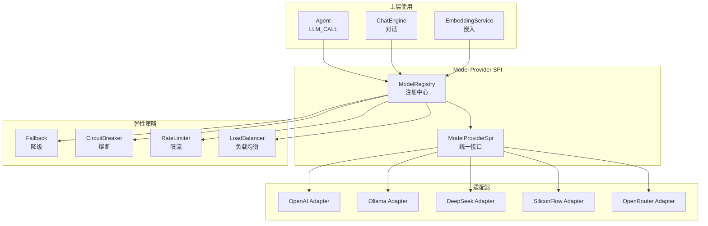
```mermaid
graph TB
    subgraph "Model Provider SPI"
        SPI[ModelProviderSpi<br/>统一接口]
        REGISTRY[ModelRegistry<br/>注册中心]
    end

    subgraph "适配器"
        OA[OpenAI Adapter]
        OL[Ollama Adapter]
        DS[DeepSeek Adapter]
        SF[SiliconFlow Adapter]
        OR[OpenRouter Adapter]
    end

    subgraph "弹性策略"
        FB[Fallback<br/>降级]
        CB[CircuitBreaker<br/>熔断]
        RL[RateLimiter<br/>限流]
        LB[LoadBalancer<br/>负载均衡]
    end

    subgraph "上层使用"
        AGENT[Agent<br/>LLM_CALL]
        CHAT[ChatEngine<br/>对话]
        EMBED[EmbeddingService<br/>嵌入]
    end

    SPI --> OA
    SPI --> OL
    SPI --> DS
    SPI --> SF
    SPI --> OR
    
    REGISTRY --> SPI
    
    AGENT --> REGISTRY
    CHAT --> REGISTRY
    EMBED --> REGISTRY
    
    REGISTRY --> FB
    REGISTRY --> CB
    REGISTRY --> RL
    REGISTRY --> LB
```

### 13.3 核心接口设计

```java
// 聊天模型提供者
public interface ChatModelProvider {
    
    /**
     * 平台类型
     */
    String platformType();
    
    /**
     * 是否可用
     */
    boolean isAvailable();
    
    /**
     * 获取聊天模型
     */
    ChatModel getChatModel(String modelName);
    
    /**
     * 获取流式聊天模型
     */
    StreamingChatModel getStreamingChatModel(String modelName);
    
    /**
     * 默认模型
     */
    String getDefaultModelName();
}

// 嵌入模型提供者
public interface EmbeddingModelProvider {
    
    String platformType();
    
    boolean isAvailable();
    
    EmbeddingModel getEmbeddingModel(String modelName);
    
    String getDefaultModelName();
}

// 图像模型提供者
public interface ImageModelProvider {
    
    String platformType();
    
    boolean isAvailable();
    
    ImageModel getImageModel(String modelName);
}

// 音频模型提供者
public interface AudioModelProvider {
    
    String platformType();
    
    boolean isAvailable();
    
    AudioModel getAudioModel(String modelName);
}

// 重排模型提供者
public interface RerankModelProvider {
    
    String platformType();
    
    boolean isAvailable();
    
    RerankModel getRerankModel(String modelName);
}
```

### 13.4 ModelRegistry

```java
public interface ModelRegistry {
    
    /**
     * 注册适配器
     */
    void registerAdapter(ChatModelProvider adapter);
    
    /**
     * 注销适配器
     */
    void unregisterAdapter(String platformType);
    
    /**
     * 获取适配器
     */
    ChatModelProvider getAdapter(String platformType);
    
    /**
     * 获取聊天模型
     */
    ChatModel getChatModel(String platformType, String modelName);
    
    /**
     * 获取流式聊天模型
     */
    StreamingChatModel getStreamingChatModel(String platformType, String modelName);
    
    /**
     * 获取所有可用平台
     */
    List<String> getAvailablePlatforms();
    
    /**
     * 刷新缓存
     */
    void refreshCache(String platformType);
}

@Service
public class ModelRegistryImpl implements ModelRegistry, ApplicationRunner {
    
    private final Map<String, ChatModelProvider> adapterMap = new ConcurrentHashMap<>();
    
    @Autowired
    private AiPlatformRepository platformRepository;
    @Autowired
    private AiModelRepository modelRepository;
    @Autowired
    private PlatformProperties platformProperties;
    
    @Override
    public void run(ApplicationArguments args) {
        reloadFromDb();
    }
    
    public void reloadFromDb() {
        adapterMap.clear();
        
        List<AiPlatformBO> platforms = platformRepository.selectAllEnabled();
        
        if (platforms != null && !platforms.isEmpty()) {
            for (AiPlatformBO platform : platforms) {
                ChatModelProvider adapter = createAdapter(platform);
                if (adapter != null) {
                    adapterMap.put(platform.getCode(), adapter);
                }
            }
        } else {
            loadDefaults();
        }
    }
    
    @Override
    public ChatModel getChatModel(String platformType, String modelName) {
        ChatModelProvider adapter = getAdapter(platformType);
        return adapter.getChatModel(modelName);
    }
    
    @Override
    public ChatModelProvider getAdapter(String platformType) {
        ChatModelProvider adapter = adapterMap.get(platformType);
        if (adapter == null) {
            throw new IllegalArgumentException("未找到平台适配器：" + platformType);
        }
        return adapter;
    }
}
```

### 13.5 弹性策略

```java
// 降级策略
public interface FallbackStrategy {
    
    /**
     * 执行带降级的调用
     */
    <T> T execute(Supplier<T> primary, Supplier<T> fallback);
}

@Component
public class ModelFallbackStrategy implements FallbackStrategy {
    
    @Override
    public <T> T execute(Supplier<T> primary, Supplier<T> fallback) {
        try {
            return primary.get();
        } catch (Exception e) {
            log.warn("主模型调用失败，执行降级: {}", e.getMessage());
            return fallback.get();
        }
    }
}

// 熔断器
public class CircuitBreaker {
    
    private final int failureThreshold;
    private final long resetTimeoutMs;
    
    private final AtomicInteger failureCount = new AtomicInteger(0);
    private volatile long lastFailureTime = 0;
    private volatile State state = State.CLOSED;
    
    public enum State { CLOSED, OPEN, HALF_OPEN }
    
    public <T> T execute(Supplier<T> action) {
        if (state == State.OPEN) {
            if (System.currentTimeMillis() - lastFailureTime > resetTimeoutMs) {
                state = State.HALF_OPEN;
            } else {
                throw new CircuitBreakerOpenException("熔断器已打开");
            }
        }
        
        try {
            T result = action.get();
            onSuccess();
            return result;
        } catch (Exception e) {
            onFailure();
            throw e;
        }
    }
    
    private void onSuccess() {
        failureCount.set(0);
        state = State.CLOSED;
    }
    
    private void onFailure() {
        int count = failureCount.incrementAndGet();
        lastFailureTime = System.currentTimeMillis();
        
        if (count >= failureThreshold) {
            state = State.OPEN;
        }
    }
}

// 限流器
public class RateLimiter {
    
    private final int maxRequests;
    private final long windowMs;
    
    private final AtomicInteger requestCount = new AtomicInteger(0);
    private volatile long windowStart = System.currentTimeMillis();
    
    public boolean tryAcquire() {
        long now = System.currentTimeMillis();
        
        if (now - windowStart > windowMs) {
            requestCount.set(0);
            windowStart = now;
        }
        
        return requestCount.incrementAndGet() <= maxRequests;
    }
}

// 负载均衡器
public interface LoadBalancer {
    
    /**
     * 选择一个平台
     */
    String select(List<String> platforms);
}

@Component
public class RoundRobinLoadBalancer implements LoadBalancer {
    
    private final AtomicInteger counter = new AtomicInteger(0);
    
    @Override
    public String select(List<String> platforms) {
        if (platforms.isEmpty()) {
            throw new IllegalStateException("无可用平台");
        }
        int index = counter.getAndIncrement() % platforms.size();
        return platforms.get(index);
    }
}
```

---

## 第十四章 Tool & MCP

### 14.1 概述

Tool 模块提供统一的工具执行能力，支持：

- 内置工具（Web 搜索、计算器、日期时间）
- MCP 工具（Model Context Protocol）
- 远程工具（HTTP、gRPC）
- 工具权限控制

### 14.2 架构设计

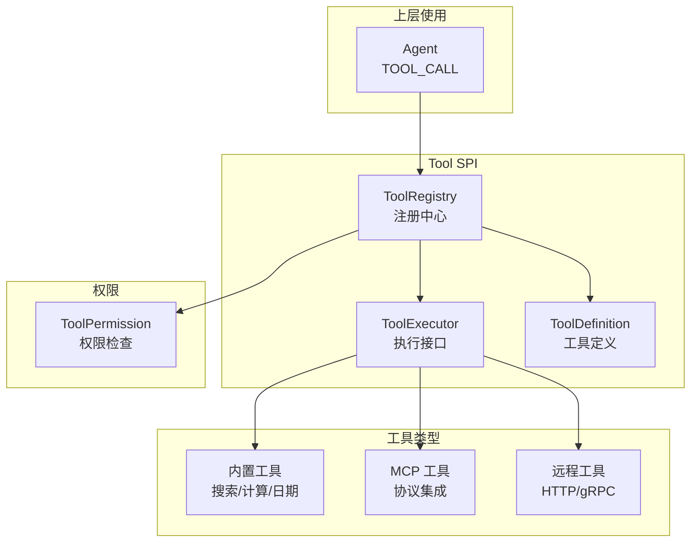
```mermaid
graph TB
    subgraph "Tool SPI"
        API[ToolExecutor<br/>执行接口]
        REG[ToolRegistry<br/>注册中心]
        DEF[ToolDefinition<br/>工具定义]
    end

    subgraph "工具类型"
        BUILTIN[内置工具<br/>搜索/计算/日期]
        MCP[MCP 工具<br/>协议集成]
        REMOTE[远程工具<br/>HTTP/gRPC]
    end

    subgraph "权限"
        PERM[ToolPermission<br/>权限检查]
    end

    subgraph "上层使用"
        AGENT[Agent<br/>TOOL_CALL]
    end

    API --> BUILTIN
    API --> MCP
    API --> REMOTE
    
    REG --> API
    REG --> DEF
    REG --> PERM
    
    AGENT --> REG
```

### 14.3 核心接口设计

```java
public interface ToolExecutor {
    
    /**
     * 工具定义
     */
    ToolDefinition getDefinition();
    
    /**
     * 执行工具
     */
    ToolResult execute(Map<String, Object> parameters);
}

public record ToolDefinition(
    String name,
    String description,
    List<ToolParameter> parameters,
    ToolType type  // BUILTIN, MCP, REMOTE
) {}

public record ToolParameter(
    String name,
    String type,       // string, number, boolean, object
    String description,
    boolean required
) {}

public record ToolResult(
    boolean success,
    Object data,
    String errorMessage
) {
    public static ToolResult success(Object data) {
        return new ToolResult(true, data, null);
    }
    
    public static ToolResult error(String message) {
        return new ToolResult(false, null, message);
    }
}
```

### 14.4 内置工具

```java
@Component
public class WebSearchTool implements ToolExecutor {
    
    @Override
    public ToolDefinition getDefinition() {
        return new ToolDefinition(
            "web_search",
            "搜索互联网获取信息",
            List.of(
                new ToolParameter("query", "string", "搜索关键词", true)
            ),
            ToolType.BUILTIN
        );
    }
    
    @Override
    public ToolResult execute(Map<String, Object> parameters) {
        String query = (String) parameters.get("query");
        
        try {
            // 调用搜索 API
            List<SearchResult> results = searchService.search(query, 5);
            return ToolResult.success(results);
        } catch (Exception e) {
            return ToolResult.error("搜索失败: " + e.getMessage());
        }
    }
}

@Component
public class CalculatorTool implements ToolExecutor {
    
    @Override
    public ToolDefinition getDefinition() {
        return new ToolDefinition(
            "calculator",
            "执行数学计算",
            List.of(
                new ToolParameter("expression", "string", "数学表达式", true)
            ),
            ToolType.BUILTIN
        );
    }
    
    @Override
    public ToolResult execute(Map<String, Object> parameters) {
        String expression = (String) parameters.get("expression");
        
        try {
            Object result = evaluate(expression);
            return ToolResult.success(result);
        } catch (Exception e) {
            return ToolResult.error("计算失败: " + e.getMessage());
        }
    }
}
```

### 14.5 MCP 工具

```java
@Component
public class McpToolExecutor implements ToolExecutor {
    
    private final McpClient client;
    private final String toolName;
    
    @Override
    public ToolDefinition getDefinition() {
        // 从 MCP 服务器获取工具定义
        return client.getToolDefinition(toolName);
    }
    
    @Override
    public ToolResult execute(Map<String, Object> parameters) {
        try {
            Object result = client.callTool(toolName, parameters);
            return ToolResult.success(result);
        } catch (Exception e) {
            return ToolResult.error("MCP 工具调用失败: " + e.getMessage());
        }
    }
}

@Component
public class McpClientManager {
    
    private final Map<String, McpClient> clients = new ConcurrentHashMap<>();
    
    @Autowired
    private McpProperties mcpProperties;
    
    @PostConstruct
    public void init() {
        for (McpServerConfig config : mcpProperties.getServers()) {
            McpClient client = createClient(config);
            clients.put(config.getName(), client);
        }
    }
    
    public McpClient getClient(String serverName) {
        return clients.get(serverName);
    }
    
    private McpClient createClient(McpServerConfig config) {
        return McpClient.builder()
            .serverUrl(config.getUrl())
            .transport(config.getTransport())
            .build();
    }
}
```

### 14.6 ToolRegistry

```java
@Component
public class ToolRegistry {
    
    private final Map<String, ToolExecutor> tools = new ConcurrentHashMap<>();
    
    @Autowired
    public void registerTools(List<ToolExecutor> executors) {
        for (ToolExecutor executor : executors) {
            tools.put(executor.getDefinition().name(), executor);
        }
    }
    
    public ToolExecutor getTool(String name) {
        ToolExecutor executor = tools.get(name);
        if (executor == null) {
            throw new IllegalArgumentException("未找到工具: " + name);
        }
        return executor;
    }
    
    public List<ToolDefinition> listTools() {
        return tools.values().stream()
            .map(ToolExecutor::getDefinition)
            .collect(Collectors.toList());
    }
    
    public ToolResult execute(String toolName, Map<String, Object> parameters) {
        ToolExecutor executor = getTool(toolName);
        return executor.execute(parameters);
    }
}
```

---

## 第十五章 Usage Center

### 15.1 概述

Usage Center 提供完整的用量统计与成本管理：

- **Token 统计**：按模型、按用户、按 Agent 统计
- **成本计算**：根据模型定价计算费用
- **配额管理**：限制用户/租户用量
- **报表导出**：支持多维度报表

### 15.2 架构设计

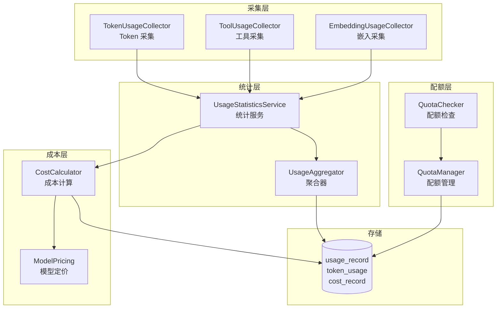
```mermaid
graph TB
    subgraph "采集层"
        TC[TokenUsageCollector<br/>Token 采集]
        TOOLC[ToolUsageCollector<br/>工具采集]
        EMBEDC[EmbeddingUsageCollector<br/>嵌入采集]
    end

    subgraph "统计层"
        STATS[UsageStatisticsService<br/>统计服务]
        AGG[UsageAggregator<br/>聚合器]
    end

    subgraph "成本层"
        CALC[CostCalculator<br/>成本计算]
        PRICE[ModelPricing<br/>模型定价]
    end

    subgraph "配额层"
        QUOTA[QuotaManager<br/>配额管理]
        CHECK[QuotaChecker<br/>配额检查]
    end

    subgraph "存储"
        DB[(usage_record<br/>token_usage<br/>cost_record)]
    end

    TC --> STATS
    TOOLC --> STATS
    EMBEDC --> STATS
    
    STATS --> AGG
    AGG --> DB
    
    STATS --> CALC
    CALC --> PRICE
    CALC --> DB
    
    CHECK --> QUOTA
    QUOTA --> DB
```

### 15.3 核心接口设计

```java
// 用量采集器
public interface UsageCollector {
    
    /**
     * 记录用量
     */
    void record(UsageRecord record);
}

// Token 用量采集
@Component
public class TokenUsageCollector implements UsageCollector {
    
    @Autowired
    private TokenUsageRepository repository;
    
    @Override
    public void record(UsageRecord record) {
        TokenUsageBO bo = new TokenUsageBO();
        bo.setUserId(record.getUserId());
        bo.setAgentId(record.getAgentId());
        bo.setPlatform(record.getPlatform());
        bo.setModel(record.getModel());
        bo.setPromptTokens(record.getPromptTokens());
        bo.setCompletionTokens(record.getCompletionTokens());
        bo.setTotalTokens(record.getTotalTokens());
        bo.setCreateTime(LocalDateTime.now());
        
        repository.insert(bo);
    }
    
    @EventListener
    public void onModelCall(ModelCallEvent event) {
        UsageRecord record = UsageRecord.builder()
            .userId(event.getUserId())
            .agentId(event.getAgentId())
            .platform(event.getPlatform())
            .model(event.getModel())
            .promptTokens(event.getPromptTokens())
            .completionTokens(event.getCompletionTokens())
            .totalTokens(event.getPromptTokens() + event.getCompletionTokens())
            .build();
        
        record(record);
    }
}

// 统计服务
@Service
public class UsageStatisticsService {
    
    @Autowired
    private TokenUsageRepository tokenUsageRepository;
    
    public UsageStatistics getStatistics(UsageQuery query) {
        List<TokenUsageBO> records = tokenUsageRepository.selectByQuery(query);
        
        long totalTokens = records.stream()
            .mapToLong(TokenUsageBO::getTotalTokens)
            .sum();
        
        long promptTokens = records.stream()
            .mapToLong(TokenUsageBO::getPromptTokens)
            .sum();
        
        long completionTokens = records.stream()
            .mapToLong(TokenUsageBO::getCompletionTokens)
            .sum();
        
        return UsageStatistics.builder()
            .totalTokens(totalTokens)
            .promptTokens(promptTokens)
            .completionTokens(completionTokens)
            .callCount(records.size())
            .build();
    }
    
    public List<UsageDimension> getStatisticsByDimension(UsageQuery query, Dimension dimension) {
        return switch (dimension) {
            case USER -> tokenUsageRepository.groupByUser(query);
            case AGENT -> tokenUsageRepository.groupByAgent(query);
            case MODEL -> tokenUsageRepository.groupByModel(query);
            case PLATFORM -> tokenUsageRepository.groupByPlatform(query);
            case DATE -> tokenUsageRepository.groupByDate(query);
        };
    }
}

// 成本计算
@Service
public class CostCalculator {
    
    @Autowired
    private ModelPricingRepository pricingRepository;
    
    public CostReport calculateCost(UsageStatistics statistics) {
        List<ModelPricing> pricings = pricingRepository.selectAll();
        
        Map<String, Double> costByModel = new HashMap<>();
        double totalCost = 0;
        
        for (UsageByModel usage : statistics.getByModel()) {
            ModelPricing pricing = pricings.stream()
                .filter(p -> p.getModel().equals(usage.getModel()))
                .findFirst()
                .orElse(null);
            
            if (pricing != null) {
                double cost = calculateModelCost(usage, pricing);
                costByModel.put(usage.getModel(), cost);
                totalCost += cost;
            }
        }
        
        return CostReport.builder()
            .costByModel(costByModel)
            .totalCost(totalCost)
            .currency("CNY")
            .build();
    }
    
    private double calculateModelCost(UsageByModel usage, ModelPricing pricing) {
        double promptCost = usage.getPromptTokens() * pricing.getPromptPricePerToken();
        double completionCost = usage.getCompletionTokens() * pricing.getCompletionPricePerToken();
        return promptCost + completionCost;
    }
}

// 配额管理
@Service
public class QuotaManager {
    
    @Autowired
    private QuotaPolicyRepository policyRepository;
    @Autowired
    private TokenUsageRepository usageRepository;
    
    public QuotaCheckResult checkQuota(Long userId, String platform) {
        QuotaPolicy policy = policyRepository.selectByUserId(userId);
        
        if (policy == null) {
            return QuotaCheckResult.allowed();
        }
        
        long usedTokens = usageRepository.sumTokensByUser(userId, LocalDateTime.now().withDayOfMonth(1));
        
        if (usedTokens >= policy.getMonthlyTokenLimit()) {
            return QuotaCheckResult.denied("月度 Token 配额已用完");
        }
        
        long remaining = policy.getMonthlyTokenLimit() - usedTokens;
        return QuotaCheckResult.allowed(remaining);
    }
}
```

### 15.4 数据库设计

```sql
-- Token 用量记录
CREATE TABLE token_usage (
    id BIGINT PRIMARY KEY AUTO_INCREMENT,
    user_id BIGINT NOT NULL,
    agent_id VARCHAR(128),
    session_id VARCHAR(128),
    platform VARCHAR(64) NOT NULL,
    model VARCHAR(128) NOT NULL,
    
    prompt_tokens INT NOT NULL DEFAULT 0,
    completion_tokens INT NOT NULL DEFAULT 0,
    total_tokens INT NOT NULL DEFAULT 0,
    
    create_time TIMESTAMP DEFAULT CURRENT_TIMESTAMP,
    
    INDEX idx_user_id (user_id),
    INDEX idx_agent_id (agent_id),
    INDEX idx_platform (platform),
    INDEX idx_model (model),
    INDEX idx_create_time (create_time)
);

-- 模型定价
CREATE TABLE model_pricing (
    id BIGINT PRIMARY KEY AUTO_INCREMENT,
    platform VARCHAR(64) NOT NULL,
    model VARCHAR(128) NOT NULL,
    
    prompt_price_per_token DECIMAL(10, 8) NOT NULL,
    completion_price_per_token DECIMAL(10, 8) NOT NULL,
    
    currency VARCHAR(8) DEFAULT 'CNY',
    
    create_time TIMESTAMP DEFAULT CURRENT_TIMESTAMP,
    update_time TIMESTAMP DEFAULT CURRENT_TIMESTAMP ON UPDATE CURRENT_TIMESTAMP,
    
    UNIQUE KEY uk_platform_model (platform, model)
);

-- 配额策略
CREATE TABLE quota_policy (
    id BIGINT PRIMARY KEY AUTO_INCREMENT,
    tenant_id BIGINT,
    user_id BIGINT,
    
    daily_token_limit BIGINT,
    monthly_token_limit BIGINT,
    daily_call_limit INT,
    
    create_time TIMESTAMP DEFAULT CURRENT_TIMESTAMP,
    update_time TIMESTAMP DEFAULT CURRENT_TIMESTAMP ON UPDATE CURRENT_TIMESTAMP,
    
    INDEX idx_tenant_id (tenant_id),
    INDEX idx_user_id (user_id)
);
```

---

## 第十六章 Observability

### 16.1 概述

Observability 模块提供完整的可观测性能力：

| 能力 | 存储 | 后端 |
|------|------|------|
| **Traces（链路追踪）** | 不存 DB | OpenTelemetry → Jaeger/Tempo |
| **Metrics（指标）** | 不存 DB | Micrometer → Prometheus |
| **Audit（审计日志）** | 存 DB | audit_log 表 |
| **Timeline（执行时间线）** | 存 DB | execution_timeline 表 |

### 16.2 架构设计

```mermaid
graph TB
    subgraph "应用层"
        AGENT[Agent Runtime]
        MODEL[Model Provider]
        KNOWLEDGE[Knowledge]
        MEMORY[Memory]
    end

    subgraph "采集层"
        TRACE[TraceCollector<br/>链路采集]
        METRIC[MetricCollector<br/>指标采集]
        AUDIT[AuditCollector<br/>审计采集]
    end

    subgraph "输出"
        subgraph "不存DB"
            OTEL[OpenTelemetry SDK]
            JAEGER[Jaeger<br/>链路追踪]
            PROM[Prometheus<br/>指标监控]
        end
        subgraph "存DB"
            AUDITDB[(audit_log)]
            TIMELINEDB[(execution_timeline)]
        end
    end

    subgraph "可视化"
        GRAFANA[Grafana]
    end

    AGENT --> TRACE
    AGENT --> METRIC
    AGENT --> AUDIT
    MODEL --> TRACE
    MODEL --> METRIC
    
    TRACE --> OTEL
    OTEL --> JAEGER
    
    METRIC --> PROM
    PROM --> GRAFANA
    
    AUDIT --> AUDITDB
    AUDIT --> TIMELINEDB
```

### 16.3 Trace 链路追踪

```java
@Configuration
@EnableAspectJAutoProxy
public class TracingConfiguration {
    
    @Bean
    public OpenTelemetry openTelemetry() {
        return OpenTelemetrySdk.builder()
            .setTracerProvider(
                SdkTracerProvider.builder()
                    .addSpanProcessor(
                        BatchSpanProcessor.builder(
                            OtlpGrpcSpanExporter.builder()
                                .setEndpoint("http://localhost:4317")
                                .build()
                        ).build()
                    )
                    .build()
            )
            .build();
    }
}

// Agent 执行追踪切面
@Aspect
@Component
public class AgentExecutionTraceAspect {
    
    @Autowired
    private Tracer tracer;
    
    @Around("@annotation(Traced)")
    public Object trace(ProceedingJoinPoint pjp) throws Throwable {
        Span span = tracer.spanBuilder(pjp.getSignature().getName())
            .setSpanKind(SpanKind.INTERNAL)
            .startSpan();
        
        try (Scope scope = span.makeCurrent()) {
            span.setAttribute("agent.id", getAgentId(pjp));
            span.setAttribute("user.id", getUserId());
            
            Object result = pjp.proceed();
            span.setStatus(StatusCode.OK);
            return result;
        } catch (Exception e) {
            span.setStatus(StatusCode.ERROR, e.getMessage());
            span.recordException(e);
            throw e;
        } finally {
            span.end();
        }
    }
}
```

### 16.4 Metrics 指标

```java
@Component
public class AgentMetrics {
    
    private final Counter executionCounter;
    private final Timer executionTimer;
    private final Gauge activeExecutions;
    
    public AgentMetrics(MeterRegistry registry) {
        executionCounter = Counter.builder("agent.execution.total")
            .description("Agent 执行总次数")
            .tag("type", "agent")
            .register(registry);
        
        executionTimer = Timer.builder("agent.execution.duration")
            .description("Agent 执行耗时")
            .register(registry);
        
        activeExecutions = Gauge.builder("agent.execution.active", 
                () -> ActiveExecutionHolder.get())
            .description("当前活跃执行数")
            .register(registry);
    }
    
    public void recordExecution(String agentId, String status, long durationMs) {
        executionCounter.increment(
            Tag.of("agent_id", agentId),
            Tag.of("status", status)
        );
        executionTimer.record(durationMs, TimeUnit.MILLISECONDS);
    }
}

@Component
public class ModelMetrics {
    
    private final Counter callCounter;
    private final Timer callTimer;
    private final Counter tokenCounter;
    
    public ModelMetrics(MeterRegistry registry) {
        callCounter = Counter.builder("model.call.total")
            .description("模型调用总次数")
            .register(registry);
        
        callTimer = Timer.builder("model.call.duration")
            .description("模型调用耗时")
            .register(registry);
        
        tokenCounter = Counter.builder("model.token.total")
            .description("Token 消耗总量")
            .register(registry);
    }
    
    public void recordCall(String platform, String model, String status, 
                          long durationMs, int promptTokens, int completionTokens) {
        callCounter.increment(
            Tag.of("platform", platform),
            Tag.of("model", model),
            Tag.of("status", status)
        );
        callTimer.record(durationMs, TimeUnit.MILLISECONDS);
        tokenCounter.increment(promptTokens + completionTokens,
            Tag.of("platform", platform),
            Tag.of("model", model),
            Tag.of("type", "prompt")
        );
    }
}
```

### 16.5 Audit 审计日志

```java
// 审计事件
public class AuditEvent extends DomainEvent {
    private final Long userId;
    private final String action;          // LOGIN, AGENT_EXECUTE, MODEL_CALL, ...
    private final String targetType;      // agent, model, knowledge, ...
    private final String targetId;
    private final Map<String, Object> detail;
    private final String ip;
}

// 审计服务
@Service
public class AuditService {
    
    @Autowired
    private AuditLogRepository repository;
    
    @Async
    @EventListener
    public void onAuditEvent(AuditEvent event) {
        AuditLogBO bo = new AuditLogBO();
        bo.setUserId(event.getUserId());
        bo.setAction(event.getAction());
        bo.setTargetType(event.getTargetType());
        bo.setTargetId(event.getTargetId());
        bo.setDetail(JSONUtils.toJsonString(event.getDetail()));
        bo.setIp(event.getIp());
        bo.setCreateTime(event.getOccurredAt());
        
        repository.insert(bo);
    }
    
    public PageData<AuditLogBO> queryAuditLogs(AuditQuery query) {
        return repository.selectPage(query);
    }
}

// 审计拦截器
@Component
public class AuditInterceptor implements HandlerInterceptor {
    
    @Autowired
    private EventPublisher eventPublisher;
    
    @Override
    public void afterCompletion(HttpServletRequest request, HttpServletResponse response, 
                               Object handler, Exception ex) {
        String action = resolveAction(request);
        
        AuditEvent event = new AuditEvent(
            LoginContextHolder.getUserId(),
            action,
            resolveTargetType(request),
            resolveTargetId(request),
            Map.of("method", request.getMethod(), "path", request.getRequestURI()),
            getClientIp(request)
        );
        
        eventPublisher.publish(event);
    }
}
```

### 16.6 Timeline 执行时间线

```java
// 时间线服务
@Service
public class TimelineService {
    
    @Autowired
    private ExecutionTimelineRepository repository;
    
    @Async
    @EventListener
    public void onNodeExecutionStarted(NodeExecutionStartedEvent event) {
        ExecutionTimelineBO bo = new ExecutionTimelineBO();
        bo.setExecutionId(event.getExecutionId());
        bo.setAgentId(event.getAgentId());
        bo.setNodeId(event.getNodeId());
        bo.setEventType("NODE_START");
        bo.setPayload(JSONUtils.toJsonString(Map.of(
            "nodeType", event.getNodeType(),
            "input", event.getInput()
        )));
        bo.setCreateTime(LocalDateTime.now());
        
        repository.insert(bo);
    }
    
    @Async
    @EventListener
    public void onNodeExecutionCompleted(NodeExecutionCompletedEvent event) {
        ExecutionTimelineBO bo = new ExecutionTimelineBO();
        bo.setExecutionId(event.getExecutionId());
        bo.setAgentId(event.getAgentId());
        bo.setNodeId(event.getNodeId());
        bo.setEventType("NODE_END");
        bo.setPayload(JSONUtils.toJsonString(Map.of(
            "status", "SUCCESS",
            "durationMs", event.getDurationMs()
        )));
        bo.setDurationMs(event.getDurationMs());
        bo.setCreateTime(LocalDateTime.now());
        
        repository.insert(bo);
    }
    
    public List<ExecutionTimelineVO> getTimeline(String executionId) {
        List<ExecutionTimelineBO> bos = repository.selectByExecutionId(executionId);
        return bos.stream().map(this::toVO).collect(Collectors.toList());
    }
}
```

### 16.7 数据库设计

```sql
-- 审计日志表
CREATE TABLE audit_log (
    id BIGINT PRIMARY KEY AUTO_INCREMENT,
    tenant_id BIGINT,
    user_id BIGINT,
    action VARCHAR(64) NOT NULL,         -- LOGIN, AGENT_EXECUTE, MODEL_CALL, ...
    target_type VARCHAR(64),             -- agent, model, knowledge, ...
    target_id VARCHAR(128),
    detail CLOB,                         -- JSON
    ip VARCHAR(64),
    
    create_time TIMESTAMP DEFAULT CURRENT_TIMESTAMP,
    
    INDEX idx_tenant_id (tenant_id),
    INDEX idx_user_id (user_id),
    INDEX idx_action (action),
    INDEX idx_create_time (create_time)
);

-- 执行时间线表
CREATE TABLE execution_timeline (
    id BIGINT PRIMARY KEY AUTO_INCREMENT,
    tenant_id BIGINT,
    execution_id VARCHAR(128) NOT NULL,
    agent_id VARCHAR(128),
    node_id VARCHAR(128),
    event_type VARCHAR(32) NOT NULL,     -- NODE_START, NODE_END, ERROR, RETRY, CHECKPOINT
    payload CLOB,                        -- JSON
    duration_ms BIGINT,
    
    create_time TIMESTAMP DEFAULT CURRENT_TIMESTAMP,
    
    INDEX idx_execution_id (execution_id),
    INDEX idx_agent_id (agent_id),
    INDEX idx_event_type (event_type),
    INDEX idx_create_time (create_time)
);
```

---

## 第十七章 数据库设计

### 17.1 ER 图

```mermaid
erDiagram
    tenant ||--o{ user : "拥有"
    tenant ||--o{ workspace : "拥有"
    workspace ||--o{ user : "包含"
    
    user ||--o{ agent_def : "创建"
    agent_def ||--o{ agent_version : "版本"
    agent_def ||--o{ agent_execution : "执行"
    
    user ||--o{ conversation_message : "对话"
    user ||--o{ long_term_memory : "记忆"
    
    user ||--o{ token_usage : "用量"
    
    knowledge ||--o{ knowledge_document : "包含"
    knowledge_document ||--o{ knowledge_chunk : "分块"
    knowledge ||--o{ knowledge_relation : "关联"
    
    workspace ||--o{ role : "角色"
    role ||--o{ menu : "权限"
```

### 17.2 Schema 分布

| Schema | 表 | 说明 |
|--------|-----|------|
| **schema_common** | dict | 字典 |
| **schema_auth** | tenant, user, role, menu, workspace, user_workspace_role, role_workspace_menu, auth_code | 认证授权 |
| **schema_agent** | ai_platform, ai_model, agent_def, agent_version, intent_def | Agent 定义 |
| **schema_memory** | conversation_message, long_term_memory, episodic_memory | 记忆存储 |
| **schema_runtime** | agent_execution, node_execution, agent_checkpoint | 运行时执行记录 ✅ |
| **schema_usage** | token_usage | Token 用量统计 ✅ |
| **schema_knowledge** | knowledge, knowledge_relation, knowledge_document, knowledge_chunk, knowledge_doc_relation | 知识库 |
| **schema_education** | ability, textbook, chapter, student, teacher, course, exam, question, study_plan, review_task, wrong_question, learning_state, achievement 等 22 张表 | 教育领域 |
| **schema_record** | profile, profile_member, timeline_event, record, media, tag, record_tag | 记录管理 |
| **schema_observation** | audit_log, execution_timeline | 可观测性（规划中 ⏳） |
| **schema_vector** | vector_store（PGVector 场景） | 向量存储 |

> **新增表说明：**
> - `node_execution` — 节点执行明细（P0-2）
> - `agent_checkpoint` — 检查点持久化（P0-2）
> - `episodic_memory` — 情景记忆表（P0-3）
> - `token_usage` — Token 用量统计（P0-5）

### 17.3 数据库迁移

推荐使用 **Flyway** 管理数据库迁移：

```
shiyu-ai-dal/src/main/resources/db/migration/
├── V001__create_schema_common.sql
├── V002__create_schema_auth.sql
├── V003__create_schema_agent.sql
├── V004__create_schema_memory.sql
├── V005__create_schema_knowledge.sql
├── V006__create_schema_education.sql
├── V007__create_schema_record.sql
├── V008__create_schema_usage.sql
├── V009__create_schema_observation.sql
└── V010__create_schema_vector.sql
```

### 17.4 H2 → PostgreSQL 迁移方案

| 维度 | H2 | PostgreSQL |
|------|----|------------|
| 向量 | JSON 存储 float[] | pgvector 扩展 |
| JSON | CLOB + 手动解析 | JSONB 原生支持 |
| 全文检索 | 不支持 | tsvector/tsquery |
| 并发 | 单机 | MVCC |
| 索引 | 基础 | GIN、GiST、HNSW |

**迁移步骤**：

1. 引入 PostgreSQL 依赖
2. 配置数据源切换
3. 向量存储切换到 PGVector
4. JSON 字段迁移到 JSONB
5. 添加 GIN 索引

---

## 第十八章 安全与权限

### 18.1 认证架构

```mermaid
graph TB
    subgraph "认证层"
        LOGIN[登录<br/>Sa-Token]
        CAPTCHA[验证码<br/>滑动窗口限流]
        RATE[限流<br/>LoginRateLimiter]
    end

    subgraph "授权层"
        RBAC[RBAC<br/>用户-角色-菜单]
        TENANT[多租户<br/>tenant_id 隔离]
        WORKSPACE[工作空间<br/>workspace_id 隔离]
    end

    subgraph "安全层"
        XSS[XSS 过滤]
        CORS[CORS 配置]
        ENCRYPT[密码加密<br/>BCrypt]
    end

    LOGIN --> RBAC
    LOGIN --> TENANT
    CAPTCHA --> RATE
    RBAC --> WORKSPACE
```

### 18.2 Sa-Token 加固

#### 18.2.1 Token 纯随机化

```java
// 修复：Token 不再暴露 userId
@PostConstruct
public void rewriteSaStrategy() {
    SaStrategy.instance.createToken = (loginId, loginType) ->
        SaFoxUtil.getRandomString(64);  // 纯随机 64 位
}
```

#### 18.2.2 JSON 序列化替代 Java 原生序列化

```java
// 修复：避免反序列化漏洞
private String serializeSession(SaSession session) {
    return JSONUtils.toJsonString(session);
}

private SaSession deserializeSession(String data) {
    return JSONUtils.parseObject(data, SaSession.class);
}
```

### 18.3 多租户隔离

```java
// 租户拦截器
@Component
public class TenantInterceptor implements HandlerInterceptor {
    
    @Override
    public boolean preHandle(HttpServletRequest request, HttpServletResponse response, 
                            Object handler) {
        Long tenantId = LoginContextHolder.getTenantId();
        if (tenantId != null) {
            TenantContext.setTenantId(tenantId);
        }
        return true;
    }
    
    @Override
    public void afterCompletion(...) {
        TenantContext.clear();
    }
}

// MyBatis-Flex 租户过滤
@Configuration
public class TenantFlexConfig {
    
    @Bean
    public FlexGlobalConfig flexGlobalConfig() {
        FlexGlobalConfig config = new FlexGlobalConfig();
        
        // 自动添加 tenant_id 过滤
        config.setTenantColumn("tenant_id");
        config.setTenantValue(() -> TenantContext.getTenantId());
        
        return config;
    }
}
```

### 18.4 API 安全

| 措施 | 实现 |
|------|------|
| XSS 过滤 | `XssFilter` + Jsoup 净化 |
| CORS | `ResourcesConfig` 白名单 |
| 密码加密 | BCrypt 委派编码器 |
| 验证码 | 6 位 + 3 次尝试限制 + 定期清理 |
| 登录限流 | 滑动窗口 + 随机抖动 |
| Token 安全 | 纯随机 64 位，不暴露 userId |
| 日志脱敏 | 不记录验证码、密码等敏感信息 |

---

## 第十九章 部署架构

### 19.1 单机部署（开发/小规模）

```yaml
# docker-compose.yml (单机)
version: '3.8'
services:
  shiyu-ai:
    image: shiyu-ai:latest
    ports:
      - "9000:9000"
    volumes:
      - shiyu-data:/app/data
    environment:
      - SPRING_PROFILES_ACTIVE=dev
      - AI_OPENAI_API_KEY=${AI_OPENAI_API_KEY}
  
  shiyu-ui:
    image: shiyu-ui:latest
    ports:
      - "80:80"

volumes:
  shiyu-data:
```

### 19.2 Docker 部署（生产）

```yaml
# docker-compose.prod.yml
version: '3.8'
services:
  shiyu-ai-1:
    image: shiyu-ai:latest
    deploy:
      replicas: 2
    environment:
      - SPRING_PROFILES_ACTIVE=prod
      - SHIYU_DATASOURCE_URL=jdbc:postgresql://postgres:5432/shiyu
      - SHIYU_VECTOR_TYPE=pgvector
  
  postgres:
    image: pgvector/pgvector:pg16
    volumes:
      - pg-data:/var/lib/postgresql/data
    environment:
      - POSTGRES_DB=shiyu
      - POSTGRES_PASSWORD=${DB_PASSWORD}
  
  jaeger:
    image: jaegertracing/all-in-one:latest
    ports:
      - "16686:16686"
      - "4317:4317"
  
  prometheus:
    image: prom/prometheus:latest
    volumes:
      - ./prometheus.yml:/etc/prometheus/prometheus.yml
  
  grafana:
    image: grafana/grafana:latest
    ports:
      - "3000:3000"
  
  nginx:
    image: nginx:latest
    ports:
      - "80:80"
      - "443:443"
    volumes:
      - ./nginx.conf:/etc/nginx/nginx.conf

volumes:
  pg-data:
```

### 19.3 Kubernetes 部署

```yaml
# k8s/deployment.yaml
apiVersion: apps/v1
kind: Deployment
metadata:
  name: shiyu-ai
spec:
  replicas: 3
  selector:
    matchLabels:
      app: shiyu-ai
  template:
    metadata:
      labels:
        app: shiyu-ai
      annotations:
        prometheus.io/scrape: "true"
        prometheus.io/port: "9000"
        prometheus.io/path: "/actuator/prometheus"
    spec:
      containers:
        - name: shiyu-ai
          image: shiyu-ai:latest
          ports:
            - containerPort: 9000
          env:
            - name: SPRING_PROFILES_ACTIVE
              value: "prod"
          resources:
            requests:
              memory: "512Mi"
              cpu: "500m"
            limits:
              memory: "2Gi"
              cpu: "2000m"
          livenessProbe:
            httpGet:
              path: /actuator/health/liveness
              port: 9000
            initialDelaySeconds: 30
          readinessProbe:
            httpGet:
              path: /actuator/health/readiness
              port: 9000
            initialDelaySeconds: 10
---
apiVersion: v1
kind: Service
metadata:
  name: shiyu-ai
spec:
  selector:
    app: shiyu-ai
  ports:
    - port: 9000
      targetPort: 9000
---
apiVersion: autoscaling/v2
kind: HorizontalPodAutoscaler
metadata:
  name: shiyu-ai-hpa
spec:
  scaleTargetRef:
    apiVersion: apps/v1
    kind: Deployment
    name: shiyu-ai
  minReplicas: 2
  maxReplicas: 10
  metrics:
    - type: Resource
      resource:
        name: cpu
        target:
          type: Utilization
          averageUtilization: 70
```

---


## 第二十章 RoadMap

### 20.1 版本规划

```mermaid
gantt
    title ShiYu AI 开发路线图
    dateFormat  YYYY-MM-DD
    
    section V1 基础能力 ✅
    Agent Runtime 完善          :done, v1a, 2026-07-10, 7d
    Memory 五层体系              :done, v1b, 2026-07-10, 7d
    VectorStore SPI              :done, v1c, 2026-07-17, 7d
    BO 收归 DAL                  :done, v1d, 2026-07-10, 3d
    
    section V2 平台能力 ✅
    Usage Center                 :done, v2a, after v1a, 5d
    Observability 集成           :done, v2b, after v1a, 5d
    Checkpoint 持久化            :done, v2c, after v1a, 4d
    Flyway 数据库迁移            :done, v2d, after v1d, 3d
    
    section V3 扩展能力 ✅
    Model Provider 弹性          :done, v3a, after v2a, 5d
    RAG 重排序                   :done, v3b, after v2a, 4d
    MCP 工具市场                 :done, v3c, after v2b, 3d
    Plugin 系统                  :done, v3d, after v3a, 4d
    
    section V4 质量与平台化（进行中）
    单元测试补充                 :v4a, after v3d, 10d
    PDF/Word 文档解析器           :v4b, after v3d, 5d
    Usage 报表增强               :v4c, after v3d, 5d
    多租户增强                   :v4d, after v3d, 8d
    Dashboard 数据联调           :v4e, after v3d, 5d
    认证页面 TODO 修复           :v4f, after v3d, 3d
    Metrics 验证                 :v4g, after v3d, 2d
    UI/UX 优化                  :v4h, after v4e, 5d
    安全扫描配置                 :v4i, after v3d, 3d
    
    section V5 规模化（规划中）
    Qdrant 集成                  :v5a, after v4d, 7d
```

### 20.2 三个月重构计划

#### 第一阶段（第 1-4 周）：核心重构 ✅ 已完成

| 周 | 任务 | 产出 | 状态 |
|----|------|------|------|
| W1 | Core 模块拆分（model/memory/tool） | 3 个新模块 | ✅ |
| W1 | BO 收归 DAL | dal.bo 包结构 | ✅ |
| W2 | Agent Runtime 补充（lifecycle/checkpoint） | 暂停/恢复能力 | ✅ |
| W2 | Memory 五层体系 | 五层 Memory 实现 | ✅ |
| W3 | VectorStore SPI | 统一接口 + JVector/InMemory | ✅ |
| W3 | 事件中心（EventBus + Spring Event） | 事件驱动架构 | ✅ |
| W4 | Usage Center | Token/Cost 统计 | ✅ |
| W4 | Observability 集成 | Trace/Metrics/Audit | ✅ |

#### 第二阶段（第 5-8 周）：能力完善 ✅ 已完成

| 周 | 任务 | 产出 | 状态 |
|----|------|------|------|
| W5 | Model Provider 弹性策略 | Fallback/CircuitBreaker | ✅ |
| W5 | Flyway 数据库迁移 | 自动化迁移 | ✅ |
| W6 | RAG 重排序 + 混合检索 | 检索质量提升 | ✅ |
| W6 | MCP 工具市场 | 工具注册/发现 | ✅ |
| W7 | Sa-Token 安全加固 | Token 纯随机/JSON 序列化 | ✅ |
| W7 | 前端 Dashboard 完善 | 用量/监控页面 | 🔄 V4 进行中 |
| W8 | 集成测试 + 性能测试 | 测试覆盖 | 🔄 V4 进行中 |
| W8 | 文档完善 | API 文档/架构文档 | ✅ |

#### 第三阶段（第 9-12 周）：企业化 + V4 质量提升（进行中）

| 周 | 任务 | 产出 | 状态 |
|----|------|------|------|
| W9 | Plugin 系统设计 | SPI + 热加载 + 沙箱 | ✅ |
| W10 | 多租户增强 | 资源隔离/配额 | 🔄 V4 进行中 |
| W11~W12 | V4 综合开发 | 见下方 V4 开发计划 | 🔄 进行中 |

#### V4 开发计划（6 周）

| 周 | 任务 | 预估 |
|----|------|------|
| W1 | 单元测试 (AgentRuntime + MemoryService) + 清理维护 | ~11h |
| W2 | 单元测试 (VectorStore + ModelRegistry) + Metrics 验证 | ~12h |
| W3 | 文档解析器 + 教育 Agent 完善 + 前端认证页面 TODO | ~16h |
| W4 | Usage 报表增强 + Dashboard 数据联调 | ~12h |
| W5 | 多租户增强 + 页面功能验证 | ~16h |
| W6 | 安全扫描配置 + UI/UX 优化 | ~9h |

### 20.3 优先级矩阵

```mermaid
quadrantChart
    title 功能优先级矩阵
    x-axis "低价值" --> "高价值"
    y-axis "高成本" --> "低成本"
    
    quadrant-1 "快速胜利"
    quadrant-2 "重大项目"
    quadrant-3 "低优先级"
    quadrant-4 "填充项目"
    
    "BO 收归 DAL": [0.3, 0.8]
    "Agent Runtime": [0.9, 0.6]
    "Memory 五层": [0.85, 0.5]
    "VectorStore SPI": [0.8, 0.55]
    "Usage Center": [0.7, 0.6]
    "Observability": [0.65, 0.55]
    "Plugin 系统": [0.5, 0.3]
    "MCP 市场": [0.55, 0.45]
    "单元测试": [0.85, 0.75]
    "文档解析器": [0.6, 0.65]
    "Flyway": [0.4, 0.85]
```

### 20.4 成功指标

| 指标 | 当前（重构后） | V4 目标 | V5 目标 |
|------|---------------|---------|---------|
| Agent 暂停/恢复 | ✅ 已支持 | 生产级 | 分布式 |
| Memory 层数 | ✅ 5 层（SPI 设计） | 语义记忆增强 | 多模态记忆 |
| VectorStore 实现 | ✅ 2（JVector + InMemory） | 文档解析器完善 | +Qdrant/Milvus |
| Token 统计 | ✅ 基础统计 | 多维报表 + WebSocket | 实时监控 |
| 可观测性 | ✅ Trace+Metrics+Audit | Metrics 验证通过 | AIOps |
| 安全加固 | ✅ Token/反序列化/限流 | OWASP 扫描 | 零信任 |
| 模块化 | ✅ 21 模块 | — | 插件化 |
| MCP 工具市场 | ✅ 注册/发现/搜索/执行 | — | 远程 MCP |
| Plugin 系统 | ✅ SPI+热加载+沙箱 | — | 开发者平台 |
| 启动验证 | ✅ 应用正常启动 :9000 | — | — |
| 测试覆盖 | 🔄 V4 进行中 | 核心模块 50% | 80% |
| 前端认证 | 🔄 V4 进行中 | 3 页 TODO 修复 | — |
| Dashboard | 🔄 V4 进行中 | 真实数据绑定 | — |
| 多租户 | ✅ 数据隔离 | 资源配额 | 全面隔离 |
| 品牌 UI | ✅ 基础页面 | 统一品牌色 + i18n | — |

---

## 附录

### A. 术语表

| 术语 | 说明 |
|------|------|
| **ADD** | Architecture Design Document，架构设计文档 |
| **SPI** | Service Provider Interface，服务提供者接口 |
| **RAG** | Retrieval-Augmented Generation，检索增强生成 |
| **HNSW** | Hierarchical Navigable Small World，分层可导航小世界图 |
