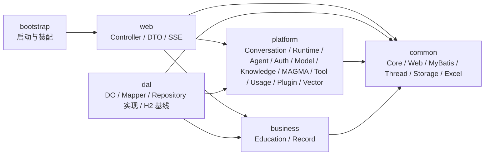
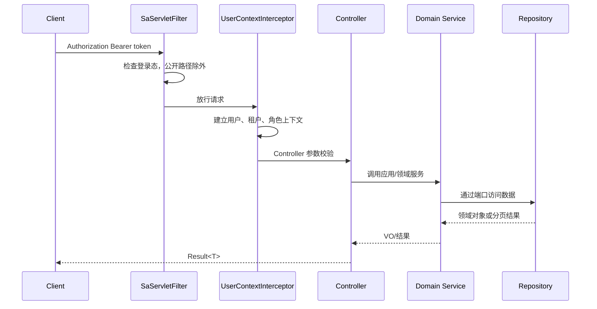

# ShiYu AI 后端技术文档

> 文档基线：2026-08-12。版本号与行为以根 `pom.xml`、各模块源码和运行配置为准。

## 1. 技术栈

| 领域 | 当前实现 |
| --- | --- |
| 语言与运行时 | Java 21 |
| 应用框架 | Spring Boot 4.1.0、Spring MVC |
| AI 与模型 | Spring AI 2.0.0、LangChain4j 1.16.3 |
| Agent 图运行时 | LangGraph4j 1.8.19 |
| 认证授权 | Sa-Token 1.45.0 |
| 数据访问 | MyBatis-Flex 1.11.7 |
| 默认数据库 | H2 2.4.240 文件数据库，MySQL 兼容模式 |
| 向量检索 | JVector 4.0.0 beta.6，HNSW；另有 InMemory 实现 |
| 全文检索 | Lucene 9.12.3、SmartCN |
| 映射与辅助 | MapStruct Plus、Lombok、Hutool、Guava、Caffeine |
| 对象存储 | 本地存储；可选 AWS S3 SDK 适配 S3/MinIO/OSS/COS |
| API 文档 | SpringDoc OpenAPI 3.1.0 |
| 可观测性 | 可选 Actuator、OpenTelemetry、Micrometer、Prometheus |
| 测试与质量 | JUnit/Spring Boot Test、JaCoCo、OWASP Dependency Check、GitHub Actions |

## 2. 总体架构

项目采用 Maven reactor 与分层模块。依赖方向应由接入和基础设施指向平台/业务抽象，业务代码通过 Repository 端口访问持久化实现。



### 2.1 模块职责

| 层级 | 模块 | 职责 |
| --- | --- | --- |
| 启动 | `infrastructure/shiyu-ai-bootstrap` | Spring Boot 入口、配置聚合、日志、数据目录锁、保留任务 |
| 接入 | `infrastructure/shiyu-ai-web` | REST Controller、参数校验、SSE、鉴权拦截、OpenAPI、文件接口 |
| 数据 | `infrastructure/shiyu-ai-dal` | 数据库初始化、DO、Mapper、Repository 实现、保留与备份相关持久化 |
| 公共 | `infrastructure/shiyu-common/*` | Core、Web、MyBatis、线程、存储、Excel 等横切能力 |
| 平台 | `platform/shiyu-ai-agent` | Agent 定义、版本、图、节点、执行、事件、审计、重试与超时 |
| 平台 | `platform/shiyu-ai-conversation` | 原始会话、结构化消息树、GenerationRun、SSE 续传和 Prompt Preview |
| 平台 | `platform/shiyu-ai-runtime` | `AiRun`、统一运行事件、Trace、usage、成本和工具审批 |
| 平台 | `platform/shiyu-ai-auth` | 用户、租户、角色、菜单、权限码、登录上下文与配额 |
| 平台 | `platform/shiyu-ai-model` | 平台适配、模型管理、对话、Embedding 与弹性策略 |
| 平台 | `platform/shiyu-ai-knowledge` | 空间、文档、知识点、图谱、检索、索引、评测和审计 |
| 平台 | `platform/shiyu-ai-vector` | `VectorStore`、Provider、JVector 和 InMemory 实现 |
| 平台 | `platform/shiyu-ai-memory` | MAGMA-based 事件、实体、Temporal/Semantic/Causal/Entity 图、治理和检索 |
| 平台 | `platform/shiyu-ai-tool` | 工具注册、调用和 MCP 接入 |
| 平台 | `platform/shiyu-ai-usage` | 用量记录、聚合与实时推送 |
| 平台 | `platform/shiyu-ai-plugin` | 插件 SPI、注册表、加载器、生命周期和沙箱 |
| 业务 | `business/shiyu-ai-education` | 教育领域模型与服务 |
| 业务 | `business/shiyu-ai-record` | 档案、记录、时间线、媒体和标签领域服务 |

## 3. 请求链路与安全模型



公开路径包括登录、注册、验证码登录、找回密码、验证码、OpenAPI/Swagger 和 H2 Console。其他路径由 Sa-Token 登录检查保护，细粒度操作可再用权限注解约束。

教育资源 Controller 位于教育包下，因此运行时实际路径带统一的 `/v1/education` 前缀，并受 `edu:resource:list` 权限约束。匿名公开清单与真实路径保持一致，不能把教育资源接口视为匿名公开接口。

Token 通过 `Authorization: Bearer <token>` 传递。默认不从 Cookie 读取，默认禁止同账号并发登录；新登录可能使旧会话失效。

`UserContextInterceptor` 将用户、当前租户、当前角色等信息放入线程上下文。Repository 和服务必须使用当前上下文实施数据隔离，不能信任客户端自行提交的租户字段作为唯一边界。

## 4. API 契约

### 4.1 统一响应

普通 REST 接口返回：

```json
{
  "code": 200,
  "data": {},
  "message": "success",
  "error": null,
  "success": true
}
```

前端以 `code === 200` 判断成功，并取 `data`。错误响应可能同时包含 HTTP 状态和业务 `code`，调用方应兼顾两者。

### 4.2 路径约定

后端 context path 是 `/`，Controller 真实路径示例：

| 领域 | 真实后端路径示例 |
| --- | --- |
| 认证与上下文 | `/v1/auth/login`、`/v1/auth/codes`、`/v1/auth/tenants` |
| 用户和授权 | `/v1/system/users/**`、`/v1/system/tenants/**`、`/v1/system/roles/**`、`/v1/system/menus/**`、`/v1/system/auth-codes/**` |
| Agent | `/v1/agents/**`、`/v1/agent-versions/**`、`/v1/agent-executions/**` |
| 模型平台 | `/v1/platform/providers/**`、`/v1/platform/models/**`、`/v1/models`、`/v1/chat/completions`、`/v1/responses` |
| 知识 | `/v1/knowledge/**` |
| 教育 | `/v1/education/**`；由 `EduWebMvcConfig` 统一加前缀 |
| 记录 | `/v1/record/**` |
| 文件 | `/v1/system/files/**` |
| 用量/插件/工具 | `/v1/usage/**`、`/v1/plugins/**`、`/v1/tools/mcp/**` |

`shiyu-ui` 的 `/api` 是浏览器/网关前缀：本地 Vite 把 `/api/v1/auth/login` 代理成后端 `/v1/auth/login`。生产环境必须配置等价的反向代理规则。

### 4.5 Conversation、Runtime 与 MAGMA 契约

- Conversation 是原始交互事实源；消息使用 SYSTEM/USER/ASSISTANT/TOOL 结构化角色和 content parts。
- Runtime 是跨模块运行事件事实源；同一用户请求默认只有一个根 `AiRun`，事件通过 `(runId, seq)` 追加并支持 SSE 恢复。
- Memory 只接收提炼事件和来源引用，不保存完整聊天；四类图和索引均为可重建派生数据。
- Prompt Preview 与真实模型请求必须复用同一 Context Assembly，并保存 `promptHash` 以便审计。
- 新 API 不恢复旧 `/chat/**`、旧 `MemoryService` 或旧 memory 数据兼容路径。

### 4.3 分页和版本

- 后端分页参数主要使用 `pageNum`、`pageSize`。
- 前端请求层会把框架的 `page` 转换为 `pageNum`。
- 知识接口当前由请求头 `version: 1` 标识协议版本，不在 URL 中添加 `/v2`。

### 4.4 SSE

Agent 执行和对话支持流式返回。浏览器使用 `fetch` 读取响应流，并携带 Bearer Token；修改事件格式时应同时更新 `shiyu-ui/apps/web-naive/src/api/stream.ts` 及流式契约测试。

## 5. Agent 技术设计

Agent 定义与版本分离：定义承载稳定标识和管理属性，版本承载可发布配置与图。图由节点和连线组成，保存前可调用图校验接口。

运行时负责：

1. 解析有效版本和图配置。
2. 根据节点类型创建执行节点。
3. 在共享状态中传递输入、中间结果、记忆和输出。
4. 应用节点超时、重试、条件路由和事件发布。
5. 持久化执行与节点时间线。
6. 同步返回最终结果，或通过 SSE 推送增量事件。

新增节点类型时，需要同步考虑节点元数据、配置校验、执行实现、序列化、前端节点表单和回归测试。

## 6. 知识与向量架构

典型知识链路为：文档进入空间 → 文件保存 → 解析和分块 → Embedding → 命名空间化向量索引 → 检索 → 图关系/上下文增强 → 返回或供 Agent 使用。

向量层通过公共 `VectorStore` 和 `VectorStoreProvider` 解耦。默认配置：

```yaml
shiyu:
  vector-store:
    type: jvector
    dimension: 512
    data-dir: ${app.home}/data/vector
```

索引命名空间必须包含租户/空间等隔离信息。切换向量模型时，向量维度和索引版本应一起迁移或重建，不能直接复用不兼容索引。

## 7. 数据与存储

### 7.1 数据目录

`app.home` 由启动前置处理器从工作目录向上寻找 `pom.xml` 自动确定，也可用环境变量 `APP_HOME` 显式指定。默认运行数据位于：

```text
${app.home}/data/
├─ db/          H2 数据库
├─ files/       本地对象/上传文件
├─ vector/      JVector 索引
├─ backups/     自动备份
└─ ...          任务、索引或模型相关运行数据
```

同一数据目录有进程锁，避免多个实例并发写入同一嵌入式数据库和索引。

### 7.2 H2 基线

首次启动由 `DatabaseInitializer` 按顺序执行 `db/baseline/h2/schema` 和 `seed`。这些 SQL 直接描述最终结构和最终种子值，不再执行后置 `ALTER/UPDATE/DELETE` 修补。已安装环境只有在基线版本和 profile 完全匹配时才跳过初始化；旧版本或未知版本会明确拒绝启动，需由部署方先备份并以受控方式重建。当前初始化器明确只支持 H2。

### 7.3 文件存储

默认 `SHIYU_STORAGE_TYPE=local`。切换到 `s3`、`minio`、`aliyun-oss` 或 `tencent-cos` 时：

- 构建中启用 `s3` Maven profile，使 SDK 进入 classpath。
- 用对应的 `SHIYU_STORAGE_*` 环境变量配置 endpoint、region、bucket 和凭据。
- 凭据只放在部署环境或密钥管理系统。

## 8. 配置体系

| 配置 | 作用 |
| --- | --- |
| `application.yml` | 端口、profile 分组、Sa-Token、存储、向量、知识任务和保留策略 |
| `application-h2.yml` | H2 数据源与 H2 Console |
| `application-ai.yml` | Spring AI 级配置；当前包含 OpenAI 环境变量入口 |
| `application-observability.yml` | 可观测性 Spring profile 配置 |
| `shiyu-web.yml` | Web、上传、Jackson 等接入层配置 |
| `config/config.yml` | 可选本地模型平台配置；被 `.gitignore` 排除 |

模型平台也可以由后台持久化管理。代码内的 `PlatformProperties` 支持 `shiyu.ai.ollama/deepseek/openai/openrouter/siliconflow`，不要把真实 API Key 写进受版本控制的 YAML。

## 9. 构建 Profile

| Maven profile | 作用 |
| --- | --- |
| `dev` / `prod` | 设置构建资源中的默认 Spring 环境标识 |
| `offline-models` | 引入本地 BGE small zh v1.5 嵌入模型依赖 |
| `observability` | 引入 Actuator、OpenTelemetry 和 Prometheus 依赖 |
| `api-docs-ui` | 引入 Swagger UI；默认激活，但显式指定其他 profile 时需按需写回 |
| `s3` | 引入 AWS S3 SDK |

Maven profile 决定依赖和资源构建，Spring profile 决定运行时配置，两者不是一回事。

## 10. 开发约定与验证

- 从仓库根目录构建完整 reactor，避免 bootstrap 引用本地 Maven 仓库中的旧模块。
- 领域模块声明 Repository 接口，DAL 提供实现；不要让平台/业务层直接依赖具体 Mapper。
- Controller 负责协议与校验，业务规则进入 Service/Domain。
- 新表、字段或种子变更应生成一套新的完整最终基线，并同步更新版本；初始化器不对已安装数据库做二次修改。
- 新增菜单组件时同时核对后端 `AUTH_MENU.component` 与前端 `views` 文件路径。
- 最小质量门禁：`mvn test`。
- 发布包门禁：`mvn -Pprod -DskipTests -Djacoco.skip=true clean package`；跳过测试只适用于测试已在此前独立通过的发布流水线。

## 11. 前后端契约审计与已知边界

本轮审计使用 TypeScript AST 从前端提取调用，并与当前 OpenAPI 快照的 400 条路径、434 个 operation 交叉比较；未解析表达式为 0，前端调用都能找到结构对应。该检查覆盖 REST、动态路径、统一响应和 SSE 端点，但仍不能替代带真实模型供应商、生产对象存储和网关的全链路验证。

当前已确认的代码边界：

- 自动 Token 续期存在契约缺口：前端开启了自动刷新，并向 `/v1/auth/refresh` 的 body 传入旧 access token；后端过滤器已将该新路径排除为可匿名访问路径。Token 已失效时，控制器负责校验轮换请求。
- 用量 WebSocket `/ws/usage` 已在后端注册，但当前 `shiyu-ui` 没有对应 WebSocket 消费代码。浏览器原生 WebSocket 也不能像普通请求一样任意设置 Authorization Header；在认证握手方案明确前，它属于后端可接入能力，不是当前前端已完成的实时功能。
- 教育资源真实路径为 `/v1/education/education-resources/{fileName}`，且有权限注解；过滤器排除项与新路径保持一致。
- OpenAPI 快照更新于 2026-08-12；代码继续变更后应运行 `pnpm run test:contract:update`，审查快照差异并重复契约测试。

## 12. 相关文档

- [后端项目介绍](./项目介绍.md)
- [后端使用文档](./使用文档.md)
- [前端技术文档](../../shiyu-ui/docs/技术文档.md)
