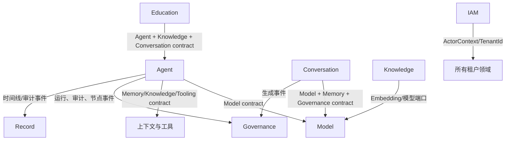

# ShiYu 系统全景与模块调用

本文是 `shiyu-ai` 与 `shiyu-ui` 的跨仓库总览，回答三个问题：模块如何归属和依赖、一次请求如何在前后端流转、每个领域提供什么功能。接口逐条清单、字段定义和权限明细仍以生成文档和 OpenAPI 快照为准。

## 1. 系统边界

```mermaid
flowchart LR
    Browser[浏览器 / Playwright] --> Shell[web-naive App Shell]
    Shell --> Feature[Feature Slice facade]
    Feature -->|/api/{domain}| HTTP[HTTP / SSE]
    HTTP --> Web[领域 Web Controller]
    Web --> App[应用服务 / 领域服务]
    App --> Contract[本领域 Contract]
    Contract --> Impl[本领域 Implementation]
    Impl --> SQL[(本领域表)]
    Impl --> Event[领域事件]
    Event --> Other[其他领域 Contract]
    Web --> Support[技术支持库]
    Impl --> Kernel[Shared Kernel]
```

- `shiyu-ai-bootstrap` 负责启动、配置、数据库初始化和应用装配。
- 通用 HTTP Filter、异常处理、序列化和文件适配器位于基础设施/公共模块。
- 业务 Controller 主要位于对应领域 implementation 的 `web` 包；它不能直接调用其他领域 implementation 或 Repository。
- 跨领域同步调用只引用目标领域 `contract`；跨领域异步协作用带 `tenantId`、`userId`、`correlationId` 的领域事件完成。
- 每个租户资源的查询必须显式带 `TenantId`；HTTP 认证适配层之外不读取线程上下文。

## 2. 后端模块关系

| 模块 | 所有权 | 主要职责 | 对外依赖 |
| --- | --- | --- | --- |
| `application/shiyu-application` | 应用层 | 应用装配、跨域只读组合和启动所需端口 | Shared Kernel、领域 contract |
| `infrastructure/shiyu-ai-bootstrap` | 技术支持 | Spring Boot 入口、配置、H2/v4 初始化、健康检查 | 所有启用的 implementation |
| `infrastructure/shiyu-ai-web` | 技术支持 | Filter、统一异常、HTTP 基础配置、OpenAPI 暴露 | common、IAM 认证适配 |
| `infrastructure/shiyu-common-*` | 技术支持 | MyBatis、存储、线程、向量、Web 和核心工具 | 不依赖领域 implementation |
| `shared/shiyu-shared-kernel` | Shared Kernel | 强类型 ID、`ActorContext`、分页、领域事件、错误类型 | 无业务领域依赖 |
| `architecture/shiyu-architecture-tests` | 质量门禁 | ArchUnit、领域边界和依赖方向检查 | 测试依赖 |

### 2.1 领域纵切

每个领域拥有一个 `contract` 和一个 `implementation` Maven 模块。`contract` 放命令、查询、端口、事件和跨域 DTO；`implementation` 放领域服务、Controller、Repository、SQL、适配器和测试。

| 领域 | 功能范围 | 主要接口/适配器 |
| --- | --- | --- |
| IAM | 登录、Token、租户、用户、角色、菜单、权限码、字典、文件入口 | `AuthController`、`UserController`、`TenantController`、`MenuController` |
| Agent | Agent 定义、版本、意图、图校验、执行、暂停/恢复/取消、评测、工具审批 | `AgentDefinitionController`、`AgentVersionController`、`ExecutionController`、`AiRuntimeController` |
| Conversation | 会话树、消息、GenerationRun、Chat Product、Prompt、OpenAI 兼容接口 | `ConversationController`、`MessageController`、`GenerationController`、`OpenAiCompatibleController` |
| Model | 模型平台、模型目录、默认模型、模型路由和网关 | `AiPlatformController`、`AiModelController`、`ModelGatewayController` |
| Memory | MAGMA 事件、关系、召回和索引重建 | `MemoryController`、`ContextRetrievalPort` |
| Knowledge | 知识空间、文档、版本、关系、图谱、检索、评测、索引任务 | `KnowledgeSpaceController`、`KnowledgeDocumentController`、`KnowledgeSearchController` |
| Tooling | 工具注册、插件市场、MCP 工具发现和调用 | `PluginController`、`McpToolController` |
| Governance | 用量、配额、定价、审计、运行观测和实时用量 | `UsageController`、`UsageWebSocketHandler` |
| Education | 课程、章节、题目、考试、学习计划、学生、复习和资源 | `CourseController`、`ExamController`、`StudentController`、`StudyPlanController` |
| Record | 档案、记录、时间线、媒体和标签 | `ProfileController`、`RecordController`、`TimelineEventController`、`MediaController` |

### 2.2 跨领域协作



禁止的依赖包括：领域 implementation 之间直接依赖、跨域直接访问 Repository/Mapper、跨领域 SQL JOIN、跨领域外键，以及从领域层读取 `UserContextHolder`。

## 3. 数据归属

领域 implementation 自己维护 `src/main/resources/db/baseline/h2/schema/<domain>` 和 `seed/<domain>`。当前 v4 是空开发库的最终基线，不是 v3/v4 迁移脚本。

| 数据前缀 | 所属领域 | 典型内容 |
| --- | --- | --- |
| `AUTH_*` | IAM | 租户、用户、角色、菜单、权限 |
| `AGENT_*` | Agent | 定义、版本、执行、检查点、评测 |
| `MODEL_AI_*` | Model | 平台和模型目录 |
| `CONVERSATION_*` | Conversation | 会话、消息、生成运行 |
| `KNOWLEDGE_*` / `VECTOR_*` | Knowledge | 空间、文档、关系、向量分块 |
| `MEMORY_*` | Memory | 事件、关系、索引 |
| `GOVERNANCE_*` / `OBSERVATION_*` | Governance | 用量、配额、审计、运行观测 |
| `EDU_*` | Education | 教育基础数据和学习过程 |
| `STORAGE_*` / `COMMON_*` | 技术支持/Common | 文件对象、上传分片、字典和基线记录 |

本地运行数据位于 `shiyu-ai/data`，包含 H2 数据库、文件、日志和向量索引；备份目录不参与源码装配。

## 4. 前端模块关系

```text
apps/web-naive/src/
├── app/              App Shell、核心页面和应用启动
├── router/           核心路由、守卫、动态菜单契约
├── features/         10 个领域 Feature Slice
│   └── <domain>/
│       ├── api/      手写 facade、请求参数转换、SSE/上传适配
│       ├── model/    UI 状态和领域模型
│       ├── composables/
│       ├── ui/       可复用领域组件
│       ├── pages/    页面容器
│       └── index.ts  公共入口和语义组件注册
├── shared/           共享 API、生成 schema、请求和流式工具
├── adapter/          框架组件适配
├── layouts/          BasicLayout 等布局
├── store/            会话、权限和偏好状态
└── locales/          中英文文案
```

App Shell 只能从 `features/<domain>/index.ts` 组装页面；Feature 之间禁止深层导入；`shared` 不得反向依赖 Feature。后端菜单的 `component` 只能使用 `feature:<domain>.<page>`、`BasicLayout` 或 `IFrameView`。

前端 Feature 与后端领域的主要对应关系如下：

| 前端入口 | 主要 facade | 后端接口前缀 |
| --- | --- | --- |
| `features/iam` | `api/index.ts` | `/api/iam` |
| `features/agent` | `api/agent.ts`、`graph.ts`、`runtime.ts`、`version.ts` | `/api/agent` |
| `features/conversation` | `api/chat.ts`、`prompt.ts`、`stream.ts` | `/api/conversation` |
| `features/model` | `api/model.ts`、`platform.ts` | `/api/model` |
| `features/knowledge` | `api/document.ts`、`space.ts`、`search.ts`、`relation.ts` | `/api/knowledge` |
| `features/memory` | `api/index.ts` | `/api/memory` |
| `features/tooling` | `api/plugins.ts` | `/api/tooling` |
| `features/governance` | `api/usage.ts` | `/api/governance` |
| `features/education` | `api/course.ts`、`exam.ts`、`student.ts` 等 | `/api/education` |

## 5. 统一接口约定

### 5.1 普通 REST

```text
HTTP request
  Authorization: Bearer <accessToken>
  tenant context: 由认证上下文解析，领域命令显式接收 TenantId/ActorContext
        ↓
Controller 参数校验与权限注解
        ↓
Application/Domain service
        ↓
Repository/Port（显式租户过滤）
        ↓
Result<T> + HTTP 状态 + 稳定业务码
```

成功由业务码 `200` 和 HTTP 成功状态共同表示；失败必须返回正确 HTTP 状态、稳定业务码和用户可理解的消息，不能泄露堆栈或内部 SQL。

常用接口组：

| 业务旅程 | 代表接口 |
| --- | --- |
| 登录与上下文 | `POST /api/iam/auth/login`、`GET /api/iam/menus/all`、`GET /api/iam/auth/codes` |
| Agent 管理 | `POST /api/agent/agents/create`、`GET /api/agent/versions/list`、`POST /api/agent/versions/publish` |
| Agent 执行 | `POST /api/agent/executions/execute`、`POST /api/agent/executions/execute-stream`、`POST /api/agent/executions/cancel` |
| 会话与生成 | `POST /api/conversation/conversations`、`POST /api/conversation/conversations/{id}/generations`、`GET /api/conversation/conversations/{id}/messages` |
| 模型管理 | `GET /api/model/providers/page`、`GET /api/model/models/page`、`POST /api/model/providers/reload` |
| 知识空间 | `/api/knowledge/spaces`、文档上传/解析、关系、检索和索引任务接口 |

完整的 404 个路径和 440 个 operation 见 [API接口参考](参考/API接口参考.md)，不要在本文件重复维护全部参数表。

### 5.2 SSE、上传与幂等

- Agent 执行流和 Conversation 生成流使用 `text/event-stream`；事件必须携带运行标识和序号，客户端支持断线续传和取消。
- 上传接口使用专用文件 facade，负责分片、合并、取消、进度和错误映射，不把二进制内容塞入普通 JSON facade。
- 会话创建、消息生成等可重试命令使用 `Idempotency-Key`；服务端返回同一业务结果，不重复计费或重复写入。
- 知识接口继续通过请求头 `version: 1` 标识协议版本，不在 URL 增加版本路径。
- Governance 后端已注册 `/ws/usage` 用量 WebSocket，但当前前端没有 WebSocket 消费者；用量页面使用 REST 查询，因此不能将该端点描述为已完成的前端实时能力。

## 6. 四条核心业务旅程

### 6.1 登录 → 首页

1. 前端 `features/iam` 调用 `/api/iam/auth/login`。
2. IAM 校验 `admin / 123456`（仅开发基线）、返回 access token 和当前 `ActorContext`。
3. 前端携带 token 请求菜单、权限码和当前租户/角色。
4. `/api/iam/menus/all` 返回菜单树；`menu-contract.ts` 将 `feature:<domain>.<page>` 映射到 Feature 公共入口。
5. 路由守卫同时执行登录检查和页面权限可见性检查；服务端仍必须重复鉴权。

### 6.2 创建 Agent → 发布 → 执行

1. Agent facade 创建定义和初始版本。
2. 图编辑器保存节点、边和版本配置。
3. Agent 服务校验图结构、节点类型、模型引用和权限。
4. 发布后执行接口生成 `AiRun`，写入租户归属和初始事件。
5. Runtime 按图协调 Model、Knowledge、Memory 和 Tooling contract。
6. 节点开始/完成、模型调用、审计和失败事件发布给 Governance/Record 等订阅方。
7. SSE 客户端按 `(runId, seq)` 消费；暂停、恢复和取消更新同一运行生命周期。

### 6.3 Conversation → Model → Governance

1. Conversation 创建消息树节点并生成 `GenerationRun`。
2. Context Assembly 统一装配 Prompt Preview 和真实请求上下文，保存 `promptHash`。
3. Conversation 通过 Model contract 选择平台、模型和路由，不直接访问 Model Repository。
4. 生成结果以普通响应或 SSE 返回，并持久化消息和运行状态。
5. 用量事件进入 Governance，按 `(tenant_id, source_type, source_id)` 幂等记录和计费。

### 6.4 Knowledge → Index → Retrieval

1. 前端创建 Knowledge Space，获得租户范围内的空间 ID。
2. 文件 facade 完成上传，Knowledge 创建文档和版本。
3. 解析/分块任务调用 Model/Embedding port，生成 `VECTOR_*` 派生数据。
4. 索引任务更新文档状态和索引生命周期；失败状态可重试。
5. 检索接口返回来源、片段、分数和版本信息，供 Chat/Agent Context Assembly 使用。

## 7. 错误、安全和数据一致性

- 没有租户、租户非法或资源租户不匹配：拒绝请求，不允许 `null` 放行或 `0` 回退。
- 权限失败：返回稳定业务码和 `401/403`，前端 facade 将其映射为登录失效、无权限或可重试错误。
- 关键命令的持久化失败必须使命令失败；只有明确标记的遥测、通知等非关键副作用可以降级记录日志。
- 领域表只由所属 implementation 的 Repository/Mapper 访问；跨领域数据通过 contract 查询或事件传递。
- 文件下载、SSE 和普通 JSON 的错误处理不同，调用方不能只判断 HTTP 200，也不能把流式错误当作普通 JSON 解包。

## 8. 事实来源与维护

| 内容 | 事实来源 | 校验方式 |
| --- | --- | --- |
| 后端模块/边界 | Maven reactor、ArchUnit | `mvn -Pstrict-warnings verify` |
| 接口路径和 schema | OpenAPI 与 `docs/参考/API接口参考.md` | `python scripts/docs/verify_documentation.py` |
| 数据表和归属 | 各领域 `db/baseline/h2` | `scripts/architecture/check_schema_ownership.py` |
| 菜单/权限/页面 | IAM seed、前端 route reference | `pnpm run test:contract`、菜单契约测试 |
| 前端边界 | `apps/web-naive/src/features` | `pnpm run check:boundaries` |

接口、菜单或 schema 变更时，先更新源码和生成快照，再更新本文件中的关系或旅程说明；逐条接口参数不在本文件复制。当前后端文档验证应以命令输出为准，避免沿用旧报告中的表数量。
