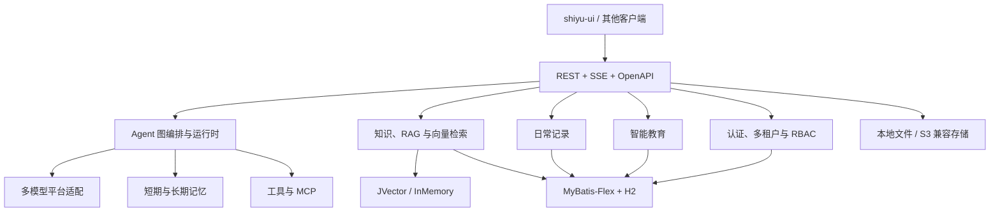

# ShiYu AI 后端项目介绍

> 文档基线：2026-08-12。本文以当前 `shiyu-ai` 代码、Maven 配置、数据库基线和 Web Controller 为依据。

## 1. 项目是什么

ShiYu AI 是一个可扩展的 AI 智能体后端平台。它以可视化 Agent 图编排为核心，把模型接入、知识检索、记忆、工具调用、权限、用量和插件等通用能力组合成平台底座，并在此之上提供智能教育与日常记录两个业务域。

它既可以作为 `shiyu-ui` 的业务后端，也可以通过 REST、SSE 与 OpenAPI 独立集成到其他客户端。

## 2. 面向谁

- 平台管理员：管理租户、用户、角色、菜单、权限码、模型平台和插件。
- Agent 设计者：创建 Agent、维护版本、编排节点、校验并发布流程。
- 知识运营人员：管理知识空间、文档、知识点、关系、索引、检索评测和审计。
- 教育业务人员与学习者：维护学科、教材、课程、题库、考试、学习计划、复习任务和学情数据。
- 个人记录用户：管理档案、成长记录、时间线、媒体与标签。
- 二次开发者：基于分层模块、Repository 端口、插件 SPI、模型适配器和向量存储接口扩展能力。

## 3. 核心能力

### 3.1 Agent 平台

- Agent 定义、复制、启停和动态注册。
- 草稿、发布、归档、激活等版本生命周期。
- 图节点与连线编辑、图校验、节点类型元数据查询。
- 同步执行与 SSE 流式执行。
- 执行状态、暂停、恢复、取消、历史与时间线。
- 意图识别、模型调用、工具调用、RAG、记忆、条件路由、数据转换和子 Agent 等节点能力。

### 3.2 模型与 AI 基础设施

- OpenAI、DeepSeek、Ollama、OpenRouter、SiliconFlow 等平台适配。
- 模型平台和模型记录的运行时管理。
- 同步与流式对话。
- 熔断、限流、负载均衡与降级扩展点。
- 可选的本地 BGE small zh 嵌入模型。

### 3.3 企业知识引擎

- 知识空间与成员访问范围。
- 文档上传、版本、解析、分块、索引任务和运维操作。
- 知识点、文档关系和知识图谱。
- 关键词、向量及融合检索。
- 检索评测、查询审计和索引重建。
- 默认 JVector HNSW 向量存储，也提供内存实现用于测试和轻量场景。

### 3.4 平台治理

- Sa-Token 登录态与 Bearer Token。
- 多租户、角色、菜单、权限码与用户租户角色分配。
- Token 用量和调用记录。
- 本地文件或 S3 兼容对象存储。
- 插件加载、启用、停用和卸载生命周期。
- 数据、日志、上传临时文件和备份的保留策略。
- 可选 OpenTelemetry、Micrometer、Prometheus 可观测能力。

### 3.5 业务扩展

- 智能教育：学科、教材、章节、课程、资源、题库、考试、学生、学习计划、复习、错题、推荐和分析。
- 日常记录：人物档案、档案成员、记录、时间线、媒体和标签。

## 4. 产品结构

## 5. 项目特点

- 模块化：平台能力、业务能力和基础设施分别维护，启动模块只负责装配。
- 本地优先：默认 H2 文件数据库、本地文件存储和 JVector，不依赖外部数据库即可启动。
- 前后端契约清晰：统一 `Result<T>` 响应，动态菜单由后端授权数据驱动，流式能力使用 SSE。
- 可扩展：模型适配器、向量存储 Provider、记忆 SPI、工具和插件都有明确扩展边界。
- 面向生产治理：包含权限、租户隔离、审计、保留策略、备份、用量和可观测性设计。

## 6. 当前边界

- 当前内置数据库初始化器只支持 H2；MySQL 驱动虽在依赖管理中，但生产切换需要补齐数据源配置与对应数据库基线/迁移方案。
- `shiyu-ui` 在浏览器侧使用 `/api` 前缀；后端自身没有 `/api` context path，开发代理或生产网关负责移除/转发该前缀。
- 模型密钥和生产存储凭据必须通过部署环境、受控配置或后台管理录入，不能提交到仓库。
- 种子数据包含 `admin` 用户，但仓库不保存可直接公开的明文管理密码；部署方应通过受控流程设置或重置密码。

## 7. 延伸阅读

- [后端技术文档](./技术文档.md)
- [后端使用文档](./使用文档.md)
- [完整文档导航](./文档导航.md)
- [前端项目介绍](../../shiyu-ui/docs/项目介绍.md)
