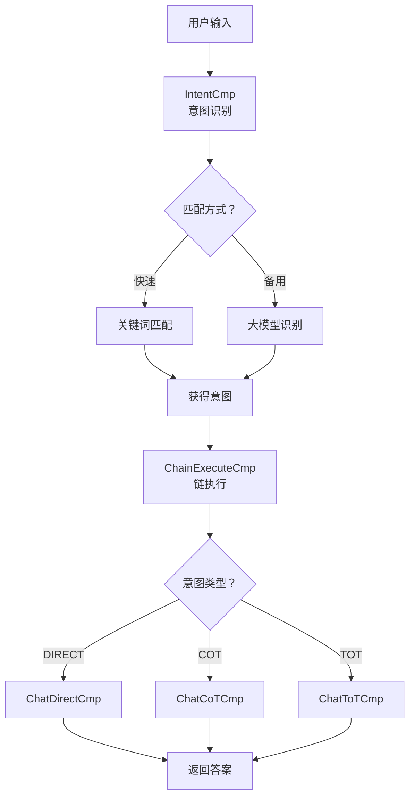
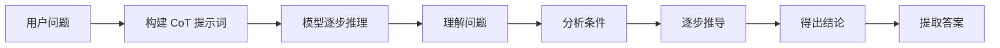
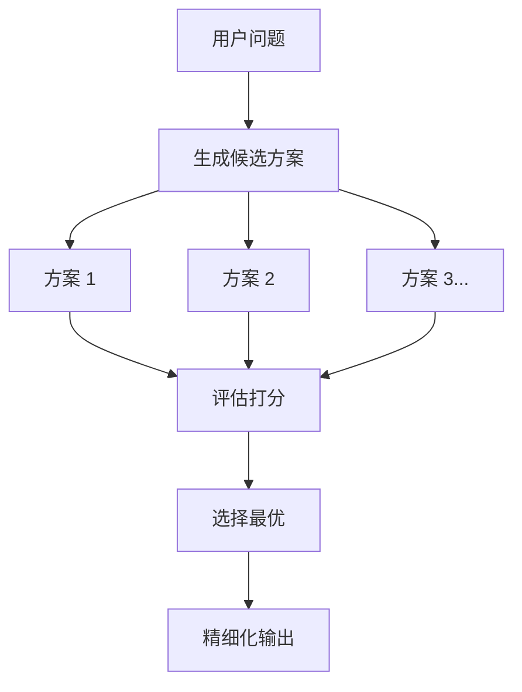

# 对话功能完善 - 项目总览

## 📋 项目概述

本次任务基于 **LiteFlow** 流程编排引擎，完善了 shiyu-chat 模块的对话功能，实现了三种智能对话模式：**Direct（直接对话）**、**CoT（思维链）**、**ToT（思维树）**。

## ✅ 完成情况概览

### 核心功能实现

| 组件 | 状态 | 说明 |
|------|------|------|
| IntentCmp（意图识别） | ✅ 完成 | 关键词匹配 + 大模型识别 |
| ChatDirectCmp（直接对话） | ✅ 完成 | 简单问答场景 |
| ChatCoTCmp（思维链） | ✅ 完成 | 逻辑推理场景 |
| ChatToTCmp（思维树） | ✅ 完成 | 多方案决策场景 |
| ChainExecuteCmp（链执行） | ✅ 已有 | 负责调用子链 |
| IntentServiceImpl | ✅ 完成 | 意图识别服务实现 |
| IntentConfig | ✅ 新增 | 配置化支持 |

### 文件清单

#### Java 源文件（已修改/新增）

```
shiyu-chat/src/main/java/com/shiyu/ai/chat/
├── config/
│   └── IntentConfig.java                    [新增] 意图配置类
├── controller/
│   └── ChatController.java                  [修改] 优化 API 接口
├── liteflow/components/
│   ├── IntentCmp.java                       [修改] 增强意图识别
│   ├── ChatDirectCmp.java                   [修改] 优化直接对话
│   ├── ChatCoTCmp.java                      [修改] 实现思维链推理
│   └── ChatToTCmp.java                      [修改] 实现思维树推理
└── service/
    └── IntentServiceImpl.java               [修改] 完整实现意图识别
```

#### 配置文件（已修改/新增）

```
shiyu-chat/src/main/resources/
├── application-ai.yml                       [修改] 添加意图配置
└── liteflow/chain/chain.json                [已有] LiteFlow 流程定义
```

#### 文档和测试文件（新增）

```
shiyu-chat/
├── 对话功能说明.md                          [新增] 详细功能文档
├── 完善总结.md                             [新增] 实现细节总结
├── 快速启动.md                             [新增] 启动指南
├── README_对话功能总览.md                   [新增] 本文档
├── test-chat.sh                            [新增] Bash 测试脚本
└── chat-tests.http                         [新增] IDEA HTTP Client 测试
```

## 🎯 核心功能详解

### 1. 意图识别（Intent Recognition）

**双层匹配策略：**
```
用户输入 → 关键词匹配（快速）→ 失败 → 大模型匹配（精准）
```

**支持的意图类型：**
- **DIRECT**: 问候寒暄、简单问答
- **COT**: 逻辑推理、数学问题
- **TOT**: 多方案决策、对比分析

**配置示例：**
```yaml
shiyu:
  intent:
    categories:
      default:
        - id: "direct_greeting"
          name: "问候寒暄"
          type: "DIRECT"
          keywords: ["你好", "您好", "hello"]
          chain-to-call: "chatDirect"
```

### 2. Direct 模式（直接对话）

**适用场景：**
- 日常寒暄
- 简单问答
- 事实查询

**处理流程：**
```
用户输入 → ChatDirectCmp → 调用模型 → 返回答案
```

**特点：**
- ⚡ 快速响应（1-3 秒）
- 💬 简洁直接
- 🎯 无需复杂推理

### 3. CoT 模式（Chain of Thought - 思维链）

**适用场景：**
- 逻辑推理题
- 数学计算
- 证明题
- 需要逐步推导的问题

**处理流程：**
```
用户输入 → ChatCoTCmp 
  ↓
构建 CoT 提示词
  ↓
引导模型逐步思考：
  1. 理解问题
  2. 分析条件
  3. 逐步推导
  4. 得出结论
  ↓
提取最终答案
```

**特点：**
- 🧠 结构化推理
- 📝 步骤清晰
- ✅ 逻辑严谨

### 4. ToT 模式（Tree of Thoughts - 思维树）

**适用场景：**
- 方案对比
- 决策咨询
- 多角度分析问题
- 需要创造性解决方案

**处理流程：**
```
用户输入 → ChatToTCmp
  ↓
发散阶段：生成 N 个候选方案
  ↓
评估阶段：对每个方案打分
  ↓
收敛阶段：选择最优方案
  ↓
精细化：生成最终答案
```

**特点：**
- 🔍 多角度分析
- ⭐ 自动评估
- 🏆 优中选优

## 📊 流程图

### 整体架构



### CoT 流程



### ToT 流程



## 🚀 使用指南

### 快速开始

1. **配置 API Key**
   ```bash
   编辑 application-ai.yml，填入有效的 API Key
   ```

2. **启动服务**
   ```bash
   mvn spring-boot:run
   ```

3. **测试对话**
   ```bash
   curl -X POST http://localhost:9001/chat \
     -H "Content-Type: application/json" \
     -d '{"text": "你好"}'
   ```

### API 接口

| 方法 | 路径 | 说明 |
|------|------|------|
| POST | /chat | 主要对话接口（JSON） |
| GET | /chat?text=xxx | 兼容 GET 方式 |
| GET | /chat/stream | 流式输出（SSE） |

### 请求示例

```json
// 请求
POST /chat
{
  "text": "我想学习编程，应该选择 Python 还是 Java？"
}

// 响应
{
  "result": "最终答案...",
  "intent": "多方案决策",
  "chain": "chatToT"
}
```

## 📁 文档导航

| 文档 | 用途 | 位置 |
|------|------|------|
| 快速启动.md | 快速上手指南 | 本文档同级目录 |
| 对话功能说明.md | 详细功能文档 | 包含完整 API 说明 |
| 完善总结.md | 实现细节总结 | 技术亮点和优化建议 |
| README_对话功能总览.md | 项目总览 | 本文档 |

## 🧪 测试

### 测试工具

1. **Bash 脚本**: `test-chat.sh`
2. **IDEA HTTP Client**: `chat-tests.http`
3. **curl 命令**: 见快速启动文档
4. **浏览器**: 访问 `/chat?text=xxx`

### 测试用例

| 编号 | 场景 | 预期模式 | 测试命令 |
|------|------|----------|----------|
| 1 | 问候寒暄 | Direct | `"text": "你好"` |
| 2 | 逻辑推理 | CoT | `"text": "证明勾股定理"` |
| 3 | 多方案决策 | ToT | `"text": "Python vs Java"` |
| 4 | 数学计算 | CoT | `"text": "水池注水问题"` |
| 5 | 创意写作 | Direct | `"text": "描写春天"` |

## 🔧 扩展指南

### 添加新的对话模式

1. **创建组件**
   ```java
   @LiteflowComponent("CHAT_NEW")
   public class ChatNewCmp extends NodeComponent {
       @Override
       public void process() {
           // 实现新逻辑
       }
   }
   ```

2. **配置链**
   ```json
   {
     "name": "chatNew",
     "value": "THEN(CHAT_NEW)"
   }
   ```

3. **添加意图**
   ```yaml
   - id: "new_intent"
     type: "NEW"
     chain-to-call: "chatNew"
   ```

### 自定义提示词

在各 Cmp 类中修改 `buildPrompt` 方法：

```java
private String buildCotPrompt(String query) {
    return "你的定制化提示词";
}
```

## 📈 性能指标

| 模式 | 平均响应时间 | 推荐场景 |
|------|-------------|----------|
| Direct | 1-3 秒 | 简单问答 |
| CoT | 5-10 秒 | 逻辑推理 |
| ToT | 15-30 秒 | 复杂决策 |

## ⚠️ 注意事项

1. **API Key**: 确保配置有效且余额充足
2. **超时设置**: CoT/ToT 可能较慢，建议设置合理超时
3. **成本控制**: ToT 会多次调用模型，注意频率
4. **网络稳定**: 需要稳定的网络连接访问大模型 API

## 🎉 技术亮点

1. **双层匹配** - 关键词 + 大模型，速度与准确率兼顾
2. **渐进式策略** - 根据问题复杂度自动选择对话模式
3. **配置化设计** - 意图定义与代码分离，易于维护
4. **容错机制** - 多层降级，保证服务稳定性
5. **结构化推理** - CoT/ToT提供科学的思考框架

## 📚 技术栈

- Spring Boot 3.x
- Spring AI
- LiteFlow
- Project Lombok
- JDK 21

## 🔗 相关资源

- [LiteFlow 官方文档](https://liteflow.cc/)
- [Spring AI 文档](https://spring.io/projects/spring-ai)
- [项目 GitHub](待添加)

---

**最后更新**: 2026-03-08  
**版本**: v1.0  
**状态**: ✅ 已完成并可用
